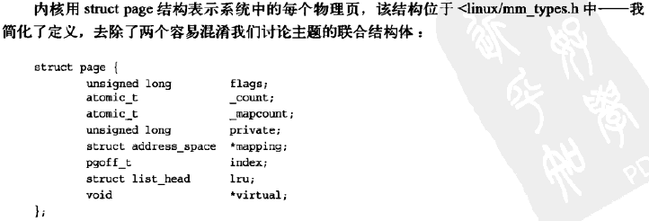
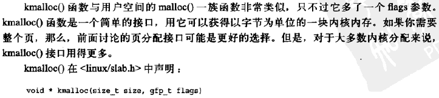
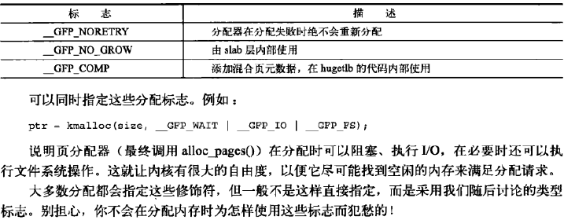
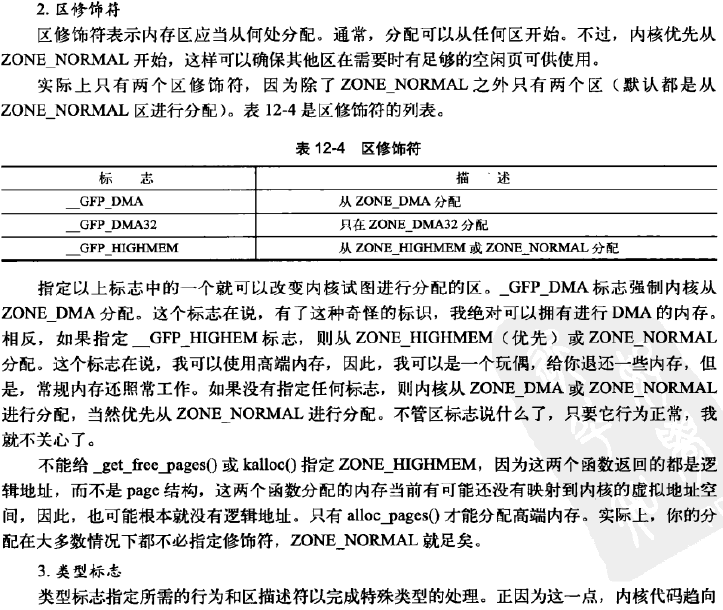
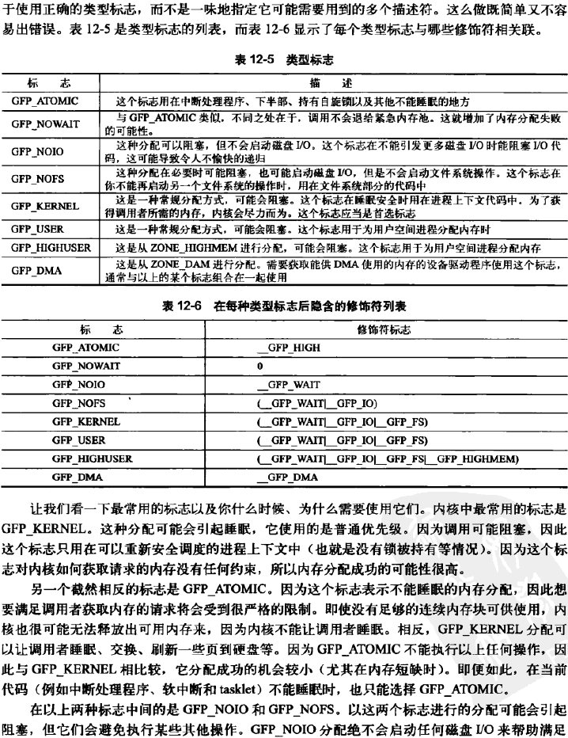
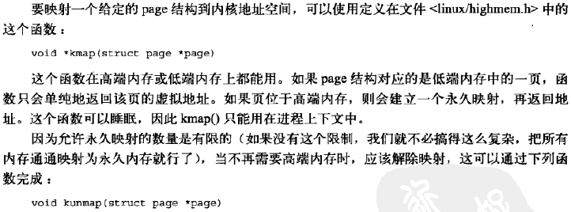
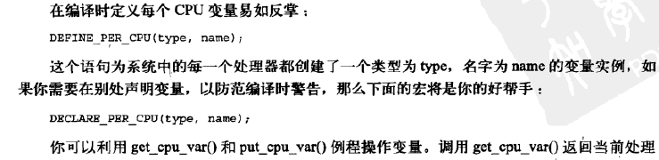

## 内存管理

#### 页（page）

#### 区（zone）

#### 获得页

**获得填充为0的页**

**释放页**

#### kmalloc()

**gfp_mask标志**

**kfree()**

#### vmalloc()

#### slab层

**slab层的设计**

**slab分配器的接口**

#### 在栈上的静态分配

**单页内核栈**

**在栈上光明正大地工作**

####  高端内存的映射

**永久映射**

**临时映射**

#### 每个CPU的分配

#### 新的每个CPU接口

**编译时的每个CPU数据**

**运行时的每个CPU数据**

#### 使用每个CPU数据的原因

#### 分配函数的选择

