## 进程地址空间

#### 地址空间

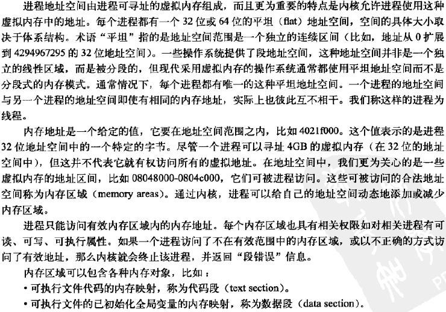

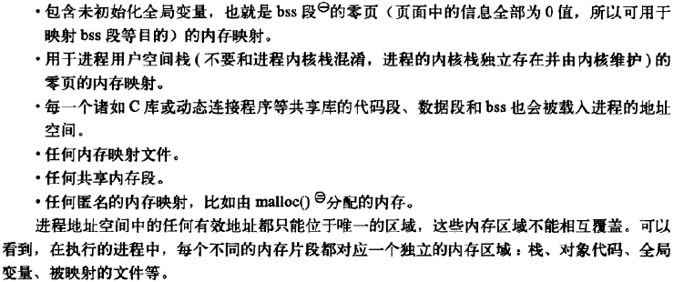

#### 内存描述符

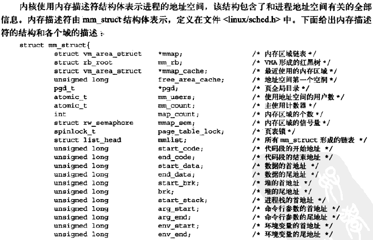

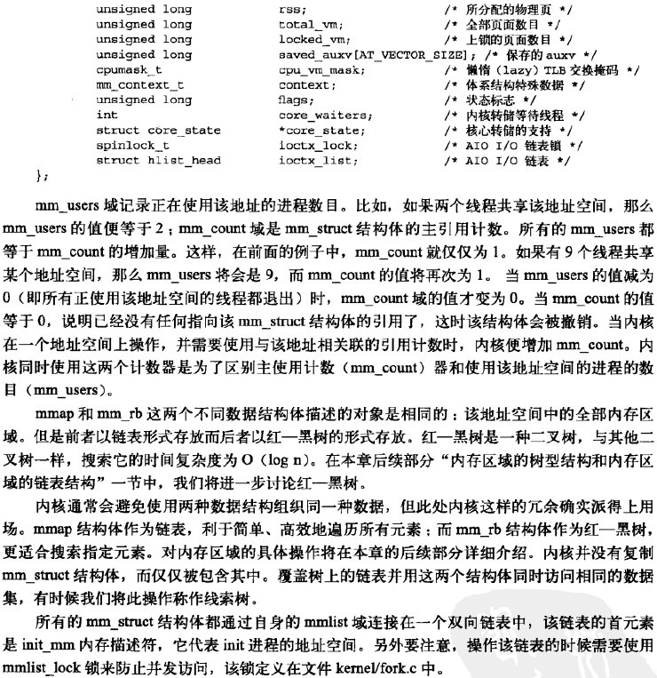

**分配内存描述符**

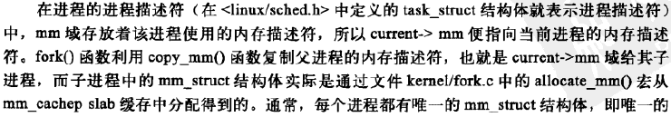

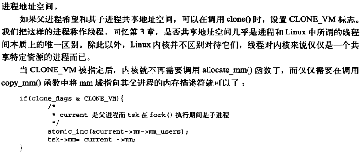

**撤销内存描述符**

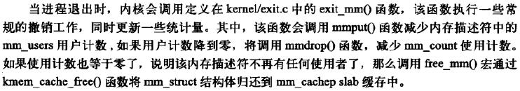

**mm_struct与内核线程**

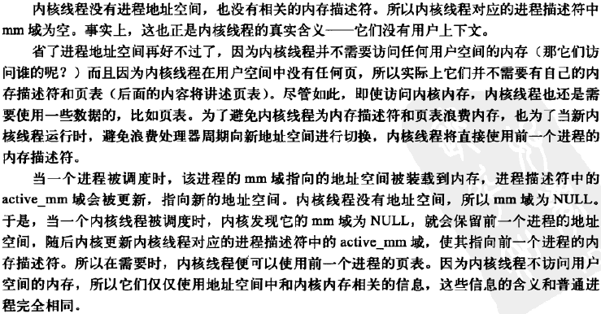

#### 虚拟内存区域

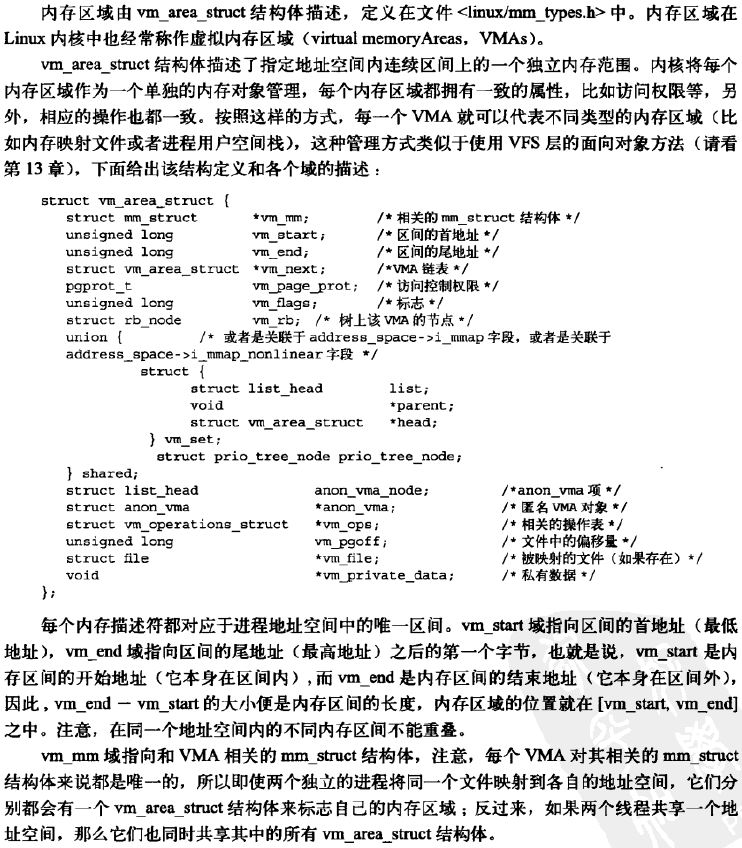

**VMA标志**

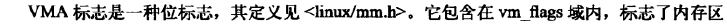

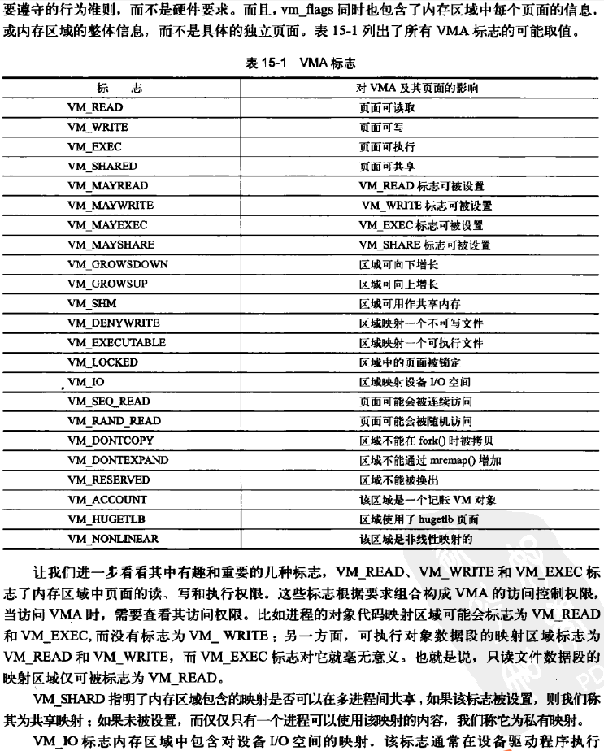

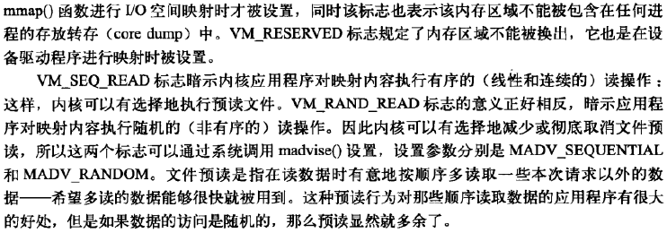

**VMA操作**

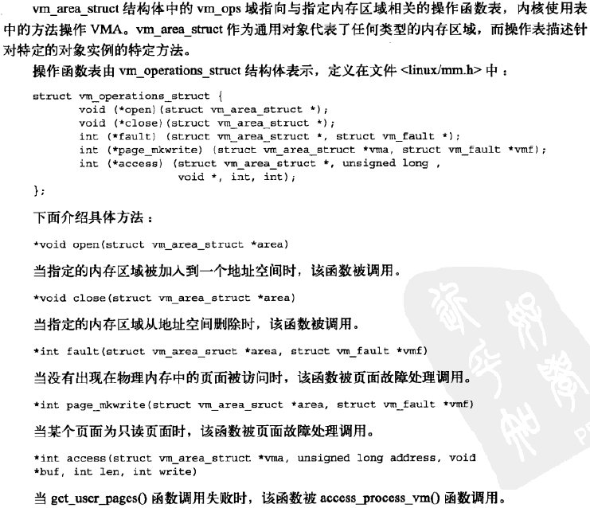

**内存区域的树型结构和内存区域的链表结构**

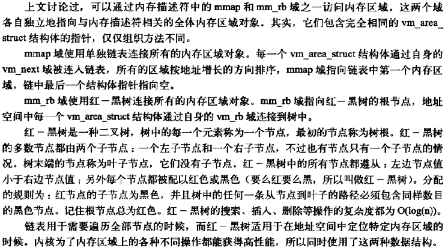

**实际使用中的内存区域**

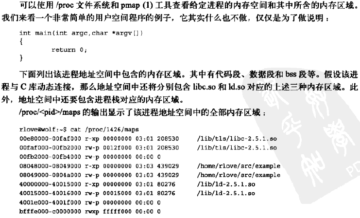

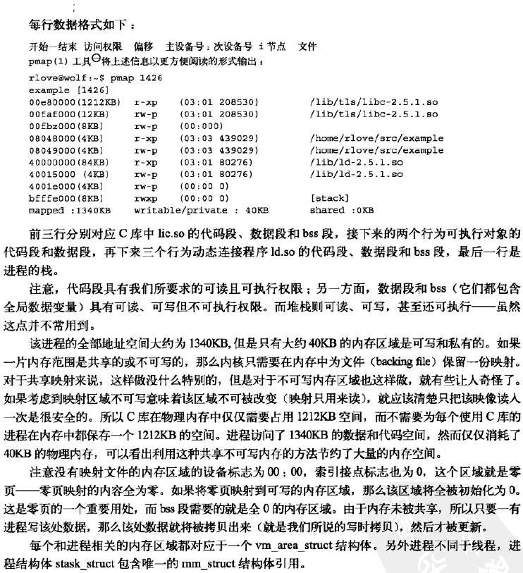

#### 操作内存区域

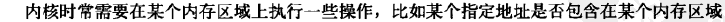

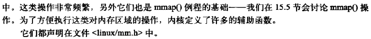

**find_vma()**

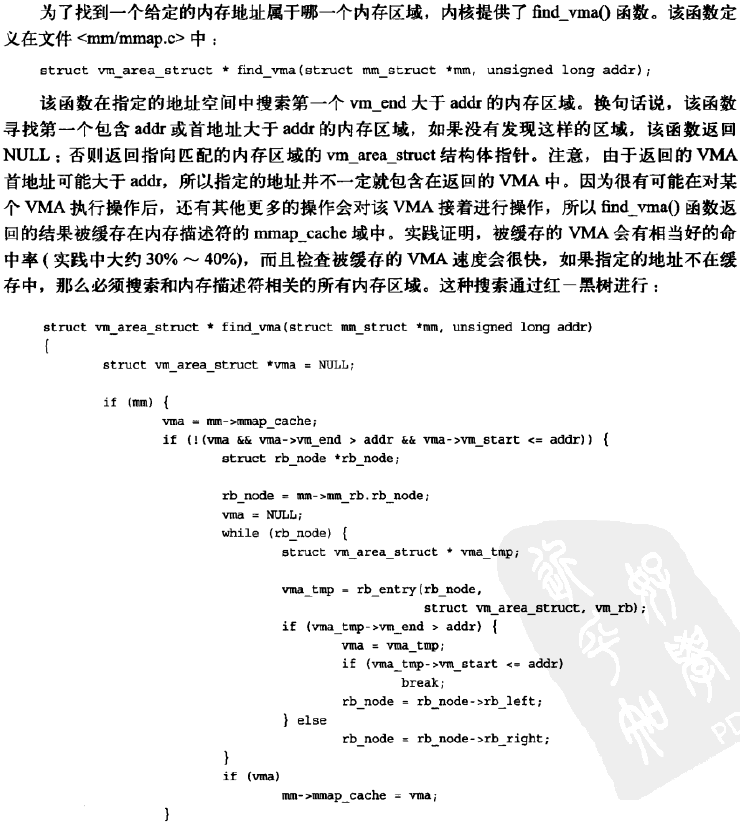

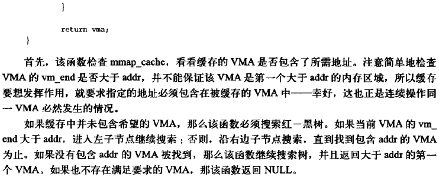

**find_vma_prev()**

**find_vma_intersection()**

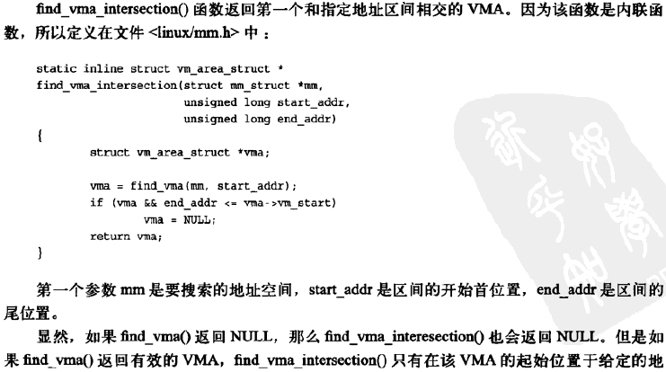

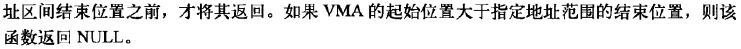

#### mmap()和do_mmap()：创建地址区间

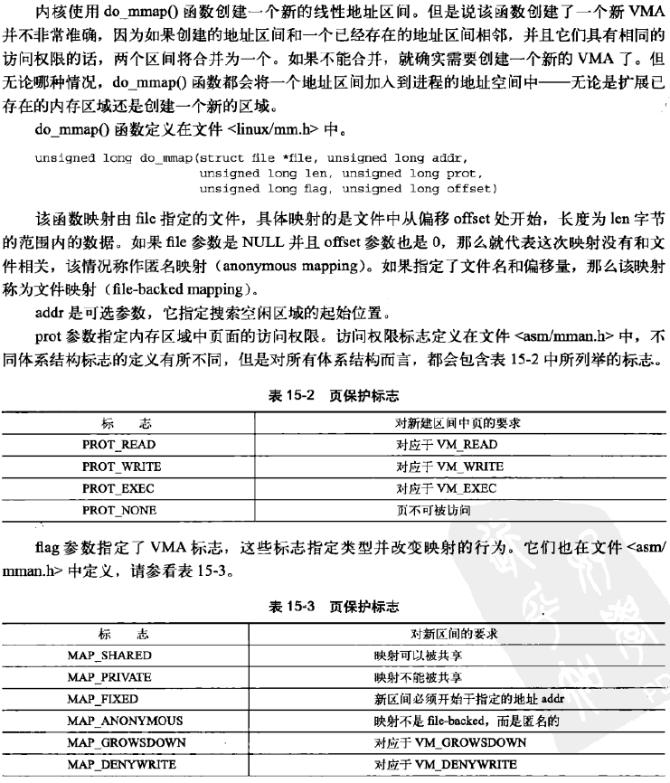

#### mummap()和do_mummap()：删除地址区间

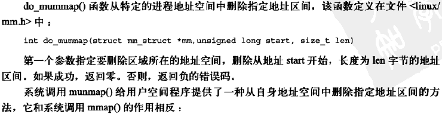

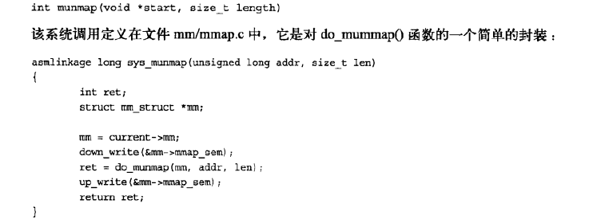

#### 页表

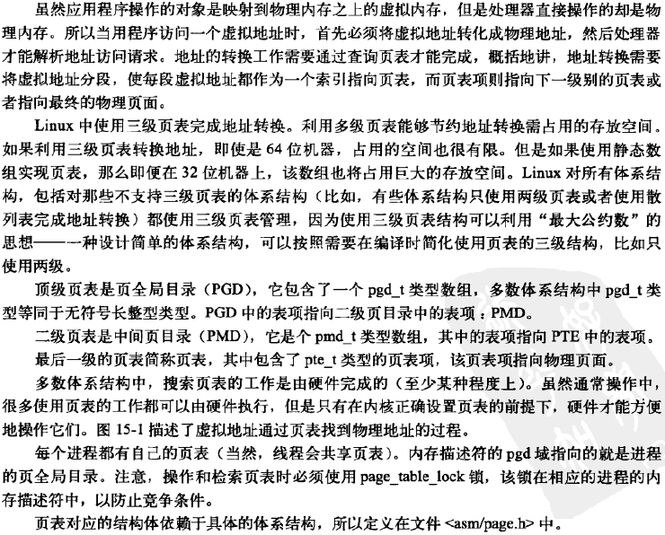

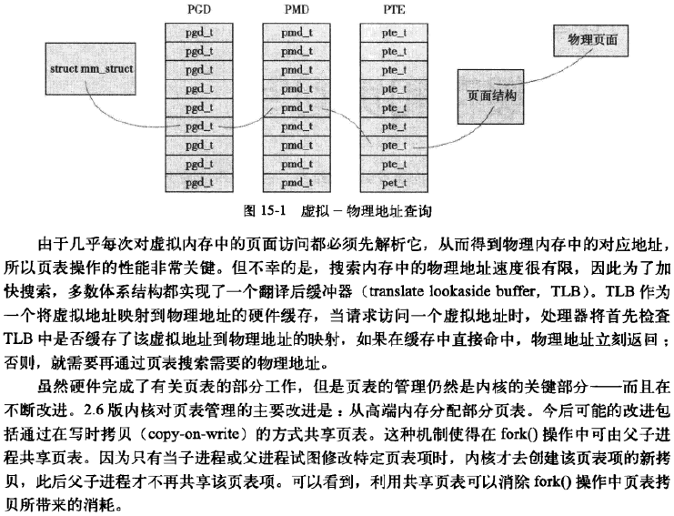

