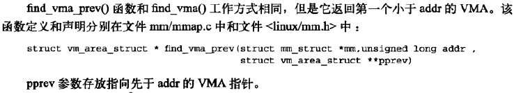
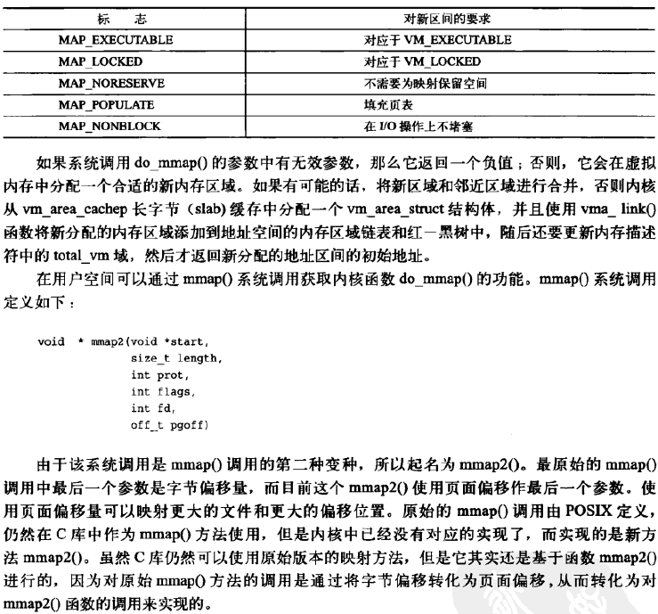

## 进程地址空间

#### 地址空间

#### 内存描述符

**分配内存描述符**

**撤销内存描述符**

**mm_struct与内核线程**

#### 虚拟内存区域

**VMA标志**

**VMA操作**

**内存区域的树型结构和内存区域的链表结构**

**实际使用中的内存区域**

#### 操作内存区域

**find_vma()**

**find_vma_prev()**

**find_vma_intersection()**

#### mmap()和do_mmap()：创建地址区间

#### mummap()和do_mummap()：删除地址区间

#### 页表

