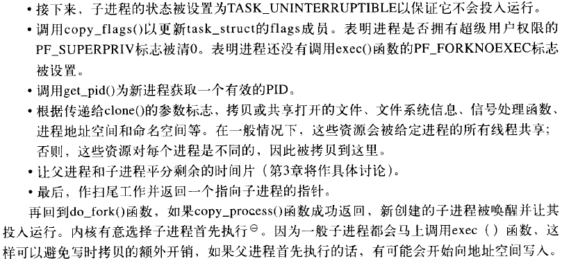
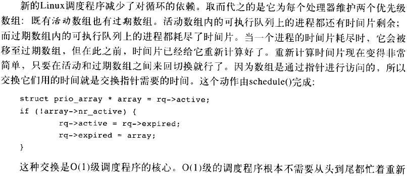
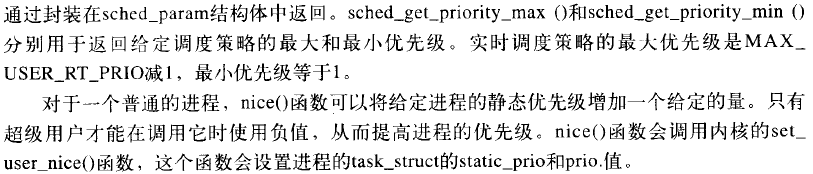

## Linux Kernel Development

### 进程管理

**2.1.1 分配进程描述符**

**2.1.2 进程描述符的存放**

**2.1.3 进程状态**

**2.1.4 设置当前进程状态**

**2.1.5 进程上下文**

#### 2.2 进程创建

**2.2.1 写时拷贝**

**2.2.2 fork()**

#### 2.3 线程在Linux中的实现

**内核线程**

#### 2.4 进程终结

**2.4.1 删除进程描述符**

### 进程调度

#### 3.1 策略

**3.1.1 I/O消耗性和处理器消耗性的进程**

**3.1.2 进程优先级**

#### 3.2 调度算法

**3.2.1 可执行队列**

**3.2.2 优先级数组**

**3.2.3 重新计算时间片**

**3.2.5 睡眠和唤醒**

**3.2.6 负载平衡程序**

#### 3.3 抢占和上下文切换

**3.3.1 用户抢占**

**3.3.2 内核抢占**

#### 3.4 实时

#### 3.5 与调度相关的系统调用

**3.5.1 与调度策略和优先级相关的系统调用**

**3.5.2 与处理器绑定有关的系统调用**

**3.5.3 放弃处理器时间**

