## 页高速缓存和页回写

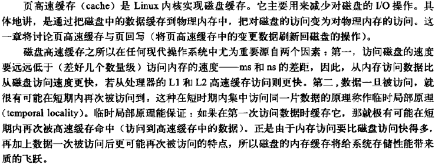

#### 缓存手段

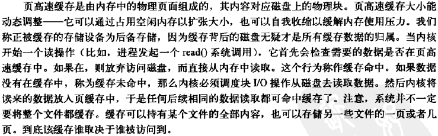

**写缓存**

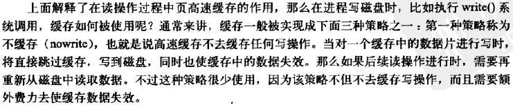

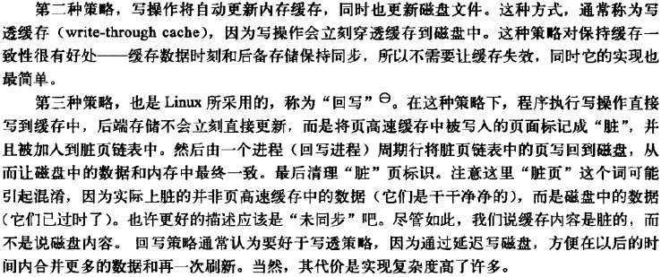

**缓存回收**

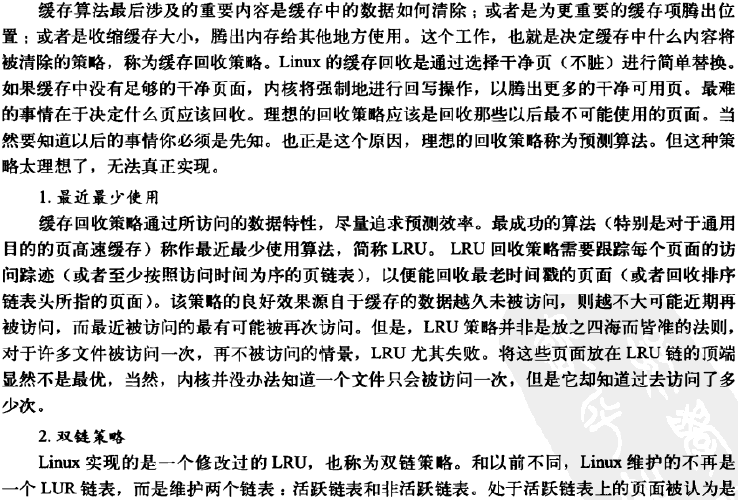

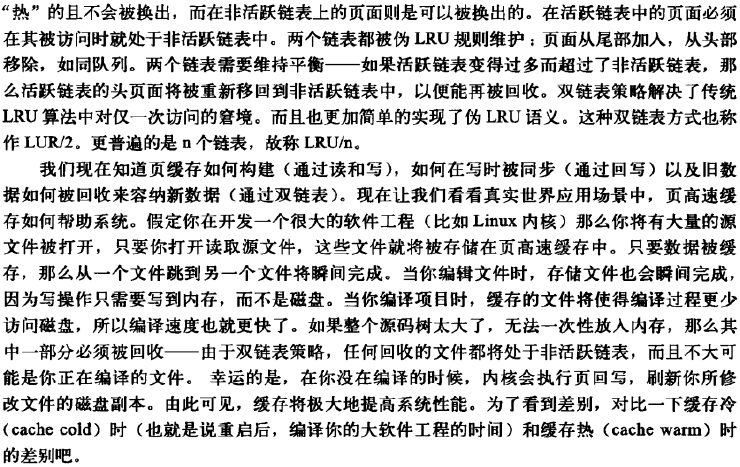

#### Linux页高速缓存

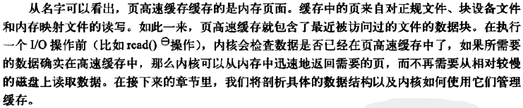

**address_space对象**

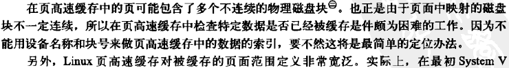

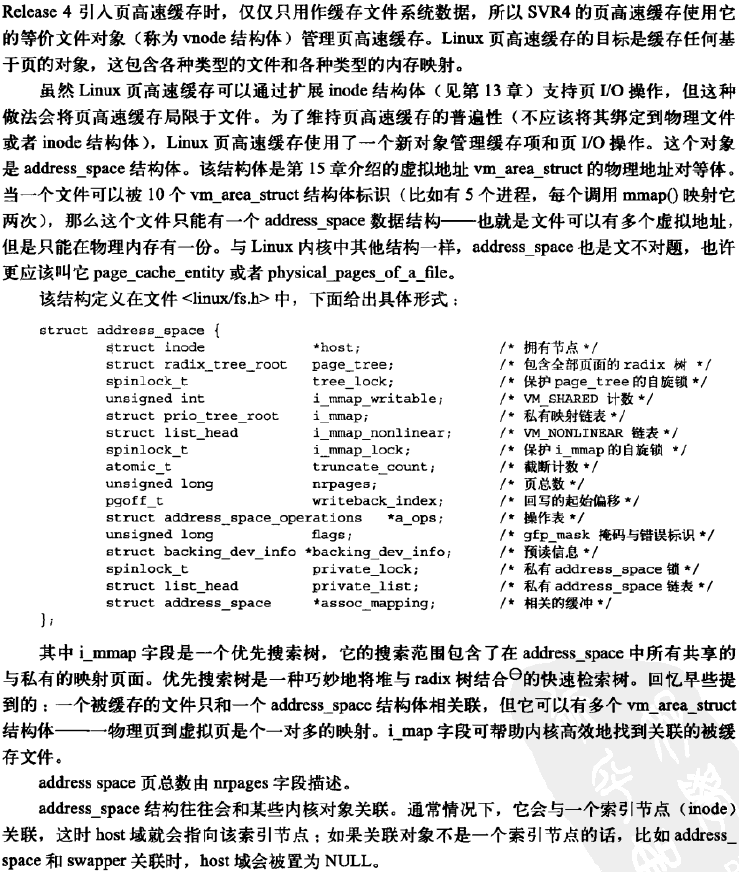

**address_space操作**

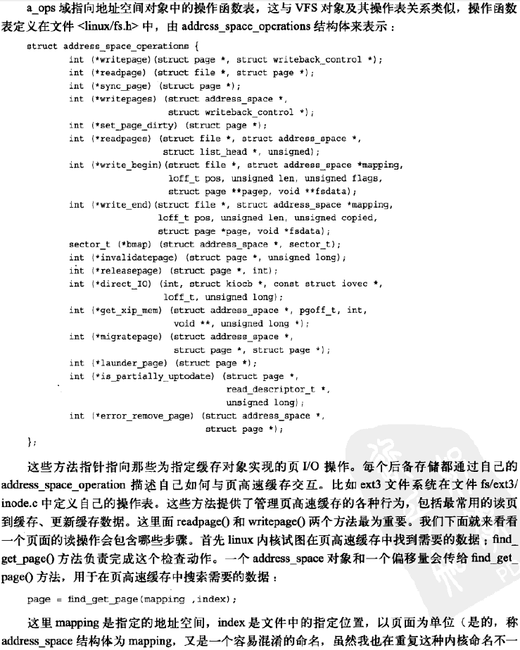

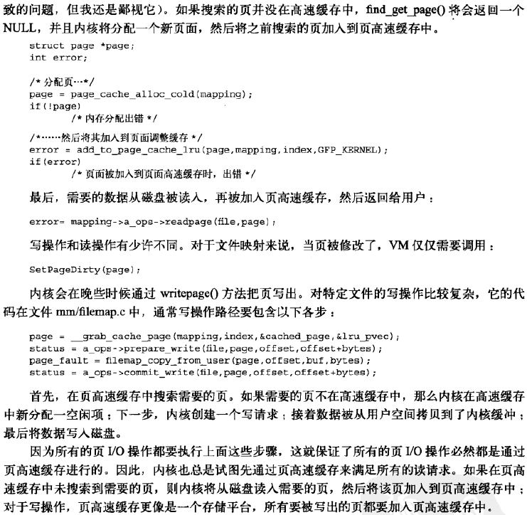

**基树**

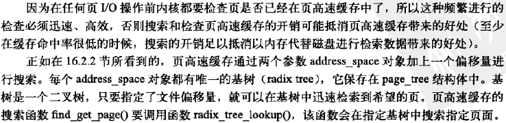

**以前的页散列表**

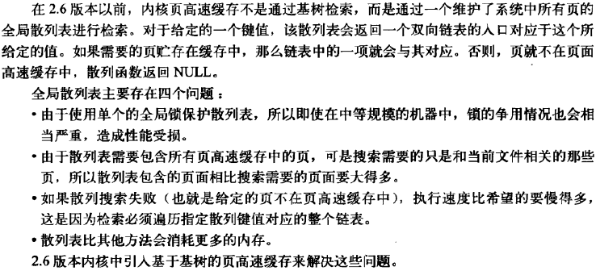

#### 缓冲区高速缓存

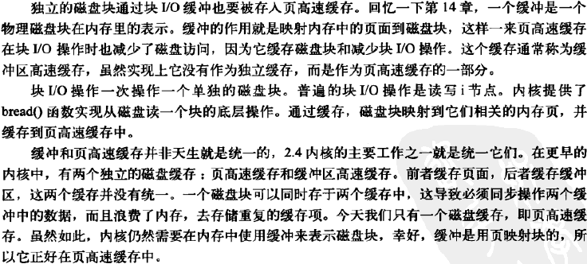

#### flusher线程

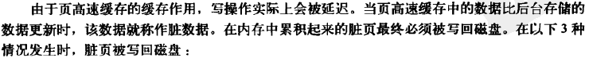

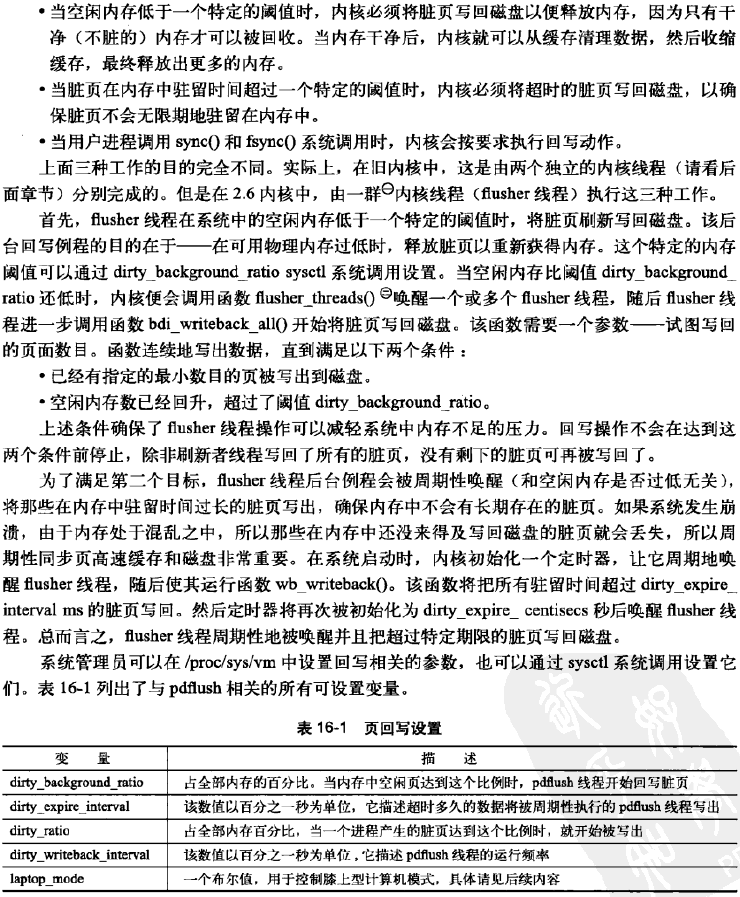

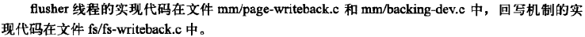

**膝上型计算机模式**

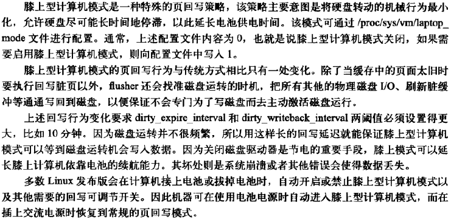

**历史上的bdflush、kupdated和pdflush**

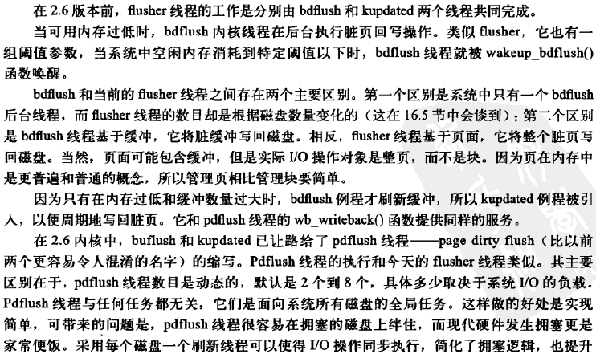

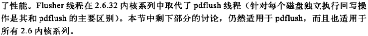

**避免拥塞的方法：使用多线程**

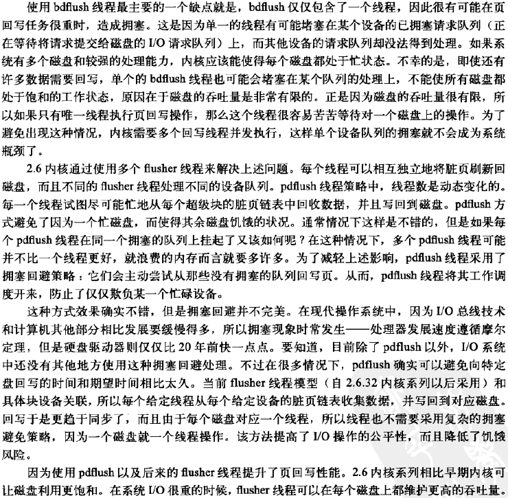

