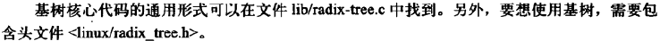

## 页高速缓存和页回写

#### 缓存手段

**写缓存**

**缓存回收**

#### Linux页高速缓存

**address_space对象**

**address_space操作**

**基树**

**以前的页散列表**

#### 缓冲区高速缓存

#### flusher线程

**膝上型计算机模式**

**历史上的bdflush、kupdated和pdflush**

**避免拥塞的方法：使用多线程**

