## I2C协议

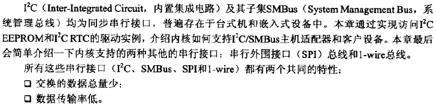

#### I2C/SMBus

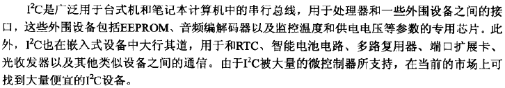

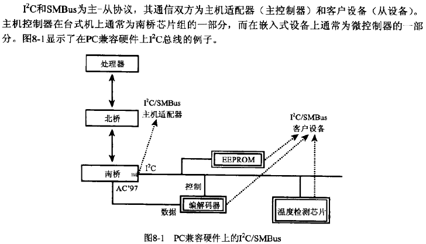

#### I2C核心

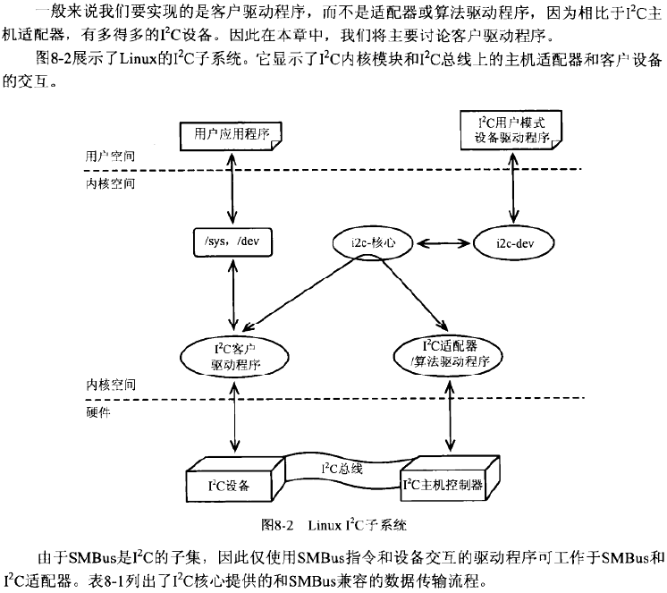

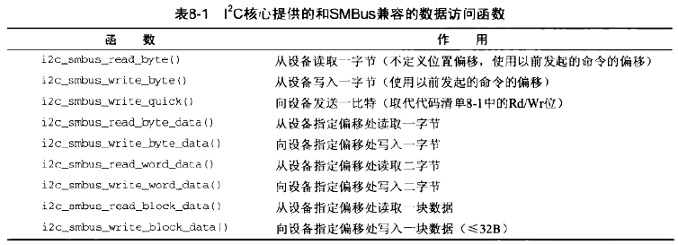

#### 总线事物

#### EEPROC

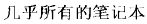

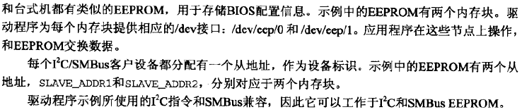

**初始化**

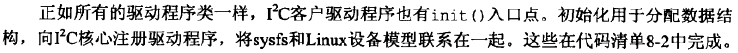

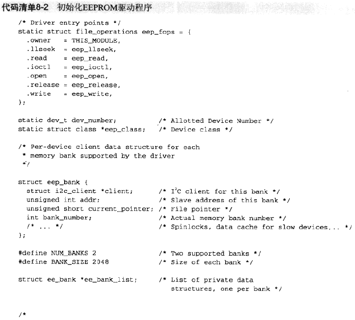

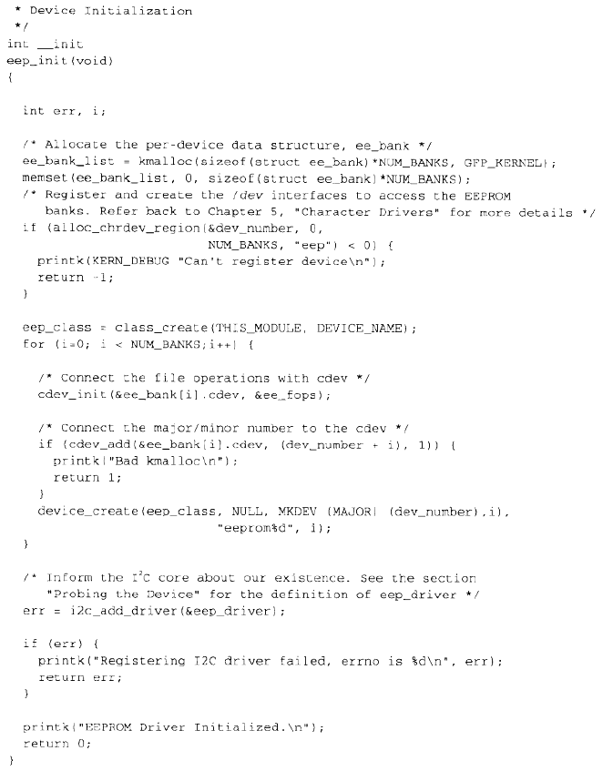

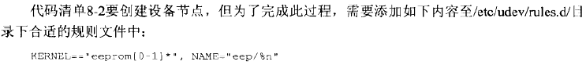

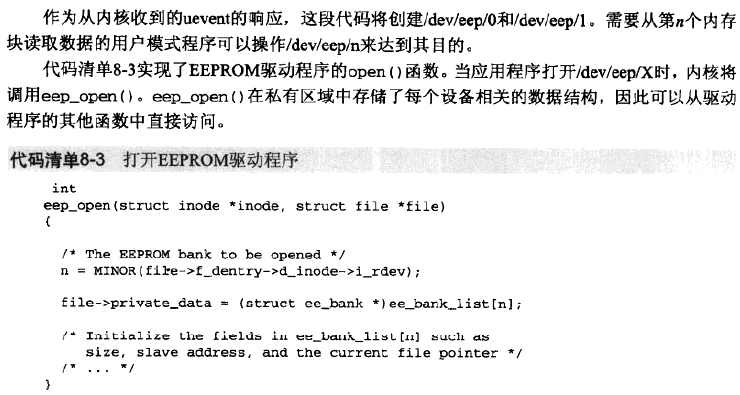

**探测设备**

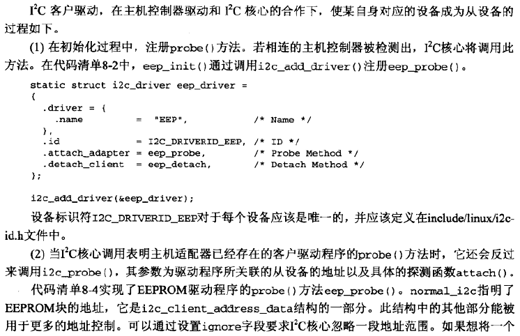

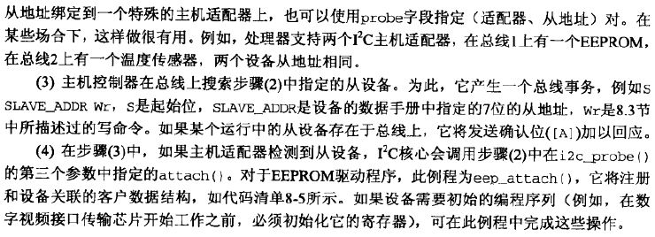

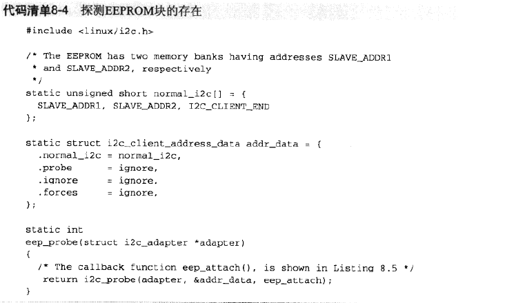

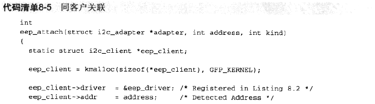

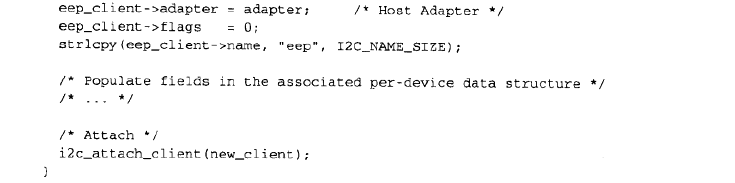

**检查适配器的功能**

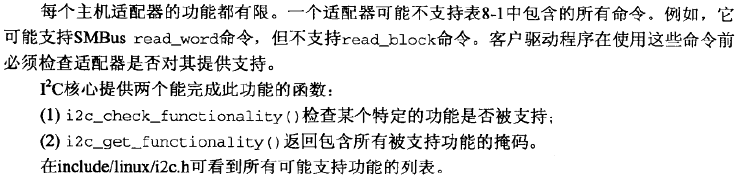

**访问设备**

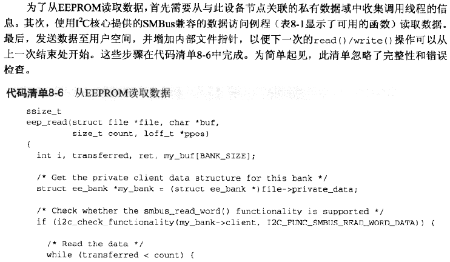

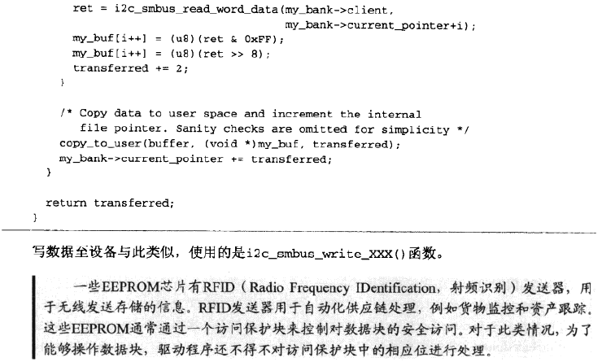

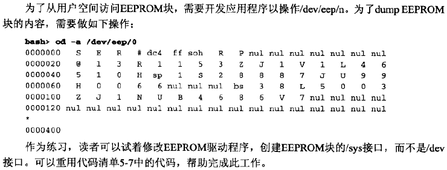

**其他函数**

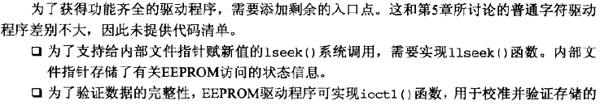

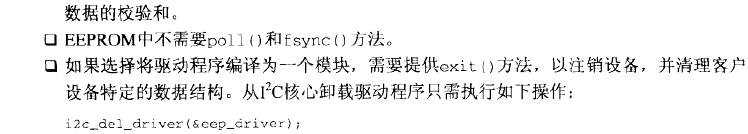

#### 实时时钟

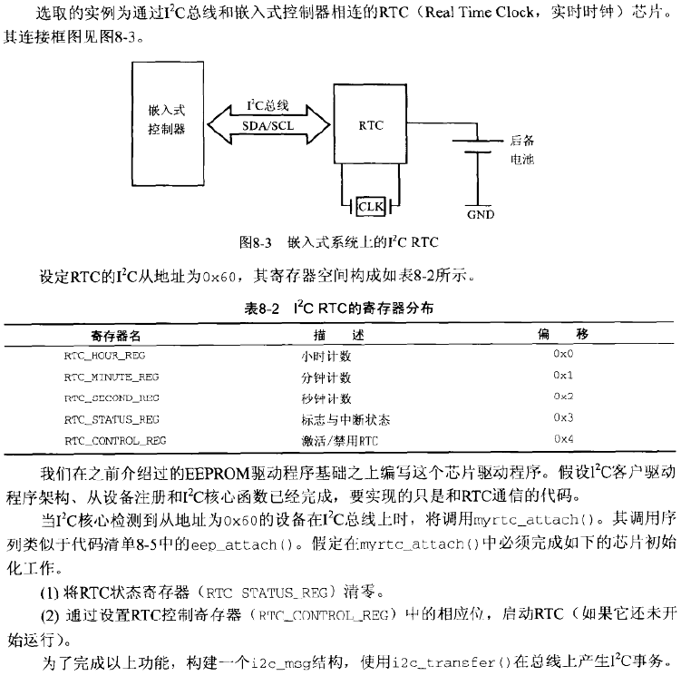

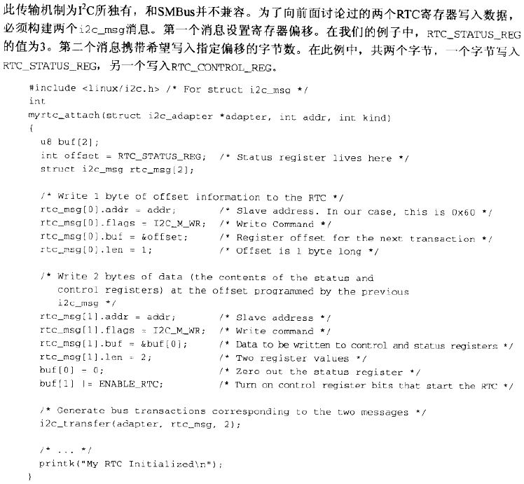

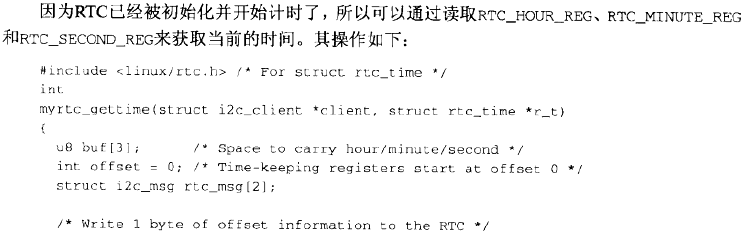

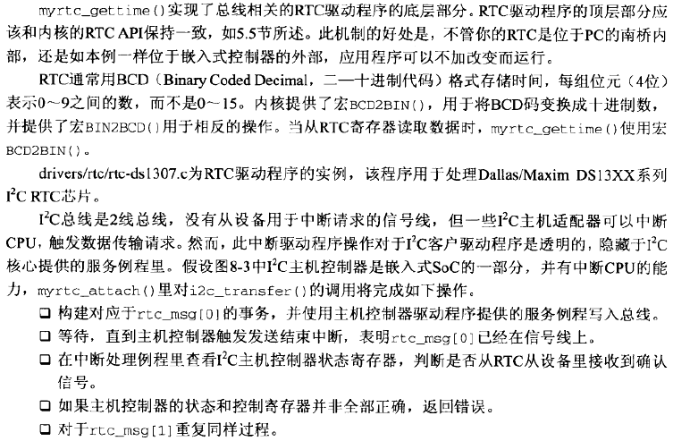

#### I2C-dev

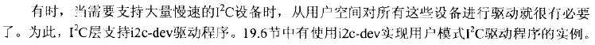

#### 使用LM-Sensors监控硬件

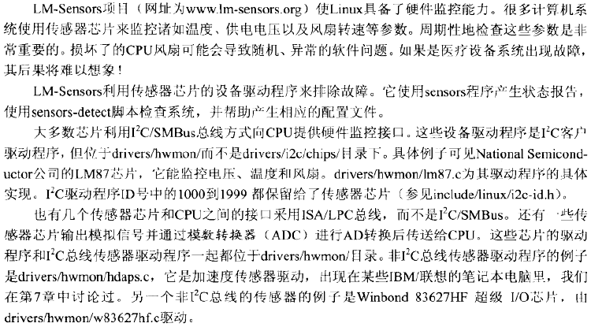

#### SPI总线

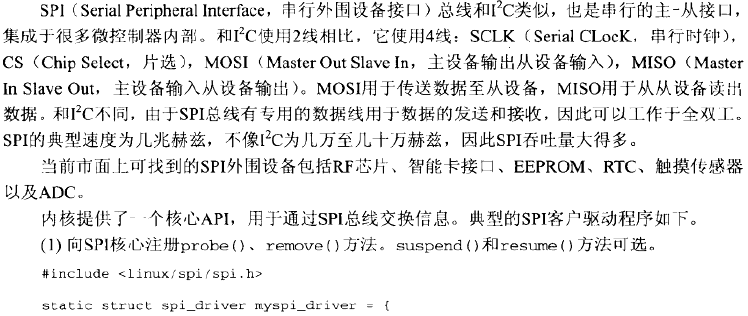

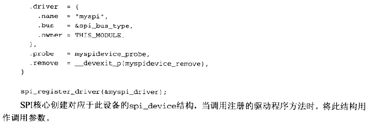

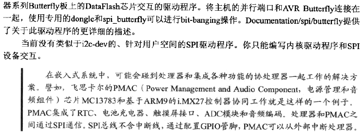

#### 1-Wire总线

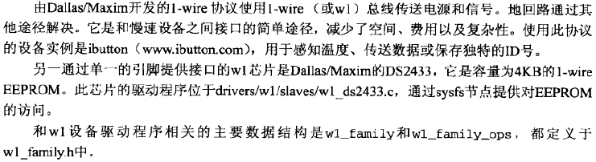

#### 调试

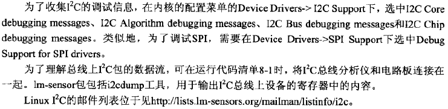

#### 查看源代码

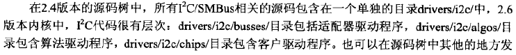

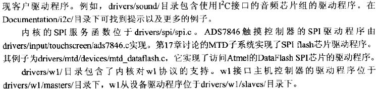

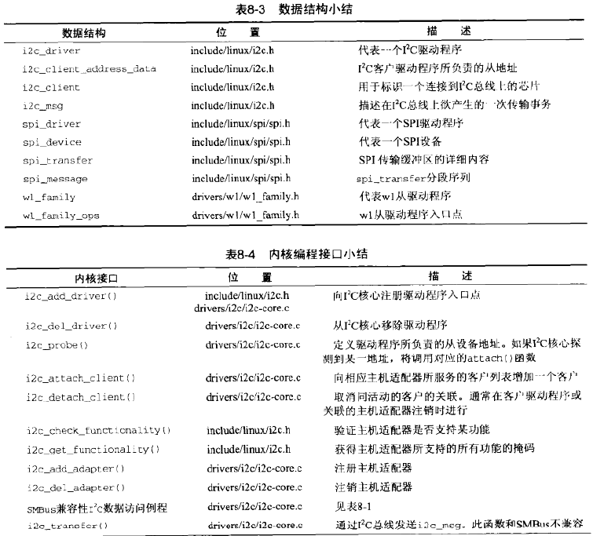

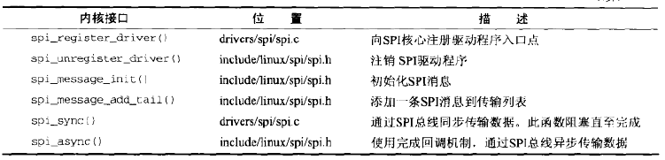