## PCMCIA和CF

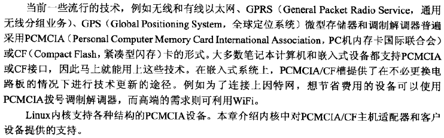

#### PCMCIA/CF是什么

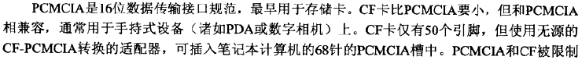

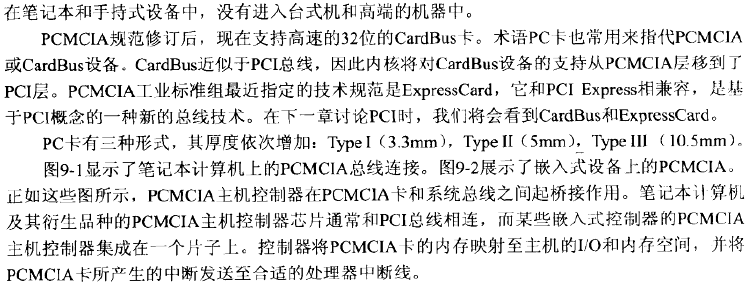

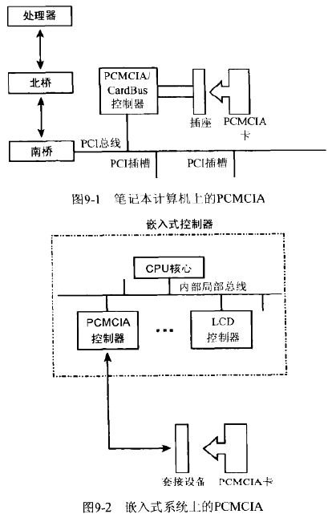

#### Linux-PCMEIA子系统

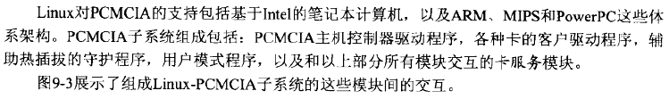

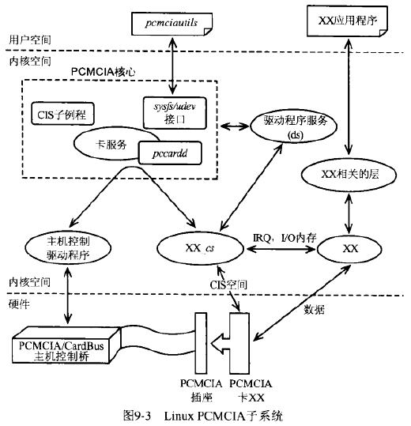

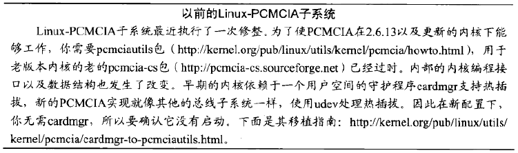

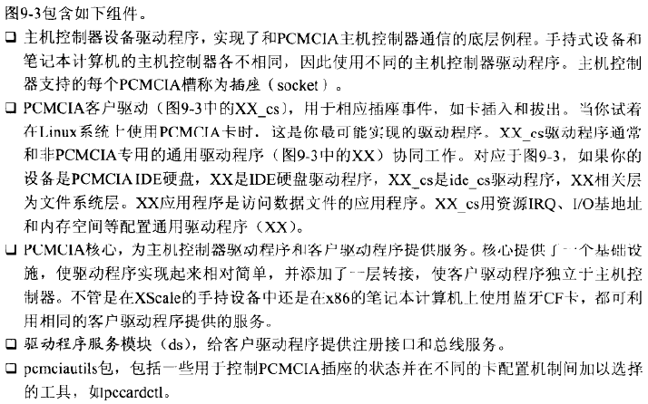

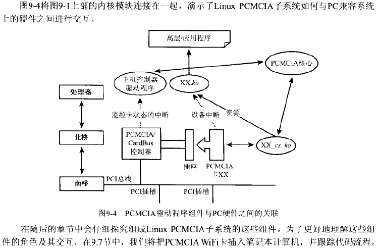

#### 主机控制器驱动程序

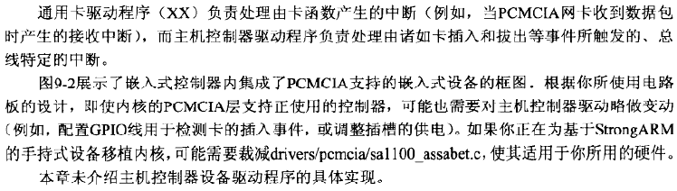

#### PCMCIA核心

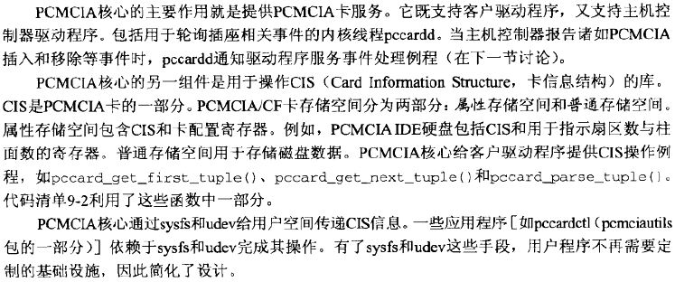

#### 驱动程序服务

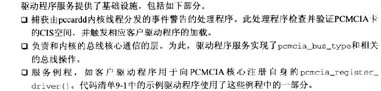

#### 客户驱动程序

**数据结构**

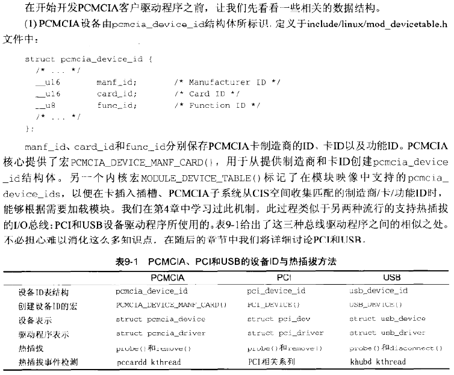

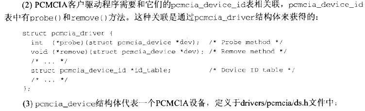

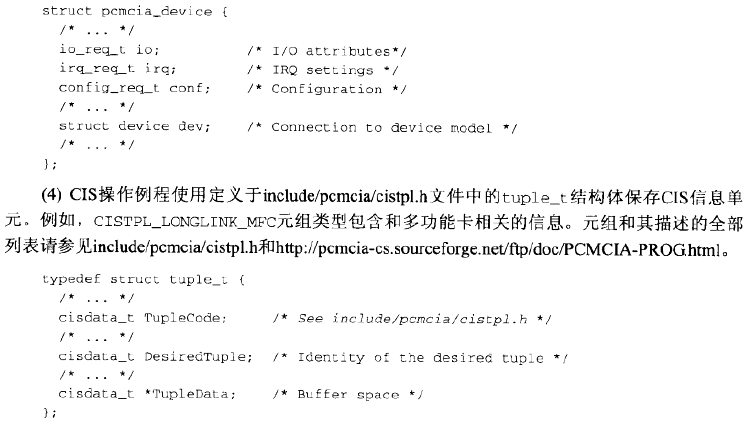

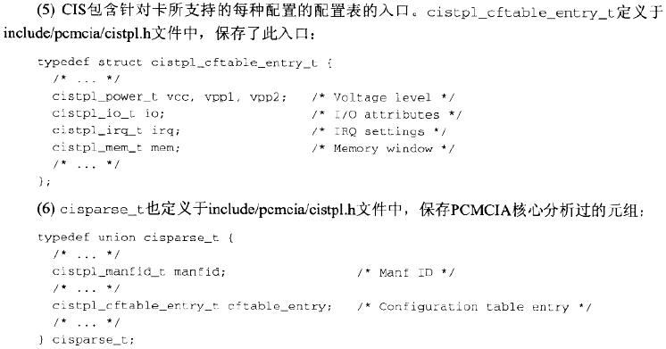

**PCMCIA卡**

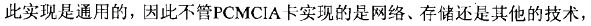

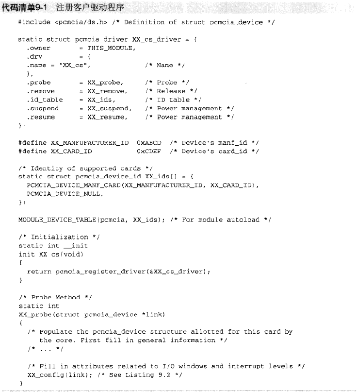

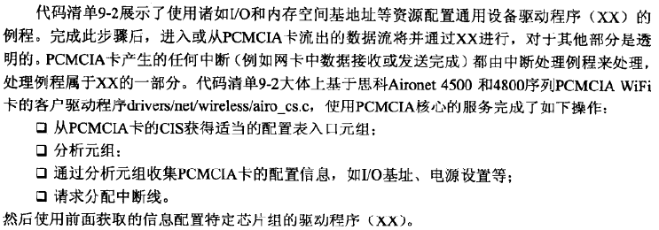

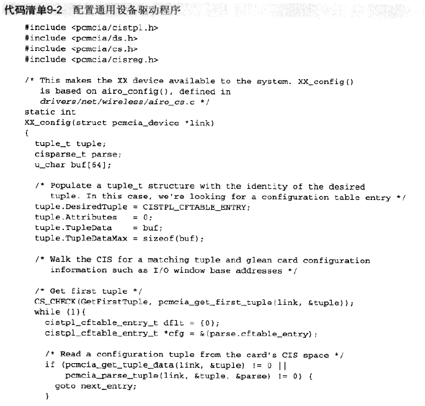

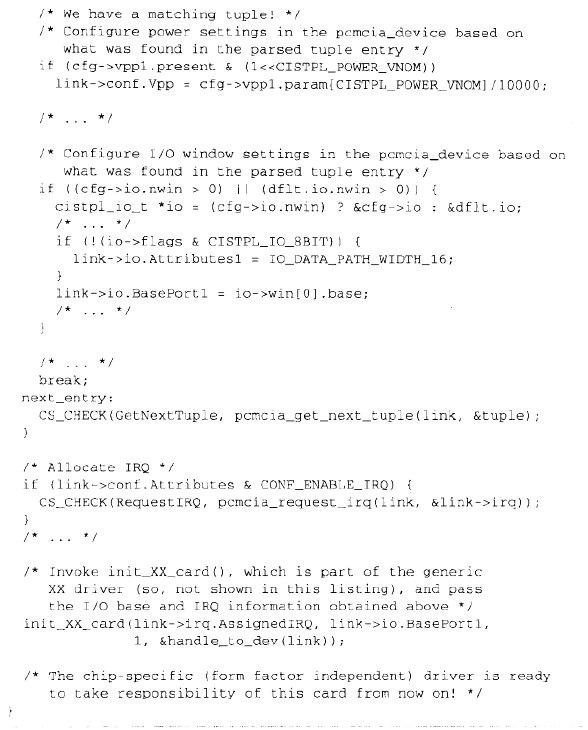

#### 将零件组装在一起

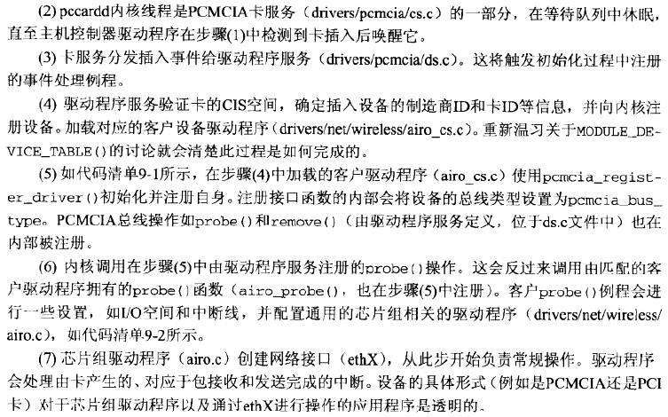

#### PCMCIA存储

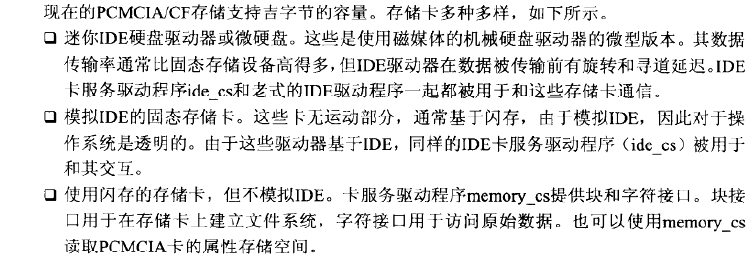

#### 串行PCMCIA

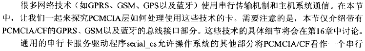

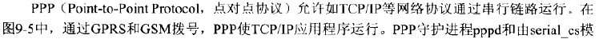

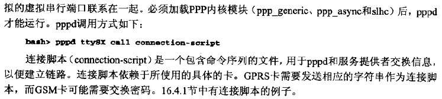

#### 调试

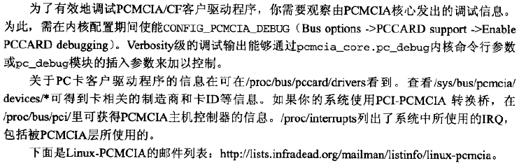

#### 查看源代码

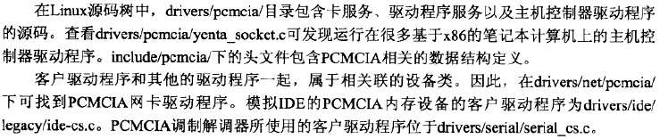

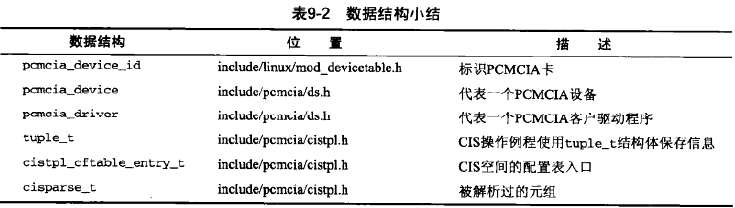

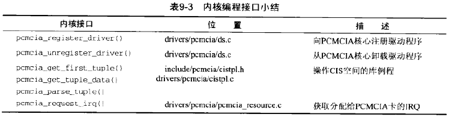

