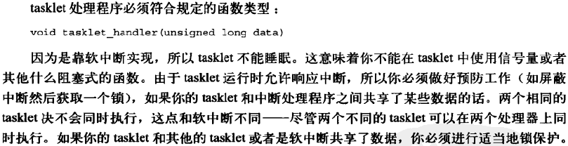
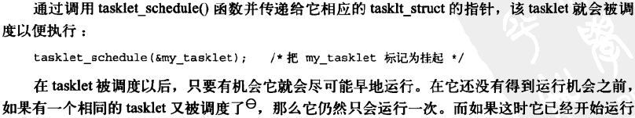
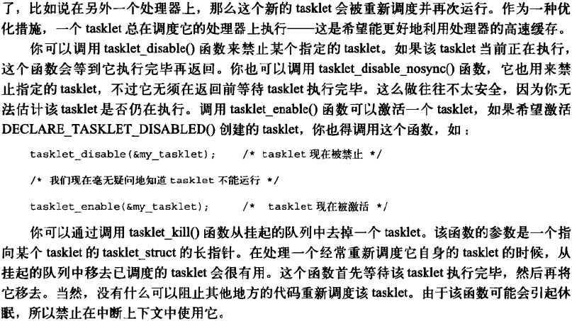
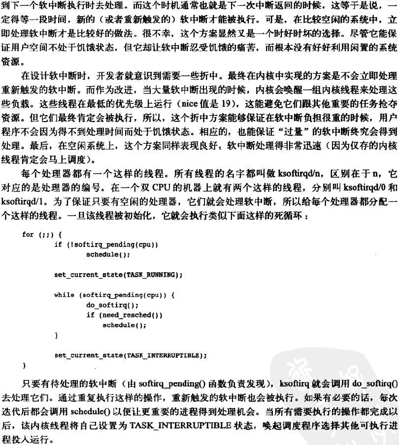
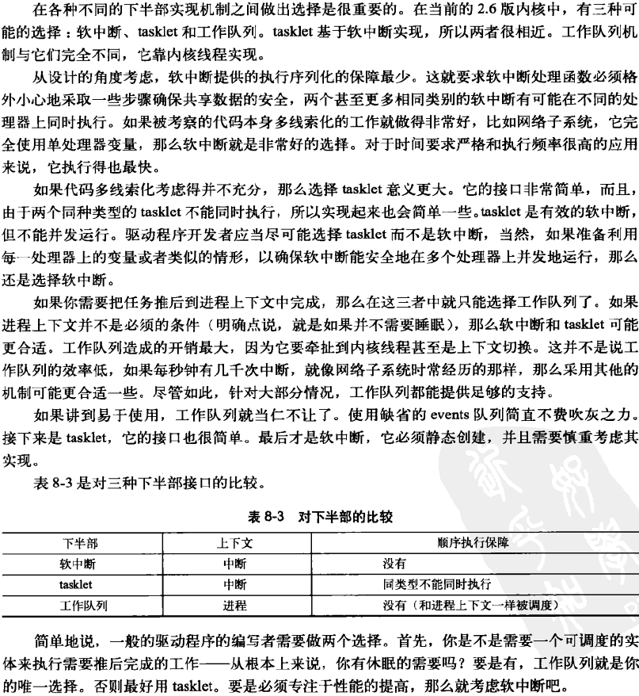

[toc]

#### 内核同步和互斥机制

​		访问共享资源的代码区域称作临界区，自旋锁（spinlock）和互斥体（mutex）是保护内核临界区的两种基本机制。

​		自旋锁确保在同时只有一个线程进入临界区，其他想进入临界区的线程必须不停地原地打转，直至第一个线程释放自旋锁，这里所说的线程不是内核线程，而是执行的线程。

```C
#include <linux/spinlock.h>
spinlock_t mylock = SPIN_LOCK_UNLOCKEN;

spin_lock(&mylock);

/* Critical Section code ... */

spin_unlock(&mylock);
```


​		与自旋锁不同的是，互斥体在进入一个被占用的临界区不会原地打转，而是使当前的线程进入睡眠状态。如果等待的时间较长，互斥体比自旋锁更合适，因为自旋锁会消耗CPU资源。多于2次进程切换时间都可被认为是长时间，一般使用互斥体。

```C
#include <linux/mutex.h>

static DEFINE_MUTEX(mymutex);

mutex_lock(&mymutex);

/* Critical Section code ... */

mutex_unlock(&mymutex);
```

总结：

​		（1）如果临界区需要睡眠，只能使用互斥体，因为在获得自旋锁后进行调度、抢占以及在等待队列上睡眠都是非法的。

​		（2）由于互斥体会在面临竞争的情况下将当前线程置于睡眠状态，因此，在中断处理函数中，只能使用自旋锁。

​		

​		**信号量**接口基本用法：

```C
#include <asm/semaphore.h>

static DECLARE_MUTEX(mysem);

down(&mysem);

/* Critical Section code ... */

up(&mysem);
```


​		**原子操作**作用于执行轻量级的、仅执行一次的操作，例如修改计数器、有条件的增加值、设置位等。原子操作可以确保操作的串行化，不再需要锁进行并发访问保护。原子操作的具体实现取决于体系架构。

​		文件位置：include/asm-xxx-arch/atomic.h


​		自旋锁的读写锁变体。**读自旋锁**：允许多个读线程同时进入临界区

```C
rwlock_t myrwlock = RW_LOCK_UNLOCKED;

read_lock(&myrwlock);
/* Critical Section code ... */
read_unlock(&myrwlock);
```

​		**写自旋锁**：如果一个写线程进入了临界区，那么其他的读和写都不允许进入

```C
rwlock_t myrwlock = RW_LOCK_UNLOCKED;

write_lock(&myrwlock);
/* Critical Section code ... */
write_unlock(&myrwlock);
```


​		**顺序锁（seqlock）**是一种支持写多于读的读写锁，在一个变量的写操作比读操作多得多的情况下非常有用。

​		**读-复制-更新（RCU）**机制用于提高读操作远多于写操作时的性能。


并发保护有四种情况：

​		（1）非抢占内核，单CPU情况下存在于进程上下文的临界区

​		（2）非抢占内核，单CPU情况下存在于进程和中断上下文的临界区

​		（3）抢占内核，单CPU情况下存在于进程和中断上下文的临界区

​		（4）抢占内核，SMP情况下存在于进程和中断上下文的临界区


#### 自旋锁


```C
DEFINE_SPINLOCK(mr_lock)
spinlock_t my_lock = SPIN_LOCK_UNLOCKED;//静态初始化
//或
void spin_lock_init(spinlock_t *lock);//动态初始化
```

```C
void spin_lock(spinlock_t *lock);
//在获取自旋锁之前，禁止中断
void spin_lock_irqsave(spinlock_t *lock, unsigned long flags);
void spin_lock_irq(spinlock_t *lock);
//禁止软件中断，但允许硬件中断
void spin_lock_bh(spinlock_t *lock)
```

对应的解锁函数如下：

```C
void spin_unlock(spinlock_t *lock);
void spin_unlock_irqrestore(spinlock_t *lock, unsigned long flags);
void spin_unlock_irq(spinlock_t *lock);
void spin_unlock_bh(spinlock_t *lock);
```

非阻塞自旋锁操作（成功返回非0,允许中断）

```C
int spin_trylock(spinlock_t *lock);
int spin_trylock_bh(spinlock_t *lock);
```


```C
extern spinlock_t lock;
// ...
spin_lock(&lock);
// do something
spin_unlock(&lock);
```

他能正常工作吗？答案是有可能。在某些情况下，这段代码可以正常工作，但想一想会不会发生这样的事：

```C
// in normal run level
extern spinlock_t lock;
// ...
spin_lock(&lock);
// do something
                                                     // interrupted by IRQ ...
                                                     // in IRQ
                                                     extern spinlock_t lock;
                                                     spin_lock(&lock);
```

我们在normal级别下获得了一个spinlock，正当我们想做什么的时候，我们被interrupt打断了，CPU转而执行interrupt level的代码，它也想获得这个spinlock，于是“死锁”发生了！解决方法如下：

```C
extern spinlock_t lock;
// ...
cli; // disable interrupt on current CPU
spin_lock(&lock);
// do something
spin_unlock(&lock);
sti; // enable interrupt on current CPU
```

在获得spinlock之前，我们先把当前CPU的中断禁止掉，然后获得一个lock;在释放lock之后再把中断打开。这样，我们就防止了死锁。事实上，Linux提供了一个更为快捷的方式来实现这个功能：

```C
extern spinlock_t lock;
// ...
spin_lock_irq(&lock);
// do something
spin_unlock_irq(&lock);
```

如果没有nested interrupt，这一切都很好。加上nested interrupt，我们再来看看这个例子：

```C
// code 1
extern spinlock_t lock1;
// ...
spin_lock_irq(&lock1);
// do something
spin_unlock_irq(&lock1);
 
// code 2
extern spinlock_t lock2;
// ...
spin_lock_irq(&lock2);
// do something
spin_unlock_irq(&lock2);
```

Code 1和code 2都可运行在interrupt下，我们很容易就可以想到这样的运行次序：

```C
Code 1                                               Code 2

extern spinlock_t lock1;
// ...
spin_lock_irq(&lock1); 
                                                     extern spinlock_t lock2;
                                                     // ...
                                                     spin_lock_irq(&lock2);
                                                     // do something 
                                                     spin_unlock_irq(&lock2);
// do something
spin_unlock_irq(&lock1); 
```

问题是在运行spin_unlock_irq(&lock2)后这个CPU的中断已经被打开，“死锁”的问题又会回到我们身边！
解决方法是我们在每次关闭中断前纪录当前中断的状态，然后恢复它而不是直接把中断打开。

```C
unsigned long flags;
local_irq_save(flags);
cli; // disable interrupt on current CPU
spin_lock(&lock);
// do something
spin_unlock(&lock);
local_irq_restore(flags);
```

Linux同样提供了更为简便的方式:

```C
unsigned long flags;
spin_lock_irqsave(&lock, flags);
// do something
spin_unlock_irqrestore(&lock, flags);
```

**总结**

1）被保护的共享资源只在进程上下文访问和软中断上下文访问
　　如果被保护的共享资源只在进程上下文访问和软中断上下文访问，那么当在进程上下文访问共享资源时，可能被软中断打断，从而可能进入软中断上下文来对被保护的共享资源访问，因此对于这种情况，对共享资源的访问必须使用spin_lock_bh和spin_unlock_bh来保护。（由于历史原因，后缀‘bh’成为对各种下半部的通称。其实spin_lock_bh本应叫作spin_lock_softirq才贴切）。
　　当然使用spin_lock_irq和spin_unlock_irq以及spin_lock_irqsave和spin_unlock_irqrestore也可以，它们失效了本地硬中断，失效硬中断隐式地也失效了软中断。但是使用spin_lock_bh和spin_unlock_bh是最恰当的，它比其他两个快。

2）被保护的共享资源只在进程上下文和tasklet或timer上下文访问
　　如果被保护的共享资源只在进程上下文和tasklet或timer上下文访问，那么同样应该使用spin_lock_bh和spin_unlock_bh来获得和释放锁的宏，因为tasklet和timer是用软中断实现的。

3）被保护的共享资源只在一个tasklet或timer上下文访问
　　如果被保护的共享资源只在一个tasklet或timer上下文访问，那么不需要任何自旋锁保护，因为同一个tasklet或timer只能在一个CPU上运行，即使是在SMP环境下也是如此。
　　实际上tasklet在调用tasklet_schedule标记其需要被调度时已经把该tasklet绑定到当前CPU，因此同一个tasklet决不可能同时在其他CPU上运行。timer也是在其被使用add_timer添加到timer队列中时已经被帮定到当前CPU，所以同一个timer绝不可能运行在其他CPU上。当然同一个tasklet有两个实例同时运行在同一个CPU就更不可能了。

4）被保护的共享资源只在两个或多个tasklet或timer上下文访问
　　如果被保护的共享资源只在两个或多个tasklet或timer上下文访问，那么对共享资源的访问仅需要用spin_lock和spin_unlock来保护，不必使用_bh版本，因为当tasklet或timer运行时，不可能有其他tasklet或timer在当前CPU上运行。

5）被保护的共享资源只在一个软中断（tasklet和timer除外）上下文访问
　　如果被保护的共享资源只在一个软中断（tasklet和timer除外）上下文访问，那么这个共享资源需要用spin_lock和spin_unlock来保护，因为同样的软中断可以同时在不同的CPU上运行。

6）被保护的共享资源在两个或多个软中断上下文访问
　　如果被保护的共享资源在两个或多个软中断上下文访问，那么这个共享资源当然更需要用spin_lock和spin_unlock来保护，不同的软中断能够同时在不同的CPU上运行。

7）被保护的共享资源在软中断（包括tasklet和timer）或进程上下文和硬中断上下文访问
　　如果被保护的共享资源在软中断（包括tasklet和timer）或进程上下文和硬中断上下文访问，那么在软中断或进程上下文访问期间，可能被硬中断打断，从而进入硬中断上下文对共享资源进行访问，因此，在进程或软中断上下文需要使用spin_lock_irq和spin_unlock_irq来保护对共享资源的访问。
　　而在中断处理句柄中使用什么版本，需依情况而定，如果只有一个中断处理句柄访问该共享资源，那么在中断处理句柄中仅需要spin_lock和spin_unlock来保护对共享资源的访问就可以了。因为在执行中断处理句柄期间，不可能被同一CPU上的软中断或进程打断。但是如果有不同的中断处理句柄访问该共享资源，那么需要在中断处理句柄中使用spin_lock_irq和spin_unlock_irq来保护对共享资源的访问。
　　在使用spin_lock_irq和spin_unlock_irq的情况下，完全可以用spin_lock_irqsave和spin_unlock_irqrestore取代，那具体应该使用哪一个也需要依情况而定。如果可以确信在对共享资源访问前中断是使能的，那么使用spin_lock_irq更好一些，因为它比spin_lock_irqsave要快一些。但是如果你不能确定是否中断使能，那么使用spin_lock_irqsave和spin_unlock_irqrestore更好，因为它将恢复访问共享资源前的中断标志而不是直接使能中断。
　　当然，有些情况下需要在访问共享资源时必须中断失效，而访问完后必须中断使能，这样的情形使用spin_lock_irq和spin_unlock_irq最好。

spin_lock用于阻止在不同CPU上的执行单元对共享资源的同时访问以及不同进程上下文互相抢占导致的对共享资源的非同步访问，而中断失效和软中断失效却是为了阻止在同一CPU上软中断或中断对共享资源的非同步访问


#### **互斥锁**


互斥锁 数组结构：struct mutex. 静态定义：

```C
DEFINE_MUTEX(name);
```

动态初始化：

```C
mutex_init(&mutex);
```

操作：

```C
mutex_lock(&mutex);
/* critical region ... */
mutex_unlock(&mutex);
mutex_trylock(struct mutex *)
mutex_is_locked (struct mutex *)
```

互斥锁有如下一些特性：

1. 每次只能有一个任务可以获得互斥锁。
2. 谁获得，谁释放，不能在一个上下文中获得锁，在另一个上下文中释放锁。
3. 不支持嵌套。
4. 进程在获得互斥量时不能退出。
5. 中断上下文中不能使用。
6. 只能使用以上的一些API操作互斥量。


#### **信号量**


1. 通用版信号量用于对一个或多个资源进行互斥访问。基本操作如下：

```C
void sema_init(struct semaphore *sem, int val);//信号量初始化函数
```

初始化：

```C
DEFINE_SEMAPHORE(name);//默认为1
```

在linux中， P函数称为down， V函数称为up。

```C
void down(struct semaphore *sem);//不可中断版本
int down_interruptible(struct semaphore *sem);//可中断版本
int down_trylock(struct semaphore *sem);//不等待版本， 立即返回，0表示成功。
```

一般情况下使用 `down_interruptible` 函数，它允许一个在信号量上等待的 用户空间进程被用户打断。不过在使用该函数时必须记住要检查它的返回 值,并做出相应的处理。该函数被中断时返回一个非零值。

```C
void up(struct semaphore *sem); //释放占用的信号量
```

2. 读写信号量 读/写信号量: `rw_semaphore` 说明：允许一个进程写，多个进程读 头文件：<linux/rwsem.h> 

初始化函数：

```C
void init_rwsem(struct rw_semaphore *sem);
```

相关操作：

```C
void down_read(struct rw_semaphore *sem);
Int down_read_trylock(struct rw_semaphore *sem);//非0表示成功
void up_read(struct rw_semaphore *sem);
void down_write(struct rw_semaphore *sem);
int down_write_trylock(struct rw_semaphore *sem);
void up_write(struct rw_semaphore *sem);
void downgrade_write(struct rw_semaphore *sem);
```


#### **内核同步机制-原子操作**


整数原子操作 数据类型为：

```C
typedef struct {
  volatile int counter;
} atomic_t;
```

相关操作如下：

```C
void atomic_set(atomic_t *v, int i);
atomic_t v = ATOMIC_INIT(0);//设置原子变量v的值为整数i
int atomic_read(atomic_t *v);//返回原子变量当前的值
void atomic_add(int i, atomic_t *v);//将i加到原子变量上
void atomic_sub(int i, atomic_t *v)//从原子变量的值中减去i
void atomic_inc(atomic_t *v);//增加原子变量的值
void atomic_dec(atomic_t *v);//减少原子变量的值
```

执行指定的操作并测试结果； 运算后，如果原子值为0，则返回值为true； 否则，返回false。

```C
int atomic_inc_and_test(atomic_t *v);
int atomic_dec_and_test(atomic_t *v);
int atomic_sub_and_test(int i, atomic_t *v);
```

将整数变量i添加到v。如果结果为负，则返回值为true，否则为false

```C
int atomic_add_negative(int i, atomic_t *v);
```

行为与atomic_add及其他函数一样，不同之处在于它们将原子变量的新值返回给调用者

```C
int atomic_add_return(int i, atomic_t *v);
int atomic_sub_return(int i, atomic_t *v);
int atomic_inc_return(atomic_t *v);
int atomic_dec_return(atomic_t *v);
```

原子位操作

在地址指向的数据项中设置位数nr。

```C
void set_bit(nr, void *addr);
```

清除存在于addr的无符号长数据中的指定位。

```C
void clear_bit(nr, void *addr);
void change_bit(nr, void *addr); // Toggles the bit.
```

此功能是唯一不需要原子操作的位操作；只是返回该位的当前值。

```C
test_bit(nr, void *addr);  
```

原子上的行为与前面列出的一样，不同之处在于它们还返回该位的先前值。


内核也提供了一套非原子位操作函数，函数名就是原子版函数前面加两下划线。

```C
int test_and_set_bit(nr, void *addr);
int test_and_clear_bit(nr, void *addr);
int test_and_change_bit(nr, void *addr);
```


#### **读/写自旋锁**

​		读/写自旋锁： `rwlock_t` 头文件：<linux/spinlock.h> 说明：读写自旋锁是一种比自旋锁粒度更小的锁机制，它保留了“自旋”的 概念，但是在写操作方面，只能最多有一个写进程，在读操作方面，同时 可以有多个读执行单元。当然，读写操作不能同时进行。

```C
rwlock_t my_rwlock = RW_LOCK_UNLOCKED; /* Static way */
rwlock_t my_rwlock;
rwlock_init(&my_rwlock);  /* Dynamic way */
```

读

```C
void read_lock(rwlock_t *lock);
void read_lock_irqsave(rwlock_t *lock, unsigned long flags);
void read_lock_irq(rwlock_t *lock);
void read_lock_bh(rwlock_t *lock);
void read_unlock(rwlock_t *lock);
void read_unlock_irqrestore(rwlock_t *lock, unsigned long flags);
void read_unlock_irq(rwlock_t *lock);
void read_unlock_bh(rwlock_t *lock);
```

写

```C
void write_lock(rwlock_t *lock);
void write_lock_irqsave(rwlock_t *lock, unsigned long flags);
void write_lock_irq(rwlock_t *lock);
void write_lock_bh(rwlock_t *lock);
int write_trylock(rwlock_t *lock);
void write_unlock(rwlock_t *lock);
void write_unlock_irqrestore(rwlock_t *lock, unsigned long flags);
void write_unlock_irq(rwlock_t *lock);
void write_unlock_bh(rwlock_t *lock);
```


#### **顺序锁seqlocks** 

​		对读写锁的一种优化。使用顺序锁，读执行单元绝不会被写执行单元 阻塞，也就是说，读执行单元可以在写执行单元对被顺序锁保护的共享资 源进行写操作时仍然可以继续读，而不必等待写执行单元完成操作，写操 作也不需要等待所有读执行单元完成读操作才去进行写操作。用于受保护 的资源很小，简单且经常访问，适用于写操作很少但必须很快的场景。不 能保护有指针成员变量的数据结构。

头文件：<linux/seqlock.h>

示例代码：

```C
seqlock_t lock1 = SEQLOCK_UNLOCKED;
seqlock_t lock2;
seqlock_init(&lock2);
unsigned int seq;
do {
  seq = read_seqbegin(&the_lock);
  /* Do what you need to do */
 } while (read_seqretry(&the_lock, seq));
```

在中断处理函数中使用seqlock，则应当使用IRQ安全的版本：

```C
unsigned int read_seqbegin_irqsave(seqlock_t *lock, unsigned long flags);
int read_seqretry_irqrestore(seqlock_t *lock, unsigned int seq, unsigned long flags);
```

获取一个写保护：

```C
void write_seqlock(seqlock_t *lock);
```

获取一个写保护：

```C
void write_seqlock(seqlock_t *lock);
```

释放：

```C
void write_sequnlock(seqlock_t *lock);
```

类似函数:

```C
void write_seqlock_irqsave(seqlock_t *lock, unsigned long flags);
void write_seqlock_irq(seqlock_t *lock);
void write_seqlock_bh(seqlock_t *lock);
void write_sequnlock_irqrestore(seqlock_t *lock, unsigned long flags);
void write_sequnlock_irq(seqlock_t *lock);
void write_sequnlock_bh(seqlock_t *lock);
```


#### 内核线程同步-signal

**1、基本概念** 

​		软中断信号（signal，又简称为信号）用来通知进程发生了异步事件。进程之间可以互相通过系统调用kill发送软中断信号。内核也可以因为内部事件而给进程发送信号，通知进程发生了某个事件。注意，信号只是用来通知某进程发生了什么事件，并不给该进程传递任何数据。

​		收到信号的进程对各种信号有不同的处理方法。处理方法可以分为三类：

​		第一种是类似中断的处理程序，对于需要处理的信号，进程可以指定处理函数，由该函数来处理。

​		第二种方法是，忽略某个信号，对该信号不做任何处理，就象未发生过一样。

​		第三种方法是，对该信号的处理保留系统的默认值，这种缺省操作，对大部分的信 号的缺省操作是使得进程终止。进程通过系统调用signal来指定进程对某个信号的处理行为。 

  ```C
 * The possible effects an unblocked signal set to SIG_DFL can have are:
 *   ignore	- Nothing Happens
 *   terminate	- kill the process, i.e. all threads in the group,
 * 		  similar to exit_group.  The group leader (only) reports
 *		  WIFSIGNALED status to its parent.
 *   coredump	- write a core dump file describing all threads using
 *		  the same mm and then kill all those threads
 *   stop 	- stop all the threads in the group, i.e. TASK_STOPPED state
 *
 * SIGKILL and SIGSTOP cannot be caught, blocked, or ignored.
 * Other signals when not blocked and set to SIG_DFL behaves as follows.
 * The job control signals also have other special effects.
 *
 *	+--------------------+------------------+
 *	|  POSIX signal      |  default action  |
 *	+--------------------+------------------+
 *	|  SIGHUP            |  terminate	|
 *	|  SIGINT            |	terminate	|
 *	|  SIGQUIT           |	coredump 	|
 *	|  SIGILL            |	coredump 	|
 *	|  SIGTRAP           |	coredump 	|
 *	|  SIGABRT/SIGIOT    |	coredump 	|
 *	|  SIGBUS            |	coredump 	|
 *	|  SIGFPE            |	coredump 	|
 *	|  SIGKILL           |	terminate(+)	|
 *	|  SIGUSR1           |	terminate	|
 *	|  SIGSEGV           |	coredump 	|
 *	|  SIGUSR2           |	terminate	|
 *	|  SIGPIPE           |	terminate	|
 *	|  SIGALRM           |	terminate	|
 *	|  SIGTERM           |	terminate	|
 *	|  SIGCHLD           |	ignore   	|
 *	|  SIGCONT           |	ignore(*)	|
 *	|  SIGSTOP           |	stop(*)(+)  	|
 *	|  SIGTSTP           |	stop(*)  	|
 *	|  SIGTTIN           |	stop(*)  	|
 *	|  SIGTTOU           |	stop(*)  	|
 *	|  SIGURG            |	ignore   	|
 *	|  SIGXCPU           |	coredump 	|
 *	|  SIGXFSZ           |	coredump 	|
 *	|  SIGVTALRM         |	terminate	|
 *	|  SIGPROF           |	terminate	|
 *	|  SIGPOLL/SIGIO     |	terminate	|
 *	|  SIGSYS/SIGUNUSED  |	coredump 	|
 *	|  SIGSTKFLT         |	terminate	|
 *	|  SIGWINCH          |	ignore   	|
 *	|  SIGPWR            |	terminate	|
 *	|  SIGRTMIN-SIGRTMAX |	terminate       |
 *	+--------------------+------------------+
 *	|  non-POSIX signal  |  default action  |
 *	+--------------------+------------------+
 *	|  SIGEMT            |  coredump	|
 *	+--------------------+------------------+
 *
 * (+) For SIGKILL and SIGSTOP the action is "always", not just "default".
 * (*) Special job control effects:
  ```

1.系统调用signal用来设定某个信号的处理方法。该调用声明的格式如下： 
void (*signal(int signum, void (*handler)(int)))(int); 
在使用该调用的进程中加入以下头文件： 
\#include <signal.h> 


2.系统调用kill用来向进程发送一个信号。该调用声明的格式如下： 
int kill(pid_t pid, int sig); 
在使用该调用的进程中加入以下头文件： 
\#include <sys/types.h> 
\#include <signal.h> 


3.系统调用pause的作用是等待一个信号。该调用的声明格式如下： 
int pause(void); 
在使用该调用的进程中加入以下头文件： 
\#include <unistd.h> 


4.alarm和 setitimer系统调用 

系统调用alarm的功能是设置一个定时器，当定时器计时到达时，将发出一个信号给进程。该调用的声明格式如下： 
unsigned int alarm(unsigned int seconds); 
在使用该调用的进程中加入以下头文件： 
\#include <unistd.h> 


5.signal_pending 

在Linux内核源码**include/linux/sched.h**文件里，有如下函数定义：

> static inline int signal_pending(struct task_struct *p)
> {
> return unlikely(test_tsk_thread_flag(p,TIF_SIGPENDING));
> }

​		检查进程是否有信号处理，返回不为0表示有信号需要处理。上面的参数我们一般是判断当前线程，故而会用到**include/asm-generic/current.h**里的current宏，定义如下：

> \#define current get_current()


6.allow_signal 

在Linux内核源码**kernel/exit.c**有该函数的实现，而在**include/linux/sched.h**文件里有如下声明：

> extern int allow_signal(int);

​		其参数是SIGKILL等宏，在**include/uapi/asm-generic/signal.h**文件中有相应的宏定义。 内核线程允许接收信号后，还需要确保该线程是可打断的，需要用到如下宏： 

（1）set_current_state 

在**include/linux/sched.h**文件中有如下宏定义：

> \#define set_current_state(state_value) \
> set_mb(current->state, (state_value))

（2）TASK_INTERRUPTIBLE 

在同一头文件中如下宏定义：

> \#define TASK_INTERRUPTIBLE 1

上面两个宏结合使用用于配置当前线程的状态是可被中断的 set_current_state(TASK_INTERRUPTIBLE);


#### **内核同步机制-完成量**

​		内核中的许多部分初始化某些活动为单独的执行线程，然后等待这些线程完成。 完成接口是一种有效并简单的方式来实现这样的代码模式。

对象创建

```C
DECLARE_COMPLETION(my_completion);
//或
struct completion my_completion;/* ... */
init_completion(&my_completion);
```

操作

```C
void wait_for_completion(struct completion *c); //执行一个不可中断的等待
void complete(struct completion *c);//唤醒一个线程
void complete_all(struct completion *c);//唤醒多个线程i
bool completion_done(struct completion *x); //当前是否有等待者
```

​		当调用 complete时，可重用completion对象，当调用 `complete_all` 时，需要重 新初始化后才能重用complete对象，可使用宏 `INIT_COMPLETION=(struct completion c)`

```C
/***********************************************************************/
//完成接口
//内核中的许多部分初始化某些活动为单独的执行线程，然后等待这些线程完成。
//完成接口是一种有效并简单的方式来实现这样的代码模式。
/***********************************************************************/

#include <linux/completion.h>
#include <linux/module.h>
#include <linux/sched.h>
#include <linux/init.h>


static DECLARE_COMPLETION(my_thread_exit);      /* Completion */
static DECLARE_WAIT_QUEUE_HEAD(my_thread_wait); /* Wait Queue */
int pink_slip = 0;                              /* Exit Flag */

/* Helper thread */
static int
my_thread(void *unused)
{
  DECLARE_WAITQUEUE(wait, current);

  daemonize("my_thread");
  add_wait_queue(&my_thread_wait, &wait);

  while (1) {
    /* Relinquish processor until event occurs */
    set_current_state(TASK_INTERRUPTIBLE);
    schedule();
    /* Control gets here when the thread is woken
       up from the my_thread_wait wait queue */

    /* Quit if let go */
    if (pink_slip) {
      break;
    }
    /* Do the real work */
    /* ... */

  }

  /* Bail out of the wait queue */
  __set_current_state(TASK_RUNNING);
  remove_wait_queue(&my_thread_wait, &wait);

  /* Atomically signal completion and exit */
  complete_and_exit(&my_thread_exit, 0);
}

/* Module Initialization */
static int __init
my_init(void)
{
  /* ... */

  /* Kick start the thread */
  kernel_thread(my_thread, NULL,
                CLONE_FS | CLONE_FILES | CLONE_SIGHAND | SIGCHLD);

  /* ... */
  return 0;
}

/* Module Release */
static void __exit
my_release(void)
{
  /* ... */
  pink_slip = 1;                        /* my_thread must go */
  wake_up(&my_thread_wait);             /* Activate my_thread */
  wait_for_completion(&my_thread_exit); /* Wait until my_thread
                                           quits */
  /* ... */
}

module_init(my_init);
module_exit(my_release);
```


**内核错误码处理**

include/linux/err.h

| 宏名称      | 意义                       |
| :---------- | :------------------------- |
| `IS_ERR()`  | 返回值是否是错误码         |
| `PTR_ERR()` | 将返回值转化为错误码       |
| `ERR_PTR()` | 根据错误码返回对错误的描述 |


#### 内核定时器

**长延时**


**短延时**


**时间戳计数器**


**实时钟**


#### 内存分配


kmalloc()用于从ZONE_NORMAL区域返回连续内存的内存分配函数，

（1）GFP_KERNEL，被进程上下文用来获取内存。如果指定了该标志，kmalloc()将被允许睡眠，以等待其他页被释放。

（2）GFP_ATOMIC，被中断上下文用来获取内存。在这种模式下，kmalloc()不允许进行睡眠等待，以获得空闲页，因此GFP_ATOMIC分配成功的可能性比用GFP_KERNEL低。


#### 内核线程


​		进程拥有自己的地址空间，所以每个进程都有自己的页表。而线程却没有，只能和其它线程共享某一个地址空间和同一份页表。这个区别的 **根本原因** 是，在进程/线程创建时，因是否拷贝当前进程的地址空间还是共享当前进程的地址空间，而使得指定的参数不同而导致的。

​		每个进程或线程都有三个数据结构，分别是 **struct thread_info**，**struct task_struct** 和 **内核栈**。虽然线程与主线程共享地址空间，但是线程也是有自己独立的内核栈的。


​		内核线程的进程描述符task_struct中包含两个跟进程地址空间相关的字段mm，active_mm。对于普通用户进程来说，mm指向虚拟地址空间的用户空间部分，而对于内核线程，mm为NULL。

​		这为优化提供了一些余地, 可遵循所谓的惰性TLB处理(lazy TLB handing)。active_mm主要用于优化，由于内核线程不与任何特定的用户层进程相关，内核并不需要倒换虚拟地址空间的用户层部分，保留旧设置即可。由于内核线程之前可能是任何用户层进程在执行，故用户空间部分的内容本质上是随机的，内核线程决不能修改其内容，故将mm设置为NULL，同时如果切换出去的是用户进程，内核将原来进程的mm存放在新内核线程的active_mm中，因为某些时候内核必须知道用户空间当前包含了什么。

> 为什么没有mm指针的进程称为惰性TLB进程?
>
> 假如内核线程之后运行的进程与之前是同一个, 在这种情况下, 内核并不需要修改用户空间地址表。地址转换后备缓冲器(即TLB)中的信息仍然有效。只有在内核线程之后, 执行的进程是与此前不同的用户层进程时, 才需要切换(并对应清除TLB数据)。

内核线程与普通进程有一些本质的区别

* 内核线程能够访问内核中数据，调用内核函数，而普通进程只有通过系统调用才能执行内核中的函数；

* 内核线程只运行在内核态，而普通进程既可以运行在用户态，也可以运行在内核态；

* 因为内核线程指只运行在内核态，因此，它只能使用大于PAGE_OFFSET（3G）的地址空间。另一方面，不管在用户态还是内核态，普通进程可以使用4GB的地址空间。


创建内核线程的接口：

kernel_thread创建出的线程的父进程是init，不能在模块中使用此接口，因为没有EXPORT_SYSMBOL。

kthread_create()创建出的新线程的父进程是kthreadd，可以在模块中使用，在kthread_create创建出的线程也对其上下文环境也进行了清理。线程创建后，不会马上运行，而是需要将kthread_create() 返回的task_struct指针传给wake_up_process()，然后通过此函数运行线程。

kthread_run()=kthread_create()+wake_up_process()


#### **队列**

​		内核中通用队列的实现称为kfifo，其实现文件位于kernel/kfifo.c中。 本部分讨论的API接口是基于2.6.33的。Linux的kfifo工作方式与其他队列一 样，提供两个主要的操作：enqueue()和dequeue()。kfifo对象维护了两个偏 移量：入口偏移量和出口偏移量。入口偏移量是下次进队发生的位置，出口偏 移量是出队发生的位置。出口偏移量问题小于或等于入口偏移量。enqueue操 作从入口偏移量处开始，将数据拷贝到队列中，操作完成后，入口偏移量相应 的增加（拷进的数据长度）。dequeue操作从出口偏移量处开始，将数据拷贝 出队列，操作完成后，出口偏移量相应地增加（拷出的数据长度）。

- 创建一个队列

    ```C
    int kfifo_alloc(struct kfifo *fifo, unsigned int size, gfp_t gfp_mask);
    ```

    该函数创建和初始化一个大小为size字节的队列。 例子：

    ```C
    struct kfifo fifo;
    int ret;
    ret = kfifo_alloc(&kifo, PAGE_SIZE, GFP_KERNEL);
    if (ret)
      return ret;
    ```

- 自建队列函数

    ```C
    int kfifo_alloc(struct kfifo *fifo, unsigned int size, gfp_t gfp_mask);
    ```

- 静态定义一个队列

    ```C
    DECLARE_KFIFO(name, size);
    INIT_KFIFO(name);
    ```

    其中，队列的大小必须是2的指数。

- 入队

    ```C
    unsigned int kfifo_in(struct kfifo *fifo, const void *from, unsigned int len);
    ```

- 出队

    ```C
    unsigned int kfifo_out(struct kfifo *fifo, void *to, unsigned int len);
    unsigned int kfifo_out_peek(struct kfifo *fifo, void *to, unsigned int len,
                                    　　unsigned offset);
    ```

- 获取队列的大小

    ```C
    static inline unsigned int kfifo_size(struct kfifo *fifo);
    //该函数用于获取用于存储kfifo队列的缓冲区的总大小。
    static inline unsigned int kfifo_len(struct kfifo *fifo);
    //该函数用于获取进入kfifo队列的字节数。
    static inline unsigned int kfifo_avail(struct kfifo *fifo);
    //队列中可用于写入的剩余缓冲区的大小。
    static inline int kfifo_is_empty(struct kfifo *fifo);
    static inline int kfifo_is_full(struct kfifo *fifo);
    //上述两个函数分别用于判断队列是否为空或满。
    ```

- 重置和销毁队列

    ```C
    static inline void kfifo_reset(struct kfifo *fifo);
    ```

- 重置一个队列

    ```C
    void kfifo_free(struct kfifo *fifo);
    ```

    ​		释放一个kfifo，与 `kfifo_alloc()` 对应。 如果创建kfifo的时候使用的是 `kfifo_init()` 函数，那么提供相应的函 数来释放缓冲区，而不是用户 `kfifo_free()` 。

    


#### 内核组件-等待队列

​		在Linux驱动程序中，可以使用等待队列(wait queue)来实现阻塞进程的唤醒。wait queue很早就作为一种基本的功能单位出现在Linux内核里了，它以队列位基础数据结构，与进程调度机制紧密结合，能够用于实现内核中异步事件通知机制。等待队列可以用来同步对系统资源的访问。(信号量在内核中也依赖等待队列来实现).

  Linux-2.6提供如下关于等待队列的操作:
  (1) 定义"等待队列头"
    `wait_queue_head_t my_queue;`

  (2) 初始化"等待队列头"
    `init_waitqueue_head(&my_queue);`
    定义和初始化的快捷方式:
    `DECLARE_WAIT_QUEUE_HEAD(my_queue);` 

  (3) 定义等待队列
    `DECLARE_WAITQUEUE(name, tsk);`
    定义并初始化一个名为name的等待队列(wait_queue_t);

  (4) 添加/移除等待队列
    `void fastcall add_wait_queue(wait_queue_head_t *q, wait_queue_t *wait);`
    `void fastcall remove_wait_queue(wait_queue_head_t *q, wait_queue_t *wait);`
    add_wait_queue()用于将等待队列wait添加到等待队列头q指向的等待队列链表中，而remove_wait_queue()用于将等待队列wait从附属的等待队列头q指向的等待队列链表中移除。

  (5) 等待事件
   `wait_event(queue, condition);`
   `wait_event_interruptible(queue, condition);`
   `wait_event_timeout(queue, condition, timeout);`
   `wait_event_interruptible_timeout(queue, condition, timeout);`
   等待第一个参数queue作为等待队列头的等待队列被唤醒，而且第二个参数condition必须满足，否则阻塞。wait_event()和wait_event_interruptible()的区别在于后者可以被信号打断，而前者不能。加上timeout后的宏意味着阻塞等待的超时时间，以jiffy为单位，在第三个参数的timeout到达时，不论condition是否满足，均返回。

  (6) 唤醒队列
    `void wake_up(wait_queue_head_t *queue);`
    `void wake_up_interruptible(wait_queue_head_t *queue);`
    上述操作会唤醒以queue作为等待队列头的所有等待队列对应的进程。
    wake_up()        <--->  wait_event()
                     wait_event_timeout()
    wake_up_interruptible() <--->  wait_event_interruptible()  
                     wait_event_interruptible_timeout()

​    wake_up()可以唤醒处于TASK_INTERRUPTIBLE和TASK_UNINTERRUPTIBLE的进程
​    wake_up_interruptble()只能唤醒处于TASK_INTERRUPTIBLE的进程。

  (7) 在等待队列上睡眠
    `sleep_on(wait_queue_head_t *q);`
    `interruptible_sleep_on(wait_queue_head_t *q);`

​    sleep_on()函数的作用就是将当前进程的状态置成TASK_UNINTERRUPTIBLE，定义一个等待队列，并把它添加到等待队列头q，直到支援获得，q引导的等待队列被唤醒。
​    interruptible_sleep_on()与sleep_on()函数类似，其作用是将目前进程的状态置成TASK_INTERRUPTIBLE，并定义一个等待队列，之后把它附属到等待队列头q，直到资源可获得，q引导的等待队列被唤醒或者进程收到信号。 

​    sleep_on()        <--->  wake_up() 
​    interruptible_sleep_on() <--->  wake_up_interruptible()


#### 工作队列


​		工作队列是一种不同于软中断和微线程的一种下半部延迟机制。工作队列将工作延迟到一个内核线程中执行，它运行在进程上下文中，它是可调度的，并且可以休眠。通常，如果延迟的工作中需要休眠，就使用工作队列，否则使用软中断或微线程。由于内核开发者反对创建一个新的内核线程，因此，应当尽量使用工作队列，它其实是事先创建了一个内核线程。

**工作队列的实现**

​		工作队列实际上一种创建内核线程以处理从其他地方入队的任务的接口。这些内核线程称为工作者线程。你可以创建一个特殊的工作者线程来处理延迟工作，然而，工作队列为我们提供了一个默认的工作者线程。在大多数情况下，直接使用该默认工作者线程就可以了。默认的工作都线程称为events/n，其中n为处理器的编号。

**代表线程的数据结构**

```C
struct workqueue_struct { 
　　struct cpu_workqueue_struct cpu_wq[NR_CPUS]; 
　　struct list_head list; 
　　const char *name; 
　　int singlethread; 
　　int freezeable; 
　　int rt; 
};
```

每个处理器对应一个 `struct cpu_workqueue_struct` 的数据结构。

```C
struct cpu_workqueue_struct {   
　　spinlock_t lock;    /* lock protecting this structure */ 
　　struct list_head worklist;  /* list of work */ 
　　wait_queue_head_t more_work;        

        struct work_struct *current_struct; 
        struct workqueue_struct *wq; /* associated workqueue_struct */ 
        task_t *thread;         /* associated thread */ 
};
```

**代表工作的数据结构**

```C
struct work_struct { 
　　　atomic_long_t data; 
　　　struct list_head entry; 
　　　work_func_t func; 
};
```

工作者线程的核心代码如下：

```C
for (;;) { 
　　prepare_to_wait(&cwq->more_work, &wait, TASK_INTERRUPTIBLE); 
　　if (list_empty(&cwq->worklist)) 
　　　　schedule(); 
　　finish_wait(&cwq->more_work, &wait); 
　　run_workqueue(cwq); 
}
```

在函数 `run_workqueue（）` ，执行实际的延迟工作：

```C
while (!list_empty(&cwq->worklist)) { 
　　struct work_struct *work; 
　　work_func_t f; 
　　void *data; 
　　work = list_entry(cwq->worklist.next, struct work_struct, entry); 
　　f = work->func; 
　　list_del_init(cwq->worklist.next); 
　　work_clear_pending(work); 
　　f(work); 
}
```

**工作队列相关数据结构的关系**


​		最上层的工作者线程，可能有多个类型。每个处理器上都有每一种类型的工作者 线程。内核代码可以根据需要创建工作者线程。默认情况下，工作者线程是 events。每个工作者线程由结构 `cpu_workqueue_struct` 来表示。结构`workqueue_struct` 代表每个类型的所有工作者线程。例如，假设除了默认的 events类型的工作者线程外，还创建了一个falcon类型的工作者线程。假设计算 机有4个处理器，那么有4个events线程（因而，有4个 `cpu_workqueue_struct` 结构） 和4个falcon线程（因而，有另外4个 `cpu_workqueue_struct` 结构）。有2个 `workqueue_struct` ，分别对应events类型和falcon类型。

**使用默认的工作队列**

创建工作队列

1. 静态方式：

    ```
    DECLARE_WORK(name, void (*func)(void *), void *data);
    ```

2. 动态方式:

    ```
    INIT_WORK(struct work_struct *work, void (*func)(void *), void *data);
    ```

3. 工作队列处理函数

    ```
    void work_handler(void *data)
    ```

4. 调度工作队列：

    ```
    schedule_work(&work)或schedule_delayed_work(&work, delay);
    ```

5. Flush工作队列:

    ```
    void flush_scheduled_work(void);
    ```

该函数不能取消任何延迟的工作，即被 `schedule_delayed_work（）` 调度的工作。 为了取消一个延迟的工作，调用：

```
int cancel_delayed_work(struct work_struct *work);
```

**创建一个新的工作队列**

```
struct workqueue_struct *create_workqueue(const char *name);
```

name为工作队列的名称，如默认的工作队列名称为events，如下所示：

```
struct workqueue_struct *keventd_wq;
keventd_wq = create_workqueue(“events”);
```

它将为每个处理器创建一个工作者线程，并使之处于就绪状态。

调度工作队列

```
int queue_work(struct workqueue_struct *wq, struct work_struct *work)
int queue_delayed_work(struct workqueue_struct *wq, struct work_struct *work, unsigned long delay)
```

flush一个工作队列

```
flush_workqueue(struct workqueue_struct *wq)
```

总结如下：

内核中提供了两个辅助接口来使用工作队列：

```
workqueue_struct 和 work_struct。
```

使用步骤如下：

1. 创建与一个或多个内核线程关联的工作队列(或一个 `workqueue_struct`结构体)。 为了创建一个服务于某个工作队列的内核线程，使用`create_singlethread_workqueue()` 。创建系统中的一个每-CPU工作者线程， 使用 `create_workqueue()` 。 内核也提供了默认的每-CPU工作者线程供你直接 使用(event/n， 其中n是CPU号)。
2. 创建一个工作单元(或一个 `work_struct` 变量)。一个 `work_struct` 变 量使用 `INIT_WORK()` 进行初始化。
3. 提交工作单元到工作队列中。使用 `queue_work()` 将一个工作单元提交到一个专 门的工作队列中。使用 `schedule_work()` 将一个工作单元提交给默认的内核工 作者线程。

工作队列使用模板

```C
//Using Workqueue to Offload Work from Interrupt Handlers
struct roller_device_struct{
  /* … */
  struct work_struct wklt;
  /* … */
};

void __init roller_init()
{
  struct roller_device_struct *dev_struct;
  /* … */
  /* Initialize tasklet */
  INIT_WORK (&dev_struct-> wklt, roller_analyze, dev);
}

/* The bottom half */
void
roller_analyze()
{
  /* … */
}

/* The interrupt handler */
static irqreturn_t
roller_interrupt(int irq, void *dev_id)
{
  /* … */
  /* Mark workqueue as pending */
  schedule_work(&dev_struct->wklt);
  return IRQ_HANDLED;
}
```


#### Linux进程的睡眠和唤醒

**1 Linux进程的睡眠和唤醒** 
		在Linux中，仅等待CPU时间的进程称为就绪进程，它们被放置在一个运行队列中，一个就绪进程的状态标志位为TASK_RUNNING。一旦一个运行中的进程时间片用完， Linux内核的调度器会剥夺这个进程对CPU的控制权，并且从运行队列中选择一个合适的进程投入运行。 
		当然，一个进程也可以主动释放CPU的控制权。函数schedule()是一个调度函数，它可以被一个进程主动调用，从而调度其它进程占用CPU。一旦这个主动放弃CPU的进程被重新调度占用CPU，那么它将从上次停止执行的位置开始执行，也就是说它将从调用schedule()的下一行代码处开始执行。 
		有时候，进程需要等待直到某个特定的事件发生，例如设备初始化完成、I/O 操作完成或定时器到时等。在这种情况下，进程则必须从运行队列移出，加入到一个等待队列中，这个时候进程就进入了睡眠状态。 
		Linux 中的**进程睡眠**状态有两种：一种是可中断的睡眠状态，其状态标志位TASK_INTERRUPTIBLE；另一种是不可中断的睡眠状态，其状态标志位为TASK_UNINTERRUPTIBLE。可中断的睡眠状态的进程会睡眠直到某个条件变为真，比如说产生一个硬件中断、释放进程正在等待的系统资源或是传递一个信号都可以是唤醒进程的条件。不可中断睡眠状态与可中断睡眠状态类似，但是它有一个例外，那就是把信号传递到这种睡眠状态的进程不能改变它的状态，也就是说它不响应信号的唤醒。不可中断睡眠状态一般较少用到，但在一些特定情况下这种状态还是很有用的，比如说：进程必须等待，不能被中断，直到某个特定的事件发生。 
		在现代的Linux操作系统中，进程一般都是用调用schedule()的方法进入睡眠状态的，下面的代码演示了如何让正在运行的进程进入睡眠状态。 

```C
sleeping_task = current; 
set_current_state(TASK_INTERRUPTIBLE); 
schedule(); 
func1();  
/* Rest of the code ... */ 
```

​		在第一个语句中，程序存储了一份进程结构指针sleeping_task，current 是一个宏，它指向正在执行的进程结构。set_current_state()将该进程的状态从执行状态TASK_RUNNING 变成睡眠状态TASK_INTERRUPTIBLE。如果schedule()是被一个状态为TASK_RUNNING的进程调度，那么schedule()将调度另外一个进程占用CPU；如果schedule()是被一个状态为TASK_INTERRUPTIBLE或TASK_UNINTERRUPTIBLE的进程调度，那么还有一个附加的步骤将被执行：当前执行的进程在另外一个进程被调度之前会被从运行队列中移出，这将导致正在运行的那个进程进入睡眠，因为它已经不在运行队列中了。 
​		我们可以使用下面的这个函数将刚才那个进入睡眠的进程唤醒。 
wake_up_process(sleeping_task); 
​		在调用了wake_up_process()以后，这个睡眠进程的状态会被设置为TASK_RUNNING，而且调度器会把它加入到运行队列中去。当然，这个进程只有在下次被调度器调度到的时候才能真正地投入运行。

**2 无效唤醒** 
		几乎在所有的情况下，进程都会在检查了某些条件之后，发现条件不满足才进入睡眠。可是有的时候进程却会在判定条件为真后开始睡眠，如果这样的话进程就会无限期地休眠下去，这就是所谓的无效唤醒问题。在操作系统中，当多个进程都企图对共享数据进行某种处理，而最后的结果又取决于进程运行的顺序时，就会发生竞争条件，这是操作系统中一个典型的问题，无效唤醒恰恰就是由于竞争条件导致的。 
		设想有两个进程A 和B，A 进程正在处理一个链表，它需要检查这个链表是否为空，如果不空就对链表里面的数据进行一些操作，同时B进程也在往这个链表添加节点。当这个链表是空的时候，由于无数据可操作，这时A进程就进入睡眠，当B进程向链表里面添加了节点之后它就唤醒A 进程，其代码如下： 
A进程: 

```C
spin_lock(&list_lock); 
if(list_empty(&list_head)) { 
    spin_unlock(&list_lock); 
    set_current_state(TASK_INTERRUPTIBLE); 
    schedule(); 
    spin_lock(&list_lock); 
} 
 
/* Rest of the code ... */ 
spin_unlock(&list_lock);
```

B进程: 

```C
spin_lock(&list_lock); 
list_add_tail(&list_head, new_node); 
spin_unlock(&list_lock); 
wake_up_process(processa_task); 
```

​		这里会出现一个问题，假如当A进程执行到第3行后第4行前的时候，B进程被另外一个处理器调度投入运行。在这个时间片内，B进程执行完了它所有的指令，因此它试图唤醒A进程，而此时的A进程还没有进入睡眠，所以唤醒操作无效。在这之后，A进程继续执行，它会错误地认为这个时候链表仍然是空的，于是将自己的状态设置为TASK_INTERRUPTIBLE然后调用schedule()进入睡眠。由于错过了B进程唤醒，它将会无限期的睡眠下去，这就是无效唤醒问题，因为即使链表中有数据需要处理，A 进程也还是睡眠了。 

**3 避免无效唤醒** 
		如何避免无效唤醒问题呢？我们发现无效唤醒主要发生在检查条件之后和进程状态被设置为睡眠状态之前，本来B进程的wake_up_process()提供了一次将A进程状态置为TASK_RUNNING的机会，可惜这个时候A进程的状态仍然是TASK_RUNNING，所以wake_up_process()将A进程状态从睡眠状态转变为运行状态的努力没有起到预期的作用。要解决这个问题，必须使用一种保障机制使得判断链表为空和设置进程状态为睡眠状态成为一个不可分割的步骤才行，也就是必须消除竞争条件产生的根源，这样在这之后出现的wake_up_process ()就可以起到唤醒状态是睡眠状态的进程的作用了。 
		找到了原因后，重新设计一下A进程的代码结构，就可以避免上面例子中的无效唤醒问题了。 
A进程: 

```C
set_current_state(TASK_INTERRUPTIBLE); 
spin_lock(&list_lock); 
if(list_empty(&list_head)) { 
    spin_unlock(&list_lock); 
    schedule(); 
    spin_lock(&list_lock); 
} 

set_current_state(TASK_RUNNING); 

/* Rest of the code ... */ 
spin_unlock(&list_lock); 
```

​		可以看到，这段代码在测试条件之前就将当前执行进程状态转设置成TASK_INTERRUPTIBLE了，并且在链表不为空的情况下又将自己置为TASK_RUNNING状态。这样一来如果B进程在A进程进程检查了链表为空以后调用wake_up_process()，那么A进程的状态就会自动由原来TASK_INTERRUPTIBLE变成TASK_RUNNING，此后即使进程又调用了schedule()，由于它现在的状态是TASK_RUNNING，所以仍然不会被从运行队列中移出，因而不会错误的进入睡眠，当然也就避免了无效唤醒问题。 

**4 Linux内核的例子** 
		在Linux操作系统中，内核的稳定性至关重要，为了避免在Linux操作系统内核中出现无效唤醒问题，Linux内核在需要**进程睡眠**的时候应该使用类似如下的操作：

```C
/* ‘q’是我们希望睡眠的等待队列 */ 
DECLARE_WAITQUEUE(wait,current); 
add_wait_queue(q, &wait); 
set_current_state(TASK_INTERRUPTIBLE); 
/* 或TASK_INTERRUPTIBLE */ 
while(!condition) /* ‘condition’ 是等待的条件*/ 
schedule(); 
set_current_state(TASK_RUNNING); 
remove_wait_queue(q, &wait); 
```

​		上面的操作，使得进程通过下面的一系列步骤安全地将自己加入到一个等待队列中进行睡眠：首先调用DECLARE_WAITQUEUE()创建一个等待队列的项，然后调用add_wait_queue()把自己加入到等待队列中，并且将进程的状态设置为TASK_INTERRUPTIBLE或者TASK_INTERRUPTIBLE。然后循环检查条件是否为真：如果是的话就没有必要睡眠，如果条件不为真，就调用schedule()。当进程检查的条件满足后，进程又将自己设置为TASK_RUNNING 并调用remove_wait_queue()将自己移出等待队列。 
​		从上面可以看到，Linux的内核代码维护者也是在进程检查条件之前就设置进程的状态为睡眠状态，然后才循环检查条件。如果在进程开始睡眠之前条件就已经达成了，那么循环会退出并用set_current_state()将自己的状态设置为就绪，这样同样保证了进程不会存在错误的进入睡眠的倾向，当然也就不会导致出现无效唤醒问题。 
​		下面让我们用linux 内核中的实例来看看Linux 内核是如何避免无效睡眠的，这段代码出自Linux2.6的内核(linux-2.6.11/kernel/sched.c: 4254): 

```C
/* Wait for kthread_stop */ 
set_current_state(TASK_INTERRUPTIBLE); 
while (!kthread_should_stop()) { 
    schedule(); 
    set_current_state(TASK_INTERRUPTIBLE); 
} 
__set_current_state(TASK_RUNNING); 
return 0; 
```

​		上面的这些代码属于迁移服务线程migration_thread，这个线程不断地检查kthread_should_stop()，直到kthread_should_stop()返回1它才可以退出循环，也就是说只要kthread_should_stop()返回0该进程就会一直睡眠。从代码中我们可以看出，检查kthread_should_stop()确实是在进程的状态被置为TASK_INTERRUPTIBLE后才开始执行的。因此，如果在条件检查之后但是在schedule()之前有其他进程试图唤醒它，那么该进程的唤醒操作不会失效。 
**小结** 
​		通过上面的讨论，可以发现在Linux 中避免进程的无效唤醒的关键是在进程检查条件之前就将进程的状态置为TASK_INTERRUPTIBLE或TASK_UNINTERRUPTIBLE，并且如果检查的条件满足的话就应该将其状态重新设置为TASK_RUNNING。这样无论进程等待的条件是否满足， 进程都不会因为被移出就绪队列而错误地进入睡眠状态，从而避免了无效唤醒问题。


#### **内核中的通知链**

​		通知链(Notifier Chains)： 通知链用于向请求通知的代码区发送状态变化消息，消息只在內核模塊間傳遞。 有四種類型的通知鏈：

1. Atomic notifier chains: Chain callbacks run in interrupt/atomic context. Callouts are not allowed to block.
2. Blocking notifier chains: Chain callbacks run in process context. Callouts are allowed to block.
3. Raw notifier chains: There are no restrictions on callbacks, registration, or unregistration. All locking and protection must be provided by the caller.
4. SRCU notifier chains: A variant of blocking notifier chains, with the same restrictions. 一般用於通知鏈被經常調用，而很少被刪除的情 形。

有几个内核中预定义的通知器：

- Die Notification: 当一个内核函数触发了一个由“opps”引起的陷阱或错误 时。
- Net device notification：当一个网卡禁用或启用时
- CPU frequency notification：当处理器频率发生变化时
- Internet address notification：当一个网卡IP地址发生变化时

自定义通知链：

​        使用 `BLOCKING_NOTIFIER_HEAD()` 初始化，通过`blocking_notifier_chain_register()` 来注册通知链。在中断上下文中，使用 `ATOMIC_NOTIFIER_HEAD()` 初始化，通过`atomic_notifier_chain_register()` 来注册通知链。示例代码：

```C
#include <linux/notifier.h>
#include <linux/kdebug.h>
#include <linux/netdevice.h>
#include <linux/inetdevice.h>

extern int register_die_notifier(struct notifier_block *nb);
extern int unregister_die_notifier(struct notifier_block *nb);

/* Die notification event handler */
int my_die_event_handler(struct notifier_block *self, unsigned long val, void *data)
{
  struct die_args *args = (struct die_args *)data;

  if (val == 1) { /* '1' corresponds to an "oops" */
    printk("my_die_event: OOPs! at EIP=%lx\n", args->regs->eip);
  } /* else ignore */
  return 0;
}

/* Die Notifier Definition */
static struct notifier_block my_die_notifier = {
  .notifier_call = my_die_event_handler,
};


/* Net Device notification event handler */
int my_dev_event_handler(struct notifier_block *self,
                         unsigned long val, void *data)
{
  printk("my_dev_event: Val=%ld, Interface=%s\n", val,
         ((struct net_device *) data)->name);
  return 0;
}

/* Net Device notifier definition */
static struct notifier_block my_dev_notifier = {
  .notifier_call = my_dev_event_handler,
};


/* User-defined notification event handler */
int my_event_handler(struct notifier_block *self,
                     unsigned long val, void *data)
{
  printk("my_event: Val=%ld\n", val);
  return 0;
}

/* User-defined notifier chain implementation */
static BLOCKING_NOTIFIER_HEAD(my_noti_chain);

static struct notifier_block my_notifier = {
  .notifier_call = my_event_handler,
};

/* Driver Initialization */
static int __init
my_init(void)
{
  /* ... */

  /* Register Die Notifier */
  register_die_notifier(&my_die_notifier);

  /* Register Net Device Notifier */
  register_netdevice_notifier(&my_dev_notifier);

  /* Register a user-defined Notifier */
  blocking_notifier_chain_register(&my_noti_chain, &my_notifier);

  /* ... */
  return 0;
}

//驱动模块初始化函数
static int __init hello3_init(void)
{
  my_init();
  blocking_notifier_call_chain(&my_noti_chain, 100, NULL);
  return 0;
}

module_init(hello3_init);
//驱动模块注册函数
static void __exit hello3_exit(void)
{
  unregister_die_notifier(&my_die_notifier);
  unregister_netdevice_notifier(&my_dev_notifier);
  blocking_notifier_chain_unregister(&my_noti_chain, &my_notifier);
}

module_exit(hello3_exit);
```


#### **proc文件系统**

示例代码：

```C
#include <linux/kernel.h>
#include <linux/module.h>
#include <linux/uaccess.h>
#include <linux/proc_fs.h>

MODULE_LICENSE("Dual BSD/GPL");
MODULE_AUTHOR("fu.yajun@byd.com");

// Entries for /proc/gdl and /proc/gdl/memory
static struct proc_dir_entry * mm_proc_mem; //对应目录项
static struct proc_dir_entry * mm_proc_dir;  //对应文件

static ssize_t procfs_test1_write(struct file * file, 
                                  const char  __user * buffer, 
                                  size_t count, 
                                  loff_t *        data)
{
  unsigned char file_name[80];
  size_t   size_to_copy;
  size_to_copy = count;
  memset(file_name, 0x0, 80);
  copy_from_user(file_name, buffer, size_to_copy);
  printk("%s", file_name);
  return size_to_copy;
}

static const struct file_operations procfs_test1_fops = {
  .write = procfs_test1_write,
};

//----------------------------------------------------------------------------
// Initialize proc filesystem
//----------------------------------------------------------------------------
static int __init mm_procfs_init(void)
{
  mm_proc_dir = 0;
  mm_proc_mem = 0;

  mm_proc_dir = proc_mkdir("gdl",0);//在/proc下创建一个目录
  if (mm_proc_dir == 0)
    {
      printk(KERN_ERR "/proc/gdl/ creation failed\n");
      return -1;
    }
  //创建/proc/gdl/memory文件
  　　mm_proc_mem = proc_create("memory", S_IFREG|S_IRWXU|S_IRWXG|S_IRWXO, 											mm_proc_dir, &procfs_test1_fops);
  if (mm_proc_mem == 0) {
    printk(KERN_ERR "/proc/gdl/memory creation failed\n");
    proc_remove(mm_proc_dir);
    mm_proc_dir = 0;
    return -1;
  }
  if (mm_proc_mem == 0)
    {
      printk(KERN_ERR "/proc/gdl/memory creation failed\n");
      remove_proc_entry("gdl", 0);
      mm_proc_dir = 0;
      return -1;
    }

  return 0;
}


//----------------------------------------------------------------------------
// De-initialize proc filesystem
//----------------------------------------------------------------------------
static int __exit mm_procfs_deinit(void)
{
  if (mm_proc_dir != 0)
    {
      if (mm_proc_mem != 0)
        {
          proc_remove(mm_proc_mem);
          mm_proc_mem = 0;
        }

      proc_remove(mm_proc_dir);
      mm_proc_dir = 0;
    }

  return 0;
}

module_init(mm_procfs_init);
module_exit(mm_procfs_deinit);
```


#### **内核中的几种分配器**

​		内存管理是内核是最复杂同时也是最重要的一部分，其中就涉及到了多种内存 分配器，如果内核初始化阶段使用的bootmem分配器，分配大块内存的伙伴系 统，以及其分配较小块内存的slab、slub和slob分配器。

1. bootmem分配器 bootmem分配器用于在启动阶段早期分配内存。该分配器用一个位图来管理 页，位图比特位的数目与系统中物理内存页的数目相同。比特位为1表示已 用页，比特位为0，表示空闲页。在需要分配内存时，分配器逐位扫描位图， 直至找到一个能提供足够连续页的位置，即所谓的最先最佳或最先适配位 置。

    该分配提供了如下内核接口：

    | 内核接口                        | 说明                                         |
    | :------------------------------ | :------------------------------------------- |
    | `alloc_bootmem`                 | 按指定大小在 `ZONE_NORMAL` 内存域分配内存    |
    | `alloc_bootmem_pages(size)`     |                                              |
    | `alloc_bootmem_low`             | 功能同上，只是从 `ZONE_DMA` 内存域分配内存。 |
    | `alloc_bootmem_low_pages(size)` |                                              |
    | `free_bootmem`                  | 释放内存                                     |

    ​		每个分配器必须实现一组特定的函数，用于内存分配和缓存： `kmalloc`、 `__kmalloc` 和 `kmalloc_node` 是一般的内存分配函数。`kmem_cache_alloc` 、 `kmem_cache_alloc_node` 提供特定类型的内核 缓存。


2. slab分配器 功能：提供小的内存块，也可用作一个缓存。 分配和释放内存在内核代码上很常见。为了使频繁分配和释放内存所导致 的开销尽量变小，程序员通常使用空闲链表。当分配的内在块不再需要时， 将这块内存插入到空闲链表中，而不是真正的释放掉，这种空闲链表相当 于内存块缓冲区。但这种方法的不足之处是，内核没有一种手段能够全局 地控制空闲链表的大小，实时地更新这些空闲链表的大小。事实上，内核 根本也不可能知道有多少空闲链表存在。

    为了解决上述问题，内核心提供了slab层或slab分配器。它作为一个通用 的内核数据结构缓冲层。slab层使用了以下几个基本原理：

- 经常使用的数据结构一般来说会被经常分配或释放，所以应该缓存它们。
- 频繁地分配和释放内存会导致内在碎片（不能找到合适的大块连续的物 理地址空间）。为了防止这种问题，缓冲后的空闲链表被存放到连续的 物理地址空间上。由于被释放的数据结构返回到了空闲链表，所以没有 导致碎片。
- 在频繁地分配和释放内存空间在情况下，空闲链表保证了更好的性能。 因为被释放的对象空间可立即用于下次的分配中。
- 如果分配器能够知道诸如对象大小、页大小和总的缓冲大小时，它可以 作出更聪明的决定。
- 如果部分缓冲区为每-CPU变量，那么，分配和释放操作可以不需要SMP锁。
- 如果分配器是非一致内存，它能从相同的内存结点中完成分配操作。
- 存储的对象可以被着色，以防止多个对象映射到同一个缓冲。

　　linux中的slab层就是基于上述前提而实现的。 slab层将不同的对象进行分组，称之为“缓冲区(cache)”。一个缓冲区存储 一种类型的对象。每种类型的对象有一个缓冲区。kmalloc()的实现就是基 于slab层之上的，使用了一族通用的缓冲区。这些缓冲区被分成了一些 slab。这些slab是由一个或多个物理上连续的页组成的。每个缓冲区可包 含多个slab。

　　每个slab包含有一些数量的对象，也即被缓冲的数据结构。每个slab 问量处于三种状态之间：满、部分满、空。当内核请求一个新的对象时， 它总是先查看处于部分满状态的slab，查看是否有合适的空间，如果没有， 则在空的slab中分配空间。

​		每个缓冲区由一个 `kmem_cache` 结构来表示。该结构包含了三个链表：`slabs_full`, `slabs_partial` 和 `slabs_emppty` 。存储在一个 `kmem_list`结构中。

| 接口名称             | 说明                          |
| :------------------- | :---------------------------- |
| `kmem_cache_create`  | 分配一个cache                 |
| `kmem_cache_destroy` | 销毁一个cache                 |
| `kmem_cache_alloc`   | 从一个cache中分配一个对象空间 |
| `kmem_cache_free`    | 释放一个对象空间到cache中     |

这些接口不宜在中断上下文中使用。


#### **中断**


​		中断又叫异步中断， 由硬件触发。而异常又称为同步中断，由软件触发。 

​		中断服务程序（中断处理函数）是一种处理中断响应的函数，它是一种遵循 特定原型声明的C函数，它运行在中断上下文中，也称为原子上下文，代码运行 在此上下文中是不能被阻塞的。中断服务程序必须运行非常快，它最基本的工作 就是告诉硬件已经收到了它发出的中断，但通常还执行大量其他的工作。为此， 一般中断服务程序分为两半，一半是数据恢复处理函数，称为上半部，它只执行 那些可以很快执行的代码，如向硬件确认已经收到中断号等，其他的工作要延迟 到下半部去执行。

　　执行在中断上下文中的代码需要注意的一些事项：

- 中断上下文中的代码不能进入休眠。
- 不能使用mutex，只能使用自旋锁， 且仅当必须时。
- 中断处理函数不能直接与用户空间进行数据交换。
- 中断处理程序应该尽快结束。
- 中断处理程序不需要是可重入的，因为相同的中断处理函数不能同时在多个处理器上运行。
- 中断处理程序可能被一个优先级更高的中断处理程序所中断。 为了避免这种 情况，可以要求内核将中断处理程序标记为一个快速中断处理程序（将本地 CPU上的所有中断禁用）， 不过在采取这个动作前要慎重考虑对系统的影响。

**注册中断处理函数**

在Linux中，注册一个中断处理函数使用 `request_irq()` ，原型为：

```C
/* request_irq: allocate a given interrupt line */ 
int request_irq(unsigned int irq, //中断号
                irq_handler_t handler, //中断处理函数
                unsigned long flags, 
                const char *name, 
                void *dev)
```

第一个参数表示要分配的中断号，第二个参数是一个指向实际中断处理程序的指针。 第三个参数irqflags值可为0， 第四个参数设备名， 第五个参数主要用于共享中断。

中断处理函数原型为：

```C
typedef irqreturn_t (*irq_handler_t)(int, void *)
```

中断处理函数的一些标记

- `IRQF_DISABLED` ：禁用其他所有的中断，该标志用于性能好且执行快的中断 处理函数。该标志也表明中断处理函数为一个快速中断处理函数。
- `IRQF_SAMPLE_RANDOM` ：设备产生的中断对内核熵池有贡献。如果设备以一 个可预测的速率引发中断， 不要使用该标志。
- `IRQF_TIMER` ：表明该中断处理函数为系统计时器中断处理函数。
- `IRQF_SHARED` ：表明该中断号是共享的。
- `IRQF_TRIGGER_RISING` ：边沿触发。
- `IRQF_TRIGGER_HIGH` ：水平触发。

例子：

```C
#define ROLLER_IRQ 7
static irqreturn_t roller_interrupt(int irq, void *dev_id);

if (request_irq(ROLLER_IRQ, roller_interrupt, IRQF_DISABLED | IRQF_TRIGGER_RISING, “roll”, NULL);
  {
    printk(KERN_ERR  “Roll: Can’t register IRQ %d\n”, ROLLER_IRQ);
    return –EIO;
  }
```

释放一个中断处理函数

```C
void free_irq(unsigned int irq, void *dev)
```

编写中断处理器

```C
static irqreturn_t intr_handler(int irq, void *dev)
```

中断处理器的返回值的类型为irqreturnt。中断处理器可以返回两个特殊值`IRQ_HANDLED` 和 `IRQ_NONE` 。也可以使用 `IRQ_RETVAL(val)` 。通常中断处理器标记为 static，表明它不能在其他的文件中被调用。

**中断控制**

禁止和使能中断

```C
local_irq_disable();
/* interrupts are disabled .. */
local_irq_enable();
```

更安全的版本：

```C
unsigned long flags;
local_irq_save(flags); /* interrupts are now disabled */
/* ... */
local_irq_restore(flags); /* interrupts are restored to their previous state */
```

**注意：flags不能传递给另一个函数，所以上述两个函数必须在同一个函数内调用。**

上述的函数都可以在中断和进程上下文中调用。

**禁用和中断某个特定的中断**

```C
void disable_irq(unsigned int irq);
void disable_irq_nosync(unsigned int irq);
void enable_irq(unsigned int irq);
void synchronize_irq(unsigned int irq);
```

​		前面两个函数禁用一个指定的中断线。此外， `disable_irq()` 在中断处理器执行完 成后才返回，而 `disable_irq_nosync()` 会立即返回。函数 `synchronize_irq()` 在返回 前等待某个特定的中断处理器退出。

下半部的主要任务就是执行中断相关的，不在中断处理器中执行的工作。如何将 中断任务分为上下两部分分别执行呢，如下提供一些参考：

- 如果工作对时间敏感，那么在中断处理器中执行。
- 如果工作与硬件相关，在中断处理器中执行。
- 如果工作需要确保另一个中断不能打断它，在中断处理器中执行。
- 对于其他的情况，一般考虑在下半部中执行。

　　通常就尽量使中断处理程序快速完成，将一些不需要迅速处理的工作推迟到 下半部中去执行。推迟是指现在暂时不执行，也不是在将来的某个特定时刻执行， 而是在系统不是很忙的时候再执行。总的来说，上半部代码执行时一些或所有中 断被禁用，而下半部代码在执行的时候所有的中断是打开的。

　　另一种推迟工作的机制是内核计时器，与下半部机制不同，计时器将工作推 迟到某个指定的时间去执行。历史上和现在正在使用的下半部机制如下表所示：

| Bottom Half           | Status        |
| :-------------------- | :------------ |
| BH                    | 在2.5中被移除 |
| Task queues Softirq   | 在2.5中被移除 |
| Tasklet(微线程)       | 2.3中开始出现 |
| Work queues(工作队列) | 2.5中开始出现 |

微线程与软中断不同的地方是：微线程在同一时刻只能在一个处理器上运行。另 外，不同的微线程可同时运行于不同的处理器上。

**下半部之间的同步**

微线程相对自己来说是串行的，即相同的微线程不会同时运行，即便是在不同的处理器上。所有只需考虑微线程之间的同步。 软中断没有提供串行化，所以所有共享的数据需要适当的锁定。 在进程上下文中，访问下半部共享数据，需要禁用下半部处理并在访问数据之前获得一个锁。 在中断上下文中，访问下半部共享数据，需要禁用中断并在访问数据之前获得一个锁。 任何在一个工作队列中的共享数据也需要锁定。

**禁用下半部**

通常情况下，仅仅禁用下半部是不够的，需要获得一个锁，并禁用下半部，特别 是在驱动程序中。对于内核核心代码，只需要禁用下半部就行了。

禁用下半部的一些函数如下：

| Method                    | Description                                                  |
| :------------------------ | :----------------------------------------------------------- |
| `void local_bh_disable()` | Disables softirq and tasklet processing on the local processor |
| `void local_bh_enable()`  | Enables softirq and tasklet processing on the local processor |

这些调用可以被嵌套，当然它们调用的次数应该相同。即 `local_bh_disable()` 与 `local_bh_enable()` 函数之间的调用次数应该相同。这些函数通过 `preempt_count` （内核抢占也用户相同的计数器）来维护每个任务的计数器。这些 函数对每个支持的平台来说是唯一的，下面是一些相同代码：

```C
/*
 * disable local bottom halves by incrementing the preempt_count
 */
void local_bh_disable(void)
{
  　　struct thread_info *t = current_thread_info();
  　　t ->preempt_count += SOFTIRQ_OFFSET;
}
/*
 * decrement the preempt_count - this will ‘automatically’ enable
 * bottom halves if the count returns to zero
 *
 * optionally run any bottom halves that are pending
 */
void local_bh_enable(void)
{
  　　struct thread_info *t = current_thread_info();
  　　t->preempt_count -= SOFTIRQ_OFFSET;
  /*
   * is preempt_count zero and are any bottom halves pending?
   * if so, run them
   */
  　　if (unlikely(!t->preempt_count && softirq_pending(smp_processor_id())))
    　　　　do_softirq();
}
```

这些函数只对软中断和微线程有意义。

**软中断**

​		软中断(softirq)是用软件方式模拟硬件中断的概念，实现宏观上的异步执行效 果。softirq是基本的下半部机制， 需要互斥使用。一般很少直接使用。通常只 用在少数性能比较关键的子系统中。它是可重入的，允许一个softirq的不同实 例可同时运行在不同的处理器上。软中断的代码位于kernel/softirq.c。

​		软中断在编译时静态分配，不能动态注册和销毁。软中断一般用`sofirq_action` 结构来表示，定义在<linux/interrupt.h>中：

```C
struct softirq_action {
　　void (*action)(struct softirq_action *);
};
```

一个具有32个元素的访结构数组声明在kernel/softirq.c中：

```C
static struct softirq_action softirq_vec[NR_SOFTIRQS];
```

​		每个注册的软中断占据数组的一项，因此，总共有 `NR_SOFTIRQS` 个注册的软中断。 软中断的数目是在编译时静态决定的，不能动态更改。内核中软中断个数的限制 是32个，但在当前内核中，只有9个。

**软中断处理函数**

软中断处理函数原型如下：

```C
void softirq_handler(struct softirq_action *)  
```

​		软中断不会抢占另一个软中断，只有中断处理函数才能抢占一个软中断。 软中断一般用于处理系统中对时间最苛刻和重要的后半部代码。当前，只有两个子系统直接使用了软中断：网络子系统和块设备子系统。另外内核计时器和微线程都基于软中断之上。

**执行软中断**

​		一个注册的软中断必须被标记后，才能运行。这称之为触发，实质上就是将其标 记为未决状态。通常，中断处理函数会触发一个软中断，然后返回。在合适的时 间，软中断会执行。 检测未决状态下的软中断通常发生在如下几个地方：

- 从硬件中断代码路径中返回
- 在ksoftirqd内核线程中
- 在任何显示地检测并执行未决软中断的代码中，如网络子系统。

执行软中断的代码主要发生在函数 `__do_softirq()` 函数中，由`do_softirq()` 调用。 主要代码如下：

```C
u32 pending; 
pending = local_softirq_pending(); 
if (pending) { 
　　struct softirq_action *h; 
　　/* reset the pending bitmask */ 
　　set_softirq_pending(0); 
　　h = softirq_vec; 
　　do { 
　　　　if (pending & 1) 
　　　　　h->action(h); 
　　　　　h++; 
　　　　　pending >>= 1; 
　　　} while (pending); 
}
```

其基本步骤如下：

1. 设置本地变量pending的值为宏 `local_softirq_pending()` 返回的值。它是一个 32位掩码，如果第n位置1，表示第n个软中断处于未决状态。

2. 清空掩码。

3. 指针h被置为 `softirq_vec` 的第一项。

4. 如果pending的第一位置位，调用h->action(h)。

5. 递增指针h，使其指向 `softirq_vec` 数组的第二项。

6. 掩码pending右移一位。

7. pointer现在指向数组的第二项，pending掩码的第一个比特位就是原来的第 二个比特位，重复前述步骤。

8. 重复执行，直到pending为0。

    **使用软中断**

在声明一个软中断时，用到了软中断的索引号，它是一个枚举类型，定义在 <linux/interrupt.h>中。内核使用该索引来作为软中断的相对优先级。值越小， 优先级越大。创建一个新的软中断时，就包括向该枚举类型添加一个新的项。

| Tasklet           | Priority | Softirq Description      |
| :---------------- | :------- | :----------------------- |
| `HI_SOFTIRQ`      | 0        | High-priority tasklets   |
| `TIMER_SOFTIRQ`   | 1        | Timers                   |
| `NET_TX_SOFTIRQ`  | 2        | Send network packets     |
| `NET_RX_SOFTIRQ`  | 3        | Receive network packets  |
| `BLOCK_SOFTIRQ`   | 4        | Block devices            |
| `TASKLET_SOFTIRQ` | 5        | Normal priority tasklets |
| `SCHED_SOFTIRQ`   | 6        | Scheduler                |
| `HRTIMER_SOFTIRQ` | 7        | High-resolution timers   |
| `RCU_SOFTIRQ`     | 8        | RCU locking              |

**注册软中断处理函数**

使用 `open_softirq()` 函数可以注册软中断对应的处理函数，如下例子所示：

```
open_softirq(NET_TX_SOFTIRQ, net_tx_action);
open_softirq(NET_RX_SOFTIRQ, net_rx_action);
```

​		软中断处理函数处于中断上下文中，且所有其他的中断是使能的，不能休眠。当 一个软中断处理函数运行时，当前处理器的软中断被禁用。但是，另外一个处理 器可以执行其他的软中断。如果在执行的过程中，触发了相同的软中断，另一个 处理器可以同时运行它。这意味着，只在软中断处理函数中使用的任何其享的数 据或全局数据需要进行适当的锁定。这是很重要的一点，也就是为什么尽量使用 微线程的原因了。仅仅防止软中断不同步运行并不理想。如果一个软中断获得了 阻止其本身的另一个实例同步运行的锁，就没有任何理由使用软中断了。结果， 大部分软中断处理函数使用每-处理器数据或其他的技巧以避免显示地使用互斥 锁。

**触发软中断**

​		当一个软中断处理函数通过 `open_softirq()` 加入到枚举列表后，它就可以运 行了。调用函数 `raise_softirq()` 就行了，如下所示：

```C
raise_softirq(NET_TX_SOFTIRQ);
```

​		该函数首先会在触发软中断之前禁用所有中断，之后将它们恢复成之前的状态。 如果所有的中断已经关闭，可以使用另外一个函数： `raise_softirq_irqoff()` ， 如下所示：

```C
/*
* interrupts must already be off!
*/
raise_softirq_irqoff(NET_TX_SOFTIRQ);
```

softirq使用模板：

```C
//Using Softirq to Offload work from Interrupt Handlers
void __init
roller_init()
{
  /* … */
  open_softirq(ROLLER_SOFT_IRQ, roller_analyze, NULL);
}

/* The bottom half */
void
roller_analyze()
{
  /* … */
}

/* The interrupt handler */
static irqreturn_t
roller_interrupt(int irq, void *dev_id)
{
  /* … */
  /* Mark softirq as pending */
  raise_softirq(ROLLER_SOFT_IRQ);
  return IRQ_HANDLED;
}
```

**微线程**

​		微线程(tasklet)是一种更通用的下半部机制，大多数情况下应该优先使用 微线程，只有在对性能要求非常高的时候才考虑使用软中断。然而，微线程是基 于软中断的，它实际上是一个软中断。内核中的微线程用两个软中断表示：`HI_SOFTIRQ` 和 `TASKLET_SOFTIRQ` 。两者唯一的区别在于 `HI_SOFTIRQ` 优 先级要高些。

**数据结构**

```
struct tasklet_struct {         　　
    struct tasklet_struct *next;        　　/* next tasklet in the list */ 
    unsigned long state;        　　/* state of the tasklet */ 
    atomic_t count;     　　/* reference counter */ 
    void (*func)(unsigned long);        　　/* tasklet handler function */ 
    unsigned long data;         　　/* argument to the tasklet function */ 
};      　　
```

​		状态state的值可为0， `TASKLET_STATE_SCHED` , `TASKLET_STATE_RUN` 。`TASKLET_STATE_SCHED` 表示某个微线程将被调度运行，而 `TASKLET_STATE_RUN`表示某个微线程正在运行。

　　count为微线程的引用计数，为非0时表示微线程被禁用，不能运行。为0时 表示微线程可以运行，且如果标记为未决状态，将可以运行。

**调度微线程**

　　被调度的微线程存储于两个每-CPU结构中： `tasklet_vec` (对于普通微线程)和 `tasklet_hi_vec` (对于高优先级微线程)。这两个结构都是 `tasklet_struct` 结构构成 的链表。链表表中的每个结点代表不同的微线程。调度微线程分别采用 `tasklet_schedule()` 和 `tasklet_hi_schedule()` 。大致步骤如下：

1. 检查微线程的状态是否为 `TASKLET_STATE_SCHED` 。如果是，该微线程已经被调度， 函数立即返回。
2. 调用 `__tasklet_schedule()` 。
3. 保存中断系统的状态，然后禁用所有本地中断。
4. 将被调度的微线程添加到 `tasklet_vec` 或 `tasklet_hi_vec` 链表的头部。这些链表 对每个处理器来说是唯一的。
5. 触发 `TASKLET_SOFTIRQ` 和 `HI_SOFTIRQ` 软中断，这样使得 `do_softirq()`能在将来的某个时刻执行该微线程。（实质上就是将微线程 标记为一个未决的软中断）
6. 恢复中断到之前的状态，然后返回。

这样， `do_softirq()` 在某个时刻会运行这些未决的软中断，并执行相关的处理函 数，即 `tasklet_action()` 和 `tasklet_hi_action()` 。这两个函数是微线程处理的核心。 执行的步骤如下：

1. 禁用本地中断，获取本处理器上的 `tasklet_vec` 和 `tasklet_hi_vec` 链表。

2. 清除链表。

3. 启动本地中断。

4. 遍历链表中的每个未决微线程。

5. 如果是处理器机器，检测微线程是否运行于另外一个处理器，即检测`TASKLET_STATE_RUN` 标志。如果是，跳过，处理下一个微线程。

6. 如果否，设置 `TASKLET_STATE_RUN` ，这样就不会在另一个处理器上运行。

7. 检测微线程的引用数是否为0，以确认微线程是否使能。如果否，跳过，处理 下一个微线程。

8. 执行微线程处理函数。

9. 清除微线程state域的 `TASKLET_STATE_RUN` 标记。

10. 重复上述过程，直到完毕。

    **使用微线程**

静态声明

```
DECLARE_TASKLET(name, func, data)
DECLARE_TASKLET_DISABLED(name, func, data);
```

例子如下：

```
DECLARE_TASKLET(my_tasklet, my_tasklet_handler, dev);
```

等价于：

```
struct tasklet_struct my_tasklet = { NULL, 0, ATOMIC_INIT(0),
                                     my_tasklet_handler, dev };
```

动态声明

```
tasklet_init(t, tasklet_handler, dev); /* dynamically as opposed to statically */
```

**编写自己的微线程处理函数**

函数原型：

```
void tasklet_handler(unsigned long data)
```

跟软中断一样，微线程不能睡眠，所以不能使用户信号量等机制。

**调度微线程**

调度微线程使用如下函数：

```
tasklet_schedule(&my_tasklet); /* mark my_tasklet as pending */
```

　　其实质就是将微线程标记为未决状态。 　　通过函数 `tasklet_disable()` 来禁用一个微线程，如果被禁用的微线程正在运 行，函数将等待微线程执行完毕后，返回。函数 `tasklet_disable_nosync()` 将立即 返回。函数 `tasklet_enable()` 使能一个微线程。

tasklet使用模板

```C
//Using Tasklets to Offload Work from Interrupt Handlers
struct roller_device_struct{
  /* … */
  struct tasklet_struct tsklt;
  /* … */
};

void __init roller_init()
{
  struct roller_device_struct *dev_struct;
  /* … */
  /* Initialize tasklet */
  tasklet_init(&dev_struct->tsklt, roller_analyze, dev);
}

/* The bottom half */
void
roller_analyze()
{
  /* … */
}

/* The interrupt handler */
static irqreturn_t
roller_interrupt(int irq, void *dev_id)
{
  /* … */
  /* Mark tasklet as pending */
  tasklet_schedule(&dev_struct->tsklt);
  return IRQ_HANDLED;
}
```

**内核线程ksoftirqd**

​		软中断和微线程的处理都依赖于一组每-处理器内核线程，这些内核线程在当系 统中软中断或微线程处理过于频繁时协助软中断和微线程的处理。

​		一个软中断或微线程可以重新激活自己，从来导致其又重新运行，这样会导致用 户程序无法获得处理器，同时，忽略二次激活也是不可接受的。为了满足这两个 需求，解决办法是，内核不会立即处理二次激活的软中断或微线程，而是，如果 软中断或微线程的数目增长过快，内核将唤醒一些内核线程来协助处理，这些内 核线程执行的优先级为最低（nice值为19），以确保它们不会在更重要的任务之 前执行。每个处理器都有一个这样的线程，命名为ksoftirqd/n，其中n是处理器 的编号。比如，对于双核处理器，有两个这样的内核线程：ksoftirqd/0, ksoftirqd/1。线程初始化，执行逻辑如下所示：

```C
for (;;) { 
　　if (!softirq_pending(cpu)) 
　　　　schedule(); 
　　set_current_state(TASK_RUNNING); 
　　while (softirq_pending(cpu)) { 
　　　　do_softirq(); 
　　　　if (need_resched()) 
　　　　　　schedule(); 
　　} 
　　set_current_state(TASK_INTERRUPTIBLE); 
}
```


#### 内核定时器与延时

​		内核需要定时器来实现一定的延时。

**数据结构定义：**

```C
struct timer_list {
  struct list_head entry; /* entry in linked list of timers */
  unsigned long expires; /* expiration value, in jiffies */
  void (*function)(unsigned long); /* the timer handler function */
  unsigned long data; /* lone argument to the handler */
  struct tvec_t_base_s *base; /* internal timer field, do not touch */
};
```

**操作：**

声明与初始化

```C
void init_timer(struct timer_list *timer);
TIMER_INITIALIZER(_functioin, _expires, _data) //宏用于赋值定时器结构体的function、expires、data和base成员。
DEFINE_TIMER(_name, _function, _expires, _data)
//setup_timer()也可用于初始化定时器并赋值其成员。
```

增加定时器

```C
void add_timer(struct timer_list *timer);
```

删除定时器

```C
int del_timer(struct timer_list *timer);
int del_timer _sync (struct timer_list *timer);//注：该函数不能用于中断上下文中，其他情况下尽量使用该函数。
```

修改定时器的expire

```C
int mod_timer(struct timer_list *timer, unsigned long expires);
```

内核定时器模板

```C
/*XXX设备结构体*/
struct xxx_dev
{
  struct cdev cdev;
  …
  timer_list xxx_timer;/*设备要使用的定时器*/
};

/*xxx驱动中的某函数*/
xxx_funcl(…)
{
  struct xxx_dev *dev = filp->private_data;
  …
    /*初始化定时器*/
    init_timer(&dev->xxx_timer);
  dev->xxx_timer.function = &xxx_do_timer;
  dev->xxx_timer.data = (unsigned long)dev;
  /*设备结构体指针作为定时器处理函数参数*/
  dev->xxx_timer.expires = jiffies + delay;
  /*添加（注册）定时器*/
  add_timer(&dev->xxx_timer);
  …
    };

/*xxx驱动中的某函数*/
xxx_func2(…)
{
  …
    /*删除定时器*/
    del_timer(&dev->xxx_timer);
  …
    }

/*定时器处理函数*/
static void xxx_do_timer(unsigned long arg)
{
  struct xxx_device *dev = (struct xxx_device*)(arg);
  …
    /*调度定时器再执行*/
    dev->xxx_timer.expires = jiffies + delay;
  add_timer(&dev->xxx_timer);
  …
    }
```

**延时机制**

- 忙等待，如：

```C
unsigned long timeout = jiffies + 10; /* ten ticks */
while (time_before(jiffies, timeout))
```

- 重新调度，如：

```C
unsigned long delay = jiffies + 5*HZ;
while (time_before(jiffies, delay))
　　cond_resched();
```

- 小延时

有时，内核代码需要更精确的延时，如小于一个时钟滴答。通常小于1毫秒，基 于jiffies的延时是不能满足要求的。内核提供了三个函数分别处理微秒，纳秒 和毫秒，原型如下：

```C
void udelay(unsigned long usecs) //微秒
void ndelay(unsigned long nsecs) //纳秒
void mdelay(unsigned long msecs) //毫秒
```

udelay()实现为一个循环，它能知道一个给定的时间段有多少次迭代。mdelay() 函数基于udelay()函数实现的。内核知道处理器1秒钟能完成的循环次数。 udelay()函数仅用于非常小的延迟。超过1毫秒的延迟不要使用udelay()。对于 较长的延时，使用mdelay()。类似于忙等待，一般情况下，不要使用这些函数， 除非有必要。

- `schedule_timeout()`

一种更好的延迟执行的方式是使用 `schedule_timeout()` 函数。该调用将当前任务 标记为睡眠状态直到指定的时间已经过去。通常，睡眠的时间很难保证与指定指 定的时间一致。调用方式如下：

```C
/* set task’s state to interruptible sleep */
set_current_state(TASK_INTERRUPTIBLE);
/* take a nap and wake up in “s” seconds */
schedule_timeout(s * HZ);
```


**底层页操作**

​		内核提供了一种底层机制来请求内存，以及几个访问内存的接口。所有这些接口 分配的内存的粒度为页大小，声明在<linux/gfp.h>，核心函数为：

```C
struct page * alloc_pages(gfp_t gfp_mask, unsigned int order)
```

该函数分配了2order 个连续的物理页，并返回指向第一个页结构的指针。

```C
void * page_address(struct page *page)
```

该函数返回指向给定物理页当前对应的逻辑地址的指针。

```C
unsigned long __get_free_pages(gfp_t gfp_mask, unsigned int order)
```

与 `alloc_pages` 类似，只不过返回的是请求页的逻辑地址。

如果只请求一个页，可使用如下相应的函数：

```C
struct page * alloc_page(gfp_t gfp_mask)
unsigned long __get_free_page(gfp_t gfp_mask)
```

如果需要返回零填充的页，使用函数：

```C
unsigned long get_zeroed_page(unsigned int gfp_mask)
```

与函数 `__get_free_page()` 类似，只不过返回的是零填充后的页。

**释放页**

下面的一些函数用于释放不再需要的页：

```C
void __free_pages(struct page *page, unsigned int order)
void free_pages(unsigned long addr, unsigned int order)
void free_page(unsigned long addr)
```

**内核栈**

​		内核栈占据一个或二个物理页，取决于编译时的配置选项。这些栈的大小从4KB 到16KB大小不等。历史上，中断处理程序与进程共享一个栈。当单页栈使能后， 中断处理函数拥有了自己的栈。

​		由于内核栈的大小限制，所以在内核函数中，尽量控制栈变量的大小和数量，避 免在一个函数内部定义很大数组。

**临时映射**

有时，映射建立必须发生在中断上下文中，这时可以使用另外一对函数。

```C
void *kmap_atomic(struct page *page, enum km_type type)
```

和

```C
void kunmap_atomic(void *kvaddr, enum km_type type)
```


#### sysfs

sysfs是一个内存虚拟文件系统，提供了一个kobject层次结构的视图。sysfs根 目录下包含至少10个目录：

- block：该目录包含了系统中注册的每个块设备对应的目录。这些目录中包含 了块设备的任何分区。

- bus：该目录提供了系统总线的一个视图。

- class：该目录包含了按高级功能组织的系统中所有设备的一个视图。

- dev：该目录是已注册设备结点的一个视图。

- devices：该目录是系统设备的拓扑视图。它直接映射了内核中的设备层次结 构。

- firmware：该目录包含了低层子系统如ACPI，EDD，EFI等等系统特定的树。

- fs：包含了已注册的文件系统的一个视图。

- kernel：该目录包含了内核配置选项和状态信息。

- modules：该目录包含了系统加载的模块的一个视图。

- power：该目录包含了系统范围内的电量管理数据。

    **从sysfs中添加和删除kobjects**

初始化一个kobject，并将其导出到sysfs使用如下函数：

```C
int kobject_add(struct kobject *kobj, struct kobject *parent, const char *fmt, ...);
```

一个kobject代表sysfs中的一个目录，如果父指针不为空，则它代表该父 kobject对应目录下的一个子目录。struct kobject *

```C
kobject_create_and_add(const char *name, struct kobject *parent);
```

该函数是一个辅助函数，它将kobjectcreate()和kobjectadd()两个函数操作合为一个函 数。

删除一个kobject对应的sysfs表示是通过函数

```C
void kobject_del(struct kobject *kobj);
```

来进行的。

**向sysfs中增加文件**

kobject映射为目录，而它的属性则映射为文件。

默认属性

```C
struct attribute {
  const char *name; /* attribute’s name */
  struct module *owner; /* owning module, if any */
  mode_t mode; /* permissions */
};
```

`sysfs_ops` 描述了怎样使用默认属性。

```C
struct sysfs_ops {
  /* method invoked on read of a sysfs file */
  ssize_t (*show) (struct kobject *kobj,
                   struct attribute *attr,
                   char *buffer);
  /* method invoked on write of a sysfs file */
  ssize_t (*store) (struct kobject *kobj,
                    struct attribute *attr,
                    const char *buffer,
                    size_t size);
};
```

**创建新属性**

通常，默认属性已经足够了，然而，有时有些kobject比较特殊，需要提供一些特殊的 数据或功能。内核提供如下接口：

```C
int sysfs_create_file(struct kobject *kobj, const struct attribute *attr);
```

当然，也可以创建文件链接，接口如下：

```C
int sysfs_create_link(struct kobject *kobj, struct kobject *target, char *name);
```

**销毁属性**

对应于属性创建函数，有两个属性销毁接口：

```C
void sysfs_remove_file(struct kobject *kobj, const struct attribute *attr);
void sysfs_remove_link(struct kobject *kobj, char *name);
```

**属性声明和定义**

通常情况下，声明和定义一个属性采用如下形式：

```C
static struct kobj_attribute foo_attribute =
        __ATTR(foo, 0666, foo_show, foo_store);
```

其中宏 `__ATTR` 的定义形式为：

```C
#define __ATTR(_name,_mode,_show,_store) { \
　      .attr = {.name = __stringify(_name), .mode = _mode },   \
　　    .show   = _show,                                        \
  　　  .store  = _store,                                       \
  　　}
```

在linux/sysfs.h中还定义了其他宏。

不过，在实际使用过程中，我们还可以直接使用linux/device.h中定义的宏来快 速声明和定义一个属性：

1. Bus

    ```C
    #define BUS_ATTR(_name, _mode, _show, _store)   \
    struct bus_attribute bus_attr_##_name = __ATTR(_name, _mode, _show, _store)
    ```

    生成的属性文件在目录/sys/bus/下

2. Driver

    ```C
    #define DRIVER_ATTR(_name, _mode, _show, _store)        \
    struct driver_attribute driver_attr_##_name =           \
            __ATTR(_name, _mode, _show, _store)
    ```

    生成的属性文件在目录/sys/driver/下

3. Class

    ```C
    #define CLASS_ATTR(_name, _mode, _show, _store)                 \
    struct class_attribute class_attr_##_name = __ATTR(_name, _mode, _show, _store)
    ```

    生成的属性文件在目录/sys/class/下

4. Device

    ```C
    #define DEVICE_ATTR(_name, _mode, _show, _store) \
            struct device_attribute dev_attr_##_name = __ATTR(_name, _mode, _show, _store)
    ```

    生成的属性文件在目录/sys/device


**Direct I/O**

​		通常情况下，大多数I/O操作在内核层次上都会进行数据缓冲，以提高性能。 然后，有些情况下，直接对用户空间的缓冲区进行I/O读写操作可能更能提高性 能和数据传输速率，特别针对大数据传递的情形，这样将省去了将数据从内核空 间复制到用户空间的操作，从而节省了传输时间。

　　当然，在使用Direct I/O之间，也有必要了解下它的一些开销，毕竟，天下 没有免费的午餐。

　　首先，启用Direct I/O，意味着将失去Buffered I/O的一切好处。其次， Direct I/O要求write系统调用必须同步执行，否则应用程序将不知道何时可重 用它的I/O Buffer。很明显，这将影响应用程序的速度。不过，也有补救措施， 即在这种情况下，一般都会同时使用异步I/O操作。

　　实现Direct I/O的核心函数是 `get_user_pages` , 它的原形如下：

```C
int get_user_pages(struct task_struct *tsk,  // current
                   struct mm_struct *mm,       // current->mm.
                   unsigned long start,  // start is the (page-aligned) address of the user-space buffer
                   int len,    // len is the length of the buffer in pages.
                   int write,  // If write is nonzero, the pages are mapped for write access
                   int force, // The force flag tells get_user_pages
                   //to override the protections on the given pages to provide the requested access
                   // drivers should always pass 0 here.
                   struct page **pages, 
                   struct vm_area_struct **vmas);
```

调用示例：

```C
down_read(¤t->mm->mmap_sem);
result = get_user_pages(current, current->mm, ...);
up_read(¤t->mm->mmap_sem);
…
//avoid pages to be swapped out 
if (! PageReserved(page))
  SetPageDirty(page);
…

// free pages
//void page_cache_release(struct page *page);
```


#### 大块数据申请及DMA

　　在内核中有时需要申请一段大内存，方法之一是可以采取如下方法： 　　示例： 如何将1M的物理内存作为私人使用(假设物理内存大小为256M)：

1. 在内核启动时，通过mem=255M参数，让内核只能使用255M的空间。

2. 然后通过如下调用来使用这个1M的私人空间：

    ```C
    dmabuf= ioremap (0xFF00000 /* 255M */, 0x100000 /* 1M */);
    ```

    不过，这种方法不宜使用在开启了高内存的系统上。

    **DMA**

　　默认情况下，Linux内核都假定设备都能在32位地址上进行DMA操作，如果不 是这样，那么需要通过如下调用来告知内核：

```C
int dma_set_mask(struct device *dev, u64mask);
```

　　下面是一个只支持24位地址DMA操作的示例：

```C
if (dma_set_mask (dev, 0xffffff))
  card->use_dma = 1;
 else {
   card->use_dma = 0; /* We'll have to live without DMA */
   printk (KERN_WARN, "mydev: DMA not supported\n");
 }
```

　　当然，如果设备本身支持32位DMA操作，则没有必要调用dmasetmask。


#### DMA映射（大块数据分配）

　　建立DMA映射包含两个步骤：

1. 分配一个DMA缓冲空间。
2. 为该缓冲空间生成一个设备可访问的地址。

　　DMA映射中需要处理cache一致性的问题。表示总线地址的数据类型：`dma_addr_t` 　根据DMA缓冲区存在时间的长短，有两种类型的DMA映射：

1. 一致性DMA映射(Coherent DMA mappings)。 这种映射在驱动的生命同期中一直存在。一致缓冲区必须同时对CPU和外设可 用，所以一致映射必须存在于cache-cohrent内存中。这种映射使用和建立的 代价比较高。

2. 流式DMA映射(Streaming DMA mappings) 流式映射是一种短期的映射，它支持一个或多个DMA操作。根据体系结构的要 求，可能会涉及到创建bounce buffer, IOMMU寄存器编程，冲刷处理Caches 等。当然，这种方式下，对缓冲区的访问要受制于一些苛刻的规则，特别是 对缓冲区的所有权，当映射建立后，缓冲区的所有权属于设备，处理器不能 访问或修改它。一般应尽可能地使用这种DMA映射方式，理由如下：

    1. 一致性DMA映射会独占映射中使用到的寄存器，导致其他模块无法访问。
    2. 流式DMA映射有更多的优化方式。

    通过如下函数可以建立一致映射：

    ```C
    /**
     * dma_alloc_coherent - allocate consistent memory for DMA
     * @dev: valid struct device pointer, or NULL for ISA and EISA-like devices
     * @size: required memory size
     * @handle: bus-specific DMA address
     *
     * Allocate some uncached, unbuffered memory for a device for
     * performing DMA.  This function allocates pages, and will
     * return the CPU-viewed address, and sets @handle to be the
     * device-viewed address.
     */
    void *dma_alloc_coherent(struct device *dev, size_t size, dma_addr_t *dma_handle, int flag);
    ```

    　　上述函数分配的BUFFER大小至少是一个页的大小, 属于大内存分配的情 形。

    通过如下函数可以将DMA Buffer映射到请求的VMA中：

    ```C
    /**
     * dma_mmap_coherent - map a coherent DMA allocation into user space
     * @dev: valid struct device pointer, or NULL for ISA and EISA-like devices
     * @vma: vm_area_struct describing requested user mapping
     * @cpu_addr: kernel CPU-view address returned from dma_alloc_coherent
     * @handle: device-view address returned from dma_alloc_coherent
     * @size: size of memory originally requested in dma_alloc_coherent知识点14内核调度器
    
     *
     * Map a coherent DMA buffer previously allocated by dma_alloc_coherent
     * into user space.  The coherent DMA buffer must not be freed by the
     * driver until the user space mapping has been released.
     */
    int dma_mmap_coherent(struct device *dev, struct vm_area_struct *vma,
                    void *cpu_addr, dma_addr_t handle, size_t size);
    ```

    **DMA池**

DMA池是针对小的，一致性DMA映射的分配机制。相关函数：

```C
struct dma_pool *dma_pool_create(const char *name, struct device *dev,
size_t size, size_t align,
size_t allocation);

void dma_pool_destroy(struct dma_pool *pool);

void *dma_pool_alloc(struct dma_pool *pool, int mem_flags,
dma_addr_t *handle);

void dma_pool_free(struct dma_pool *pool, void *vaddr, dma_addr_t addr);
```

　　对于流式DMA映射，接口要复杂些。建立映射时，需要指定数据移动的方 向，根据不同的目的，有如下一些选项：

| `DMA_TO_DEVICE`     | data is being sent to the device (in response, perhaps, to a writesystem call), `DMA_TO_DEVICE`should be used; |
| :------------------ | :----------------------------------------------------------- |
| `DMA_FROM_DEVICE`   | data going to the CPU, is marked with `DMA_FROM_DEVICE`.     |
| `DMA_BIDIRECTIONAL` | If data can move in either direction, use `DMA_BIDIRECTIONAL` |
| `DMA_NONE`          | only for debug purpose, should never use                     |

传输单个缓冲区：

```C
dma_addr_t dma_map_single(struct device *dev, void *buffer, size_t size,
                          enum dma_data_direction direction);
void dma_unmap_single(struct device *dev, dma_addr_t dma_addr, size_t size,
                      enum dma_data_direction direction);
```

一旦缓冲区被映射后，它只属于设备，驱动不能访问。如果一定要在映射期间访 问缓冲区的内容，必须调用如下相关的接口：

```C
void dma_sync_single_for_cpu(struct device *dev, dma_handle_t bus_addr,
size_t size, enum dma_data_direction direction);
…
void dma_sync_single_for_device(struct device *dev, dma_handle_t bus_addr,
size_t size, enum dma_data_direction direction);
```

**单页流式映射**

有时，要映射包含struct page指针的缓冲区，可使用如下接口：

```C
dma_addr_t dma_map_page(struct device *dev, struct page *page,
                        unsigned long offset, size_t size,
                        enum dma_data_direction direction);
void dma_unmap_page(struct device *dev, dma_addr_t dma_address,
                    size_t size, enum dma_data_direction direction);
```

代码示例：

```C
static u32 _kernel_page_allocate(void)
{
        struct page *new_page;
        u32 linux_phys_addr;

        new_page = alloc_page(GFP_HIGHUSER | __GFP_ZERO | __GFP_REPEAT | __GFP_NOWARN | __GFP_COLD);

        if ( NULL == new_page )
        {
                return 0;
        }

        /* Ensure page is flushed from CPU caches. */
        linux_phys_addr = dma_map_page(NULL, new_page, 0, PAGE_SIZE, DMA_BIDIRECTIONAL);

        return linux_phys_addr;
}

static void _kernel_page_release(u32 physical_address)
{
        struct page *unmap_page;

        #if 1
        dma_unmap_page(NULL, physical_address, PAGE_SIZE, DMA_BIDIRECTIONAL);
        #endif

        unmap_page = pfn_to_page( physical_address >> PAGE_SHIFT );
        MALI_DEBUG_ASSERT_POINTER( unmap_page );
        __free_page( unmap_page );
}
```

**scatter/gather I/O**

它是一种特殊的流式DMA映射，将多个BUFFER，通过一个DMA操作，从或往设备传 输数据。


#### I/O端口

​		I/O端口是驱动与设备进行通信的手段，它拥有独立的地址空间。

​		下面考察下相关的操作函数： 在访问I/O端口前，首先要确保我们对该端口拥有唯一访问权，因此，在访问端 口前，我们通过如下函数向系统提供访问端口的要求：

```C
#include <linux/ioport.h>
struct resource *request_region(unsigned long first, unsigned long n,
                                const char *name);
```

​		上述函数告诉内存我们要使用n个端口，端口号从first开始。name是设备的名称。 如果返回NULL，则表明当前不同使用所请求的端口。可以通过查看 /proc/ioports的内容了解当前哪些端口被占用了。当然，对应端口请求函数， 访问端口结束后，可以通过如下函数释放端口。

```C
void release_region(unsigned long start, unsigned long n);
```

　　一旦通过 `request_region` 取得到端口的访问权后，就可以通过如下一系列函 数对端口进行操作了：

```C
unsigned inb(unsigned port);
void outb(unsigned char byte, unsigned port);
/**
   Read or write byte ports (eight bits wide). The port argument is defined as
   unsigned long for some platforms and unsigned short for others. The return
   type of inb is also different across architectures.
*/
unsigned inw(unsigned port);
void outw(unsigned short word, unsigned port);
/**
   These functions access 16-bit ports (one word wide); they are not available when
   compiling for the S390 platform, which supports only byte I/O.
*/
unsigned inl(unsigned port);
void outl(unsigned longword, unsigned port);
/**
   These functions access 32-bit ports. longword is declared as either unsigned long
   or unsigned int, according to the platform. Like word I/O, “long” I/O is not
   available on S390.
*/
```


​		下面考察下I/O内存的相关操作： 跟I/O端口一样，在使用I/O内存时，必须首先确保I/O内存可用，通过如下函数 来请求I/O内存的访问：

```C
struct resource *request_mem_region(unsigned long start, unsigned long len, char *name);
```

　　该函数将分配一个包含len字节的内存区域，从start地址开始。当该段内存 区域不再需要时，通过如下函数释放：

```C
void release_mem_region(unsigned long start, unsigned long len);
```

　　之后，为了使设备驱动能够访问I/O内存地址，必须将申请到的I/O内存地址 通过ioremap映射。ioremap的函数原型如下：

```C
#include <asm/io.h>
void *ioremap(unsigned long phys_addr, unsigned long size);
void *ioremap_nocache(unsigned long phys_addr, unsigned long size);
void iounmap(void * addr);
```

　　通过ioremap映射后得到的地址不能通过指针的反引用直接使用，而是必须 使用如下一些接口函数：

```C
unsigned int ioread8(void *addr);
unsigned int ioread16(void *addr);
unsigned int ioread32(void *addr);

void iowrite8(u8 value, void *addr);
void iowrite16(u16 value, void *addr);
void iowrite32(u32 value, void *addr);
```


#### 将I/O端口按照I/O内存来访问

　　些硬件的一些版本使用I/O端口的方式访问寄存器，而一些版本则使用I/O内 存的方式访问，为了统一，可以将I/O端口映射为I/O内存的方式进行访问，为了 实现这个目的，可以使用如下函数：

```C
void *ioport_map(unsigned long port, unsigned int count);
```

​		该函数将从port地址开始的cont个I/O端口重新映射，使它们看上去像I/O内存。 之后，就可以使用ioread8及类似的函数访问端口了。需要注意的是，再使用该 函数之前，仍然需要首先调用requestregion函数。解除映射使用如下函数：

```C
void ioport_unmap(void *addr);
```


#### debugfs

​		在内核开发中，为了更有效地调试驱动的功能，监测一些状态信息，需要利用内 存文件系统导出一些信息，供用户空间访问。其中debugfs就是一种这样的内存 文件系统，它常驻内存。要启用它，必须配置内核编译选项： `CONFIG_DEBUG_FS` 。 它的挂载点为：/sys/kernel/debug。

　　常用API介绍如下：

1. 创建一个文件

    ```C
    struct dentry *debugfs_create_file(const char *name, umode_t mode,
                                       struct dentry *parent, void *data,
                                       const struct file_operations *fops);
    ```

2. 创建一个目录

    ```C
    struct dentry *debugfs_create_dir(const char *name, struct dentry *parent);
    ```

3. 创建一个链接文件

    ```C
    struct dentry *debugfs_create_symlink(const char *name, struct dentry *parent,
                                          const char *dest);
    ```

使用示例：

```C
//create /sys/debug/binder directory
binder_debugfs_dir_entry_root = debugfs_create_dir("binder", NULL);
if (binder_debugfs_dir_entry_root)
        binder_debugfs_dir_entry_proc = debugfs_create_dir("proc",
                                         binder_debugfs_dir_entry_root);
ret = misc_register(&binder_miscdev);
if (binder_debugfs_dir_entry_root) {
        debugfs_create_file("state",
                            S_IRUGO,
                            binder_debugfs_dir_entry_root,
                            NULL,
                            &binder_state_fops);
        ...
}
```

​		Libfs是内核中的一个库，它提供了几个标准通用的接口，可用于创建用于 特殊目的的小型文件系统。这些接口非常适用于内存文件。代码位于fs/libfs.c。 这些接口名称通常以simple开头。

　　debugfs文件系统就是基于这些标准接口实现的。


#### 非阻塞I/O

​		非阻塞I/O的应用程序通过会调用poll,select和epoll等系统调用，这些系统 调用实际上实现的是同一个功能：允许每个进程判断在不阻塞进程的情况下， 当前的文件是否可读写。

上述支持依赖于设备驱动对其提供支持，需要在设备驱动中实现如下函数：

```C
unsigned int (*poll) (struct file *filp, poll_table *wait);
```

只要应用程序调用上述系统调用中的任何一个，都会调用到设备驱动的poll 函数，它主要负责如下功能：

1. 对一个或多个等待队列中调用 `poll_wait` , 该函数可以查询poll的状态。 If no file descriptors are currently available for I/O, the kernel causes the process to wait on the wait queues for all file descriptors passed to the system call.
2. Return a bit mask describing the operations (if any) that could be immediately performed without blocking.

`poll_table` 是内核用于实现上述系统调用的数据结构，驱动不需要关注它 的实现内容，把它当作一个透明的数据即可。

驱动通过如下函数：

```C
void poll_wait (struct file *, wait_queue_head_t *, poll_table *);
```

将一个等待队列添加到 `poll_wait` 中。

poll方法返回一个位掩码来表明当前I/O的状态，主要有如下一些I/O状态：

- POLLIN This bit must be set if the device can be read without blocking.

- POLLRDNORM This bit must be set if “normal” data is available for reading. A readable device returns (POLLIN | POLLRDNORM).

- POLLHUP When a process reading this device sees end-of-file, the driver must set POLLHUP (hang-up). A process calling select is told that the device is readable, as dictated by the select functionality.

- POLLERR An error condition has occurred on the device. When poll is invoked, the device is reported as both readable and writable, since both read and write return an error code without blocking.

- POLLOUT This bit is set in the return value if the device can be written to without blocking.

- POLLWRNORM This bit has the same meaning as POLLOUT, and sometimes it actually is the same number. A writable device returns (POLLOUT | POLLWRNORM).

- POLLWRBAND Like POLLRDBAND, this bit means that data with nonzero priority can be written to the device. Only the datagram implementation of poll uses this bit, since a datagram can transmit out-of-band data.

    示例：

    ```C
    static unsigned int scull_p_poll(struct file *filp, poll_table *wait)
    {
          struct scull_pipe *dev = filp->private_data;
          unsigned int mask = 0;
          /*
           * The buffer is circular; it is considered full
           * if "wp" is right behind "rp" and empty if the
           * two are equal.
           */
          down(&dev->sem);
          poll_wait(filp, &dev->inq, wait);
          poll_wait(filp, &dev->outq, wait);
          if (dev->rp != dev->wp)
            mask |= POLLIN | POLLRDNORM; /* readable */
          if (spacefree(dev))
            mask |= POLLOUT | POLLWRNORM; /* writable */
          up(&dev->sem);
          return mask;
    }
    ```


#### configfs

​		一种用户空间驱动的内核对象配置。它与sysfs类似。 configfs是一种基于 Ram的文件系统， 从用户空间创建和销毁内核对象, 内核对象的生命周期完 全由用户空间控制。而sysfs则是用于从用户 空间查看和操纵内核空间创建的对象。通常挂载在 `/sys/kernel/config` 下，对象生命周期由内核控制。

在什么情况下用：

- 当模块有很多参数需要配置时
- 当需要动态创建内核对象并且内核对象需要修改配置时

configfs可被编译为一个模块或直接编译进内核，可通过如下命令访问：

```
mount  -t configfs none /config
```

​		顶层结构是 `struct configfs_subsystem` ，为configfs子系统结构，接着是`struct config_group` ，是configfs目录和属性的容器， `struct config_item`是configfs目录，代表可配置的内核对象， `struct configfs_attribute` 是目 录下面的属性。

​		具有相同属性和操作的一组item称为group。mkdir创建一个item，rmdir销毁 一个item。

示例程序：

```C
/*
 *      LDT - Linux Driver Template - basic configfs
 *
 *      Copyright (C) 2012 Constantine Shulyupin http://www.makelinux.net/
 *
 *      Dual BSD/GPL License
 *
 *      based on configfs_example_explicit.c and much more simple, without containers, just 70 LOC
 *
 *      Sample usage:
 *      sudo insmod ldt_configfs_basic.ko
 *      ls /configfs/ldt_configfs_basic/
 *      sudo sh -c "echo 123 >  /configfs/ldt_configfs_basic/parameter"
 *      cat /configfs/ldt_configfs_basic/parameter
 *
 */

#include <linux/module.h>
#include <linux/configfs.h>

static int parameter;

static ssize_t ldt_attr_description_show(struct config_item *item, char *page)
{
  return sprintf(page, "basic sample of configfs\n");
}

static ssize_t ldt_attr_parameter_show(struct config_item *item, char *page)
{
  return sprintf(page, "%d\n", parameter);
}

static ssize_t ldt_attr_parameter_store(struct config_item *item,  const char *page, size_t count)
{
        ssize_t ret = -EINVAL;
        ret = kstrtoint(page, 0, &parameter);
        if (ret)
          return ret;
        ret = count;
        return ret;
}

static struct configfs_attribute ldt_parameter_attr = {
        .ca_owner = THIS_MODULE,
        .ca_name = "parameter",
        .ca_mode = S_IRUGO | S_IWUSR,
        .show = ldt_attr_parameter_show,
        .store = ldt_attr_parameter_store,
};

static struct configfs_attribute ldt_description_attr = {
        .ca_owner = THIS_MODULE,
        .ca_name = "description",
        .ca_mode = S_IRUGO,
        .show = ldt_attr_description_show,
};

static struct configfs_attribute *ldt_attrs[] = {
        &ldt_description_attr,
        &ldt_parameter_attr,
        NULL,
};


static struct config_item_type ci_type = {
  .ct_attrs = ldt_attrs,
  .ct_owner = THIS_MODULE,
};

static struct configfs_subsystem ldt_subsys = {
        .su_group = {
                .cg_item = {
                        .ci_namebuf = KBUILD_MODNAME,
                        .ci_type = &ci_type,
                },
        },
};

static int __init configfs_example_init(void)
{
        int ret;
        config_group_init(&ldt_subsys.su_group);
        mutex_init(&ldt_subsys.su_mutex);
        ret = configfs_register_subsystem(&ldt_subsys);
        if (ret)
                pr_err("Error %d while registering subsystem %s\n",
                       ret, ldt_subsys.su_group.cg_item.ci_namebuf);
        return ret;
}

static void __exit configfs_example_exit(void)
{
        configfs_unregister_subsystem(&ldt_subsys);
}

module_init(configfs_example_init);
module_exit(configfs_example_exit);
MODULE_LICENSE("GPL");
```


#### 链表

**双向循环链表**


#### 散列链表


#### 通知链


#### 完成接口


#### 大内核锁


#### 顺序和屏障


DSB:

等待前面的内存存储指令执行完毕后，后面的指令才能执行

DMB:

等待前面的内存存储指令执行完毕后，后面的内存存储指令才能执行，非内存存储指令可以正常执行

ISB:

刷新前面流水线中的数据以便下一条指令能够获取到最新的数据


#### 软中断

1. 分配索引


2. 注册处理程序


3. 触发软中断


#### tasklet


1. 声明自己的tasklet


2. 编写自己的tasklet处理程序



3. 调度自己的tasklet





4. ksoftirqd





#### 下半部选择




