## 其他设备和驱动程序

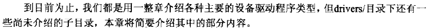

#### ECC报告

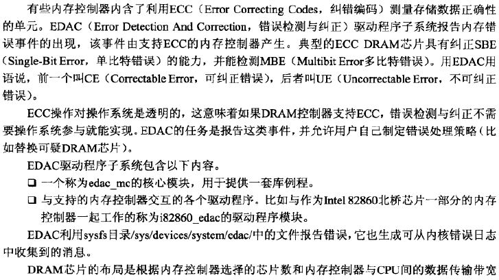

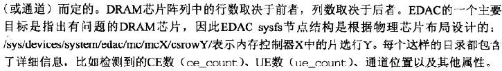

**支持ECC的内存控制器**

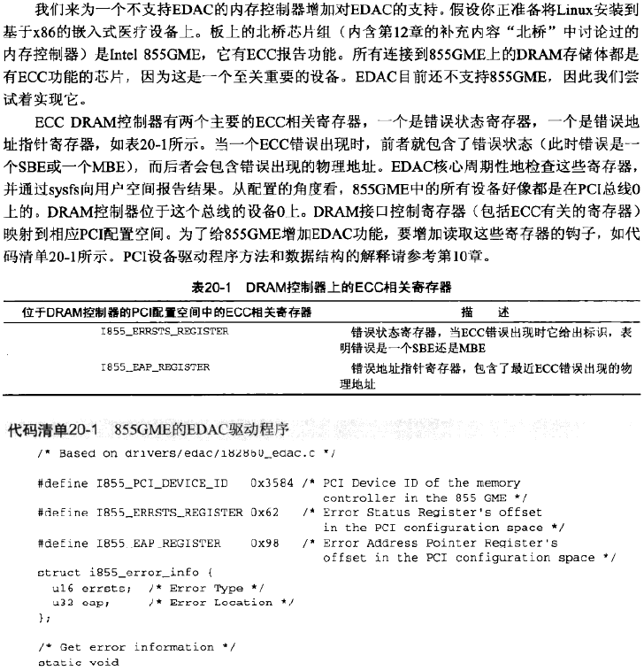

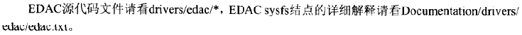

#### 频率调整

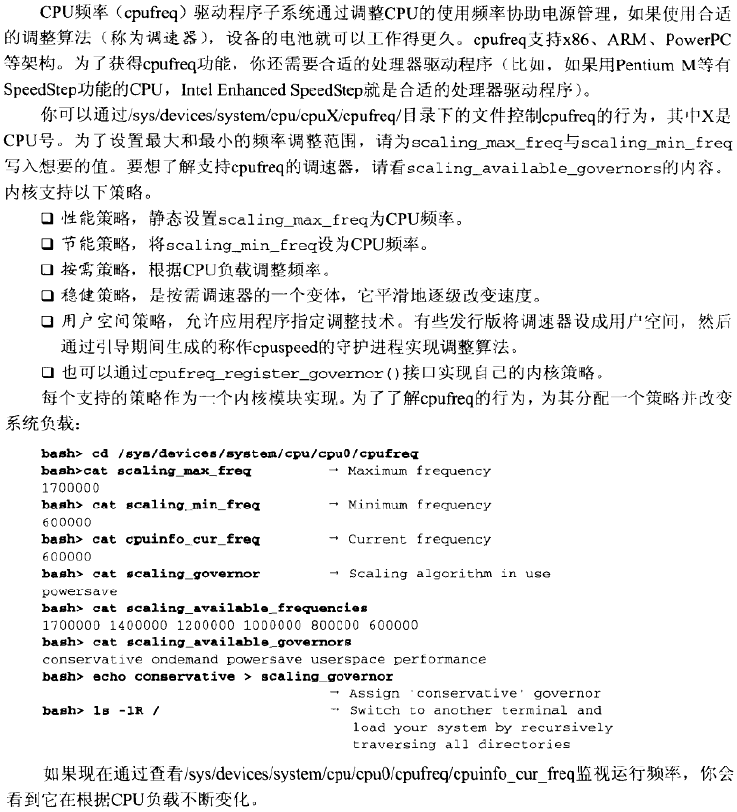

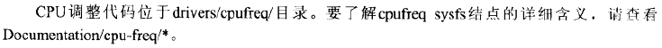

#### 嵌入式控制器

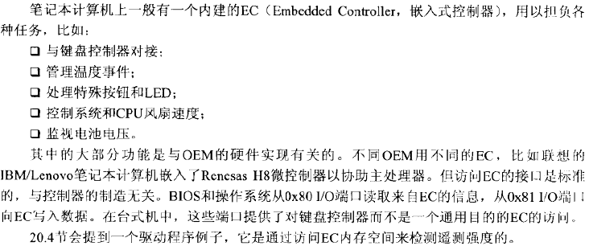

#### ACPI

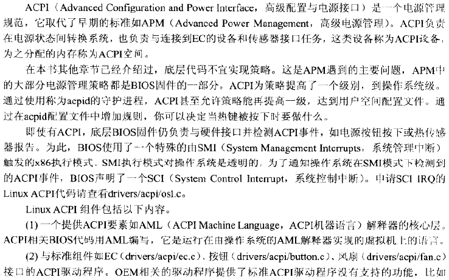

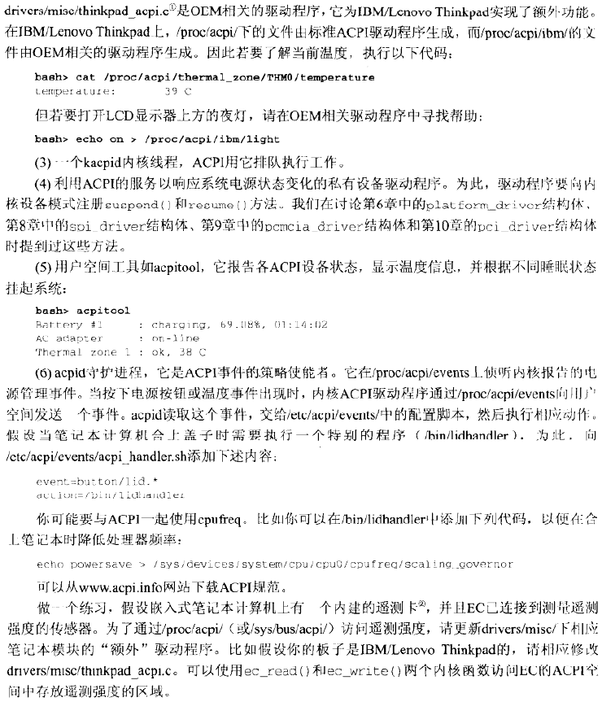

#### ISA与MCA

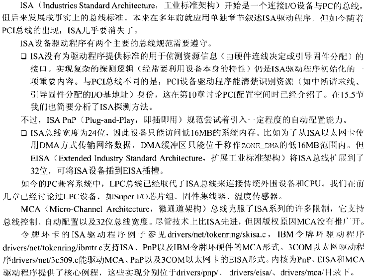

#### 火线

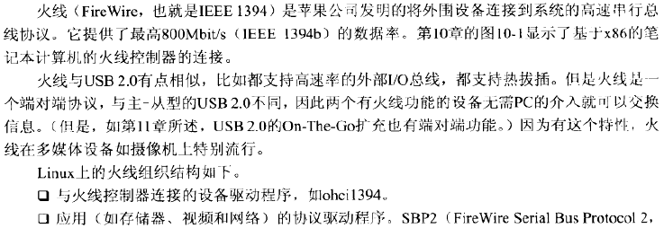

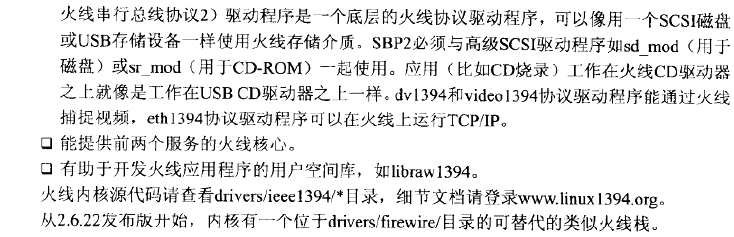

#### 智能输入/输出

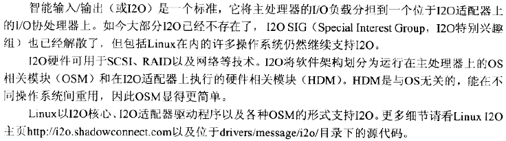

#### 业余无线电

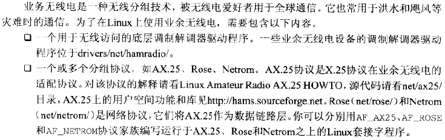

#### VoIP

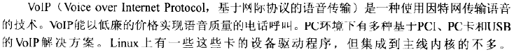

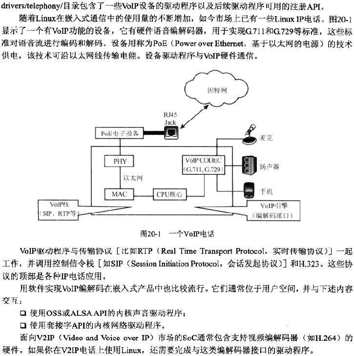

#### 高速互联

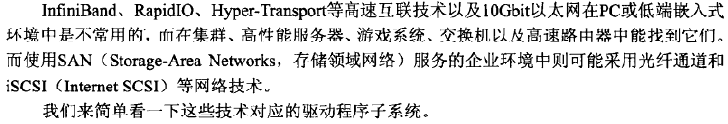

**InfiniBand**

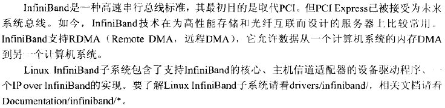

**RapidIO**

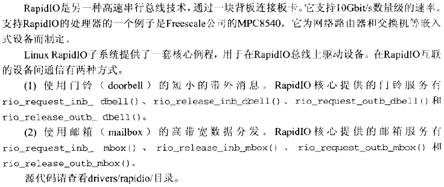

**光纤通道**

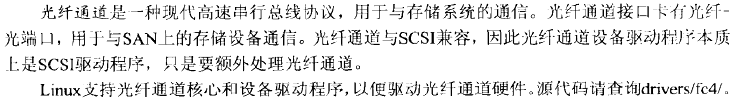

**iSCSI**

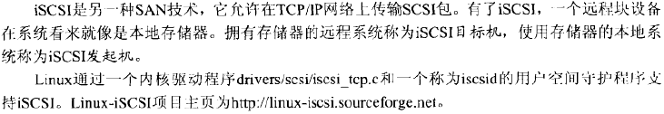

