## 字符设备驱动

#### 字符设备驱动程序基础

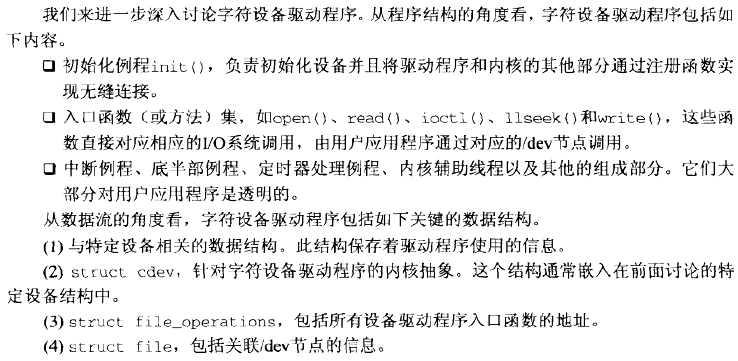

#### 驱动程序初始化

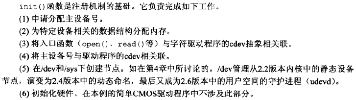

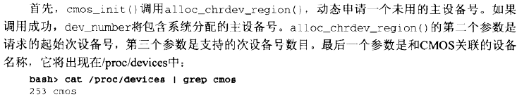

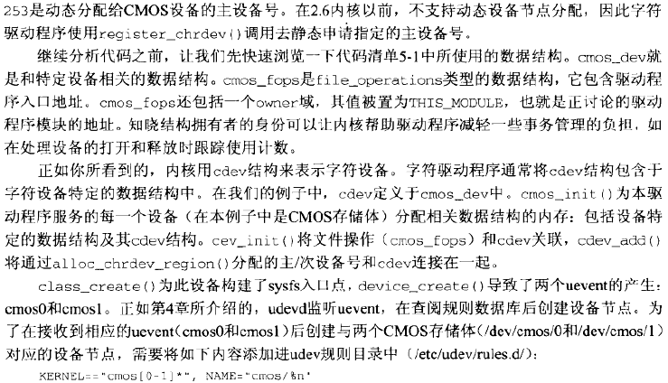

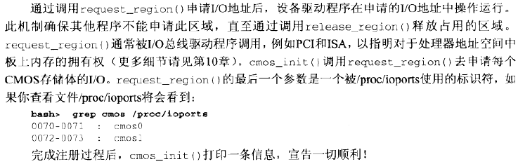

**打开和释放**

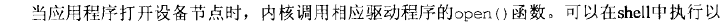

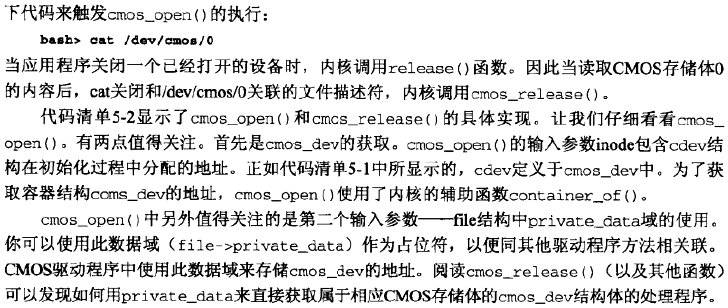

**数据交换**

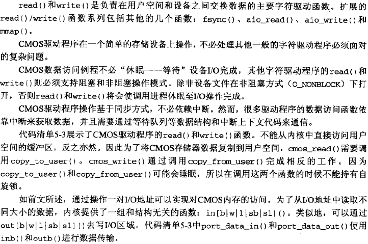

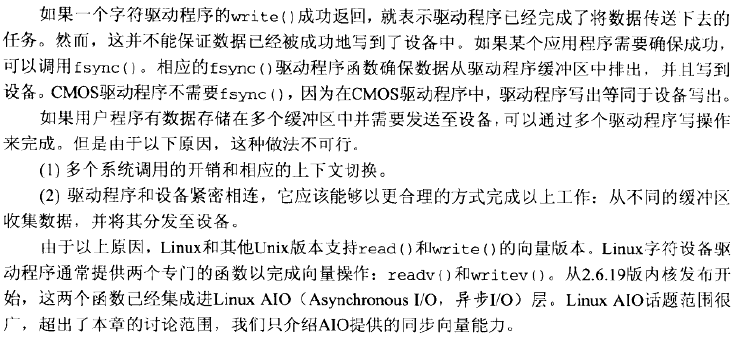

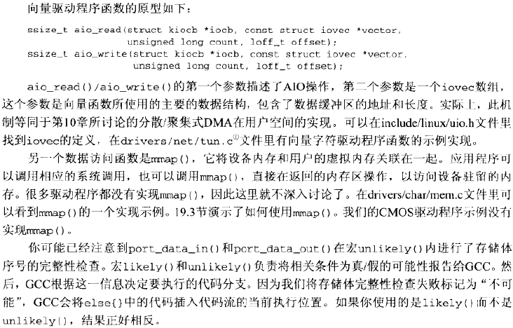

**查找**

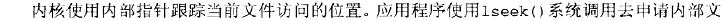

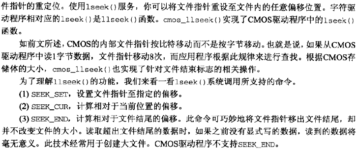

**控制**

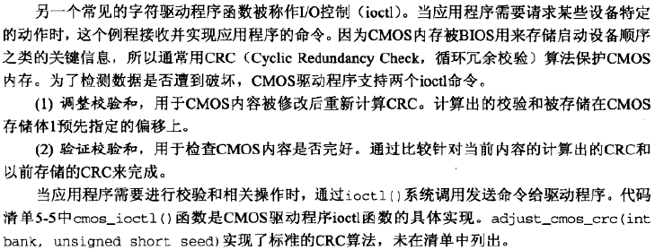

#### 检测数据是否可获得

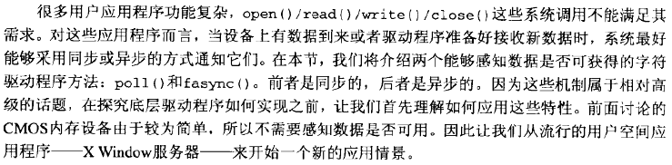

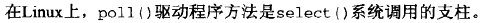

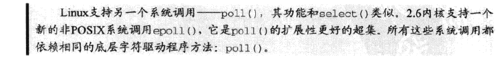

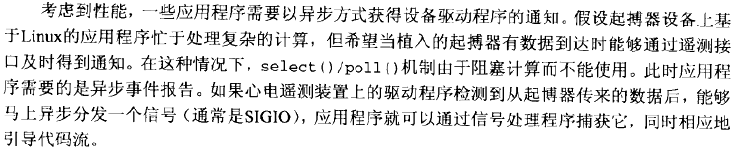

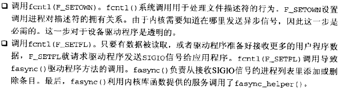

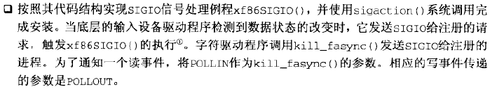

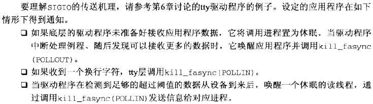

#### 和并行端口交互

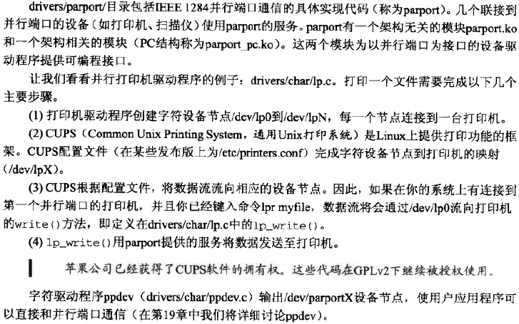

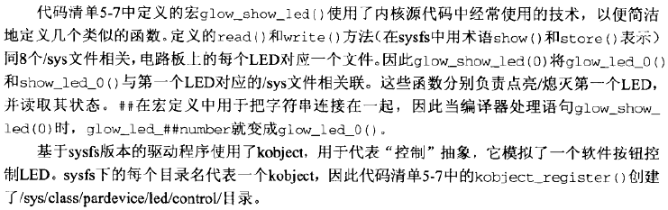

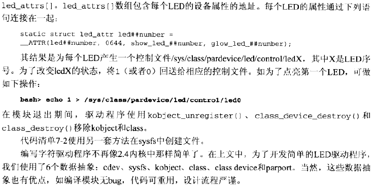

#### RTC子系统

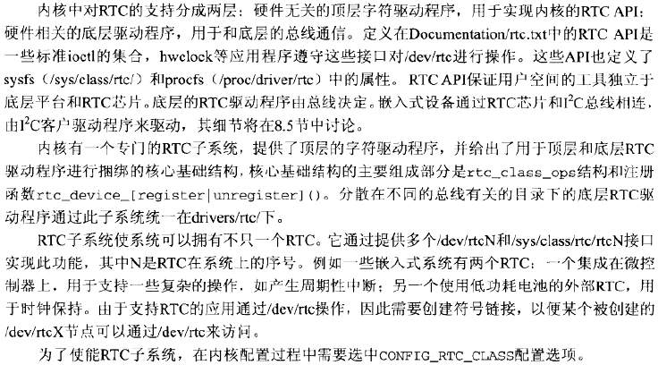

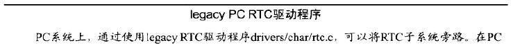

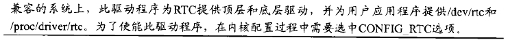

#### 伪字符驱动程序

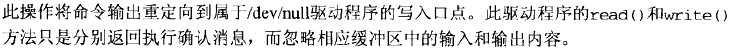

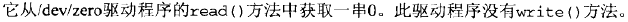

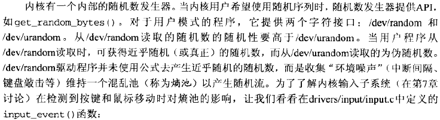

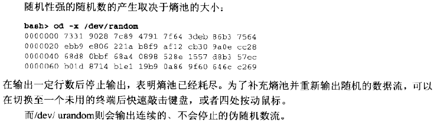

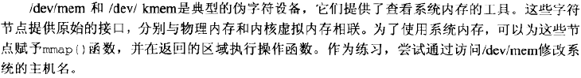

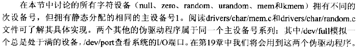

#### 混杂驱动程序

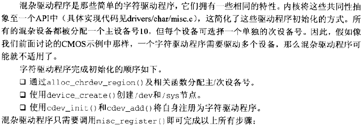

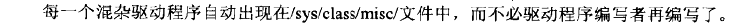

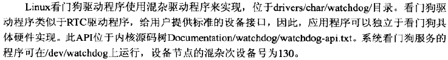

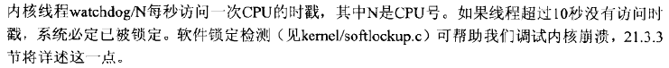

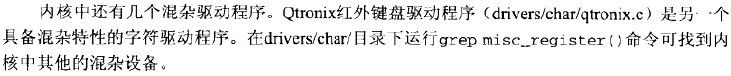

#### 查看源代码

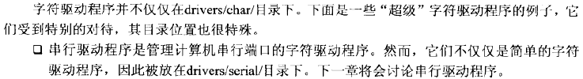

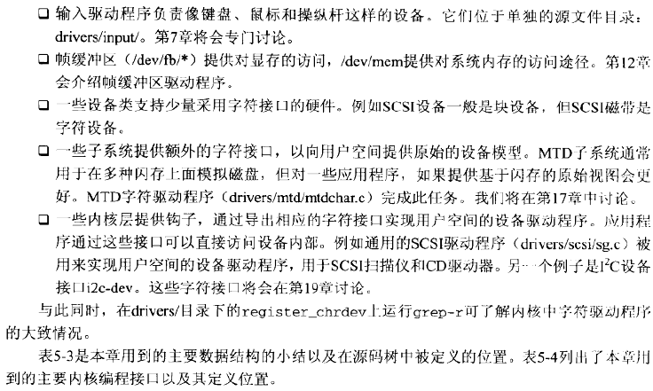

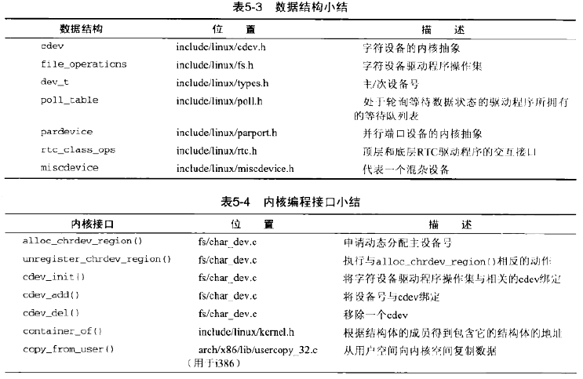

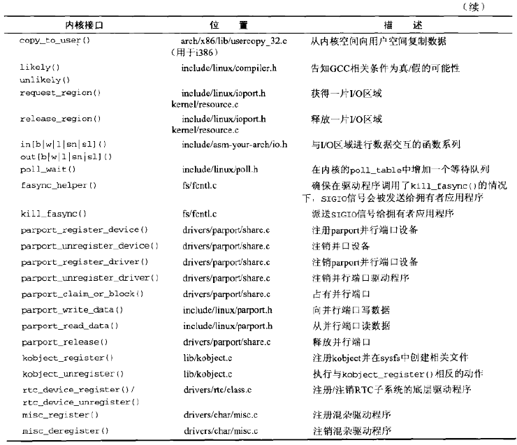

