## 存储技术设备

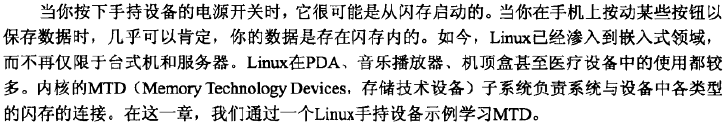

#### 闪存

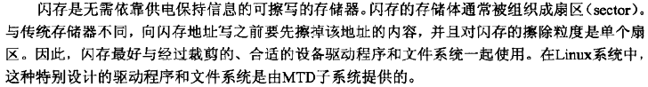

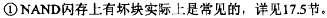

#### Linux-MTD子系统

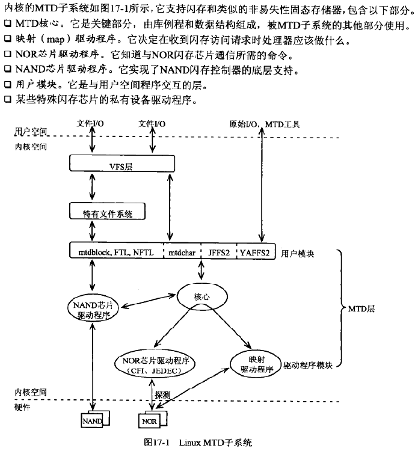

#### 映射驱动程序

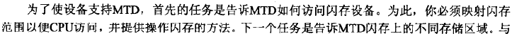

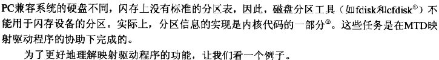

**手持设备**

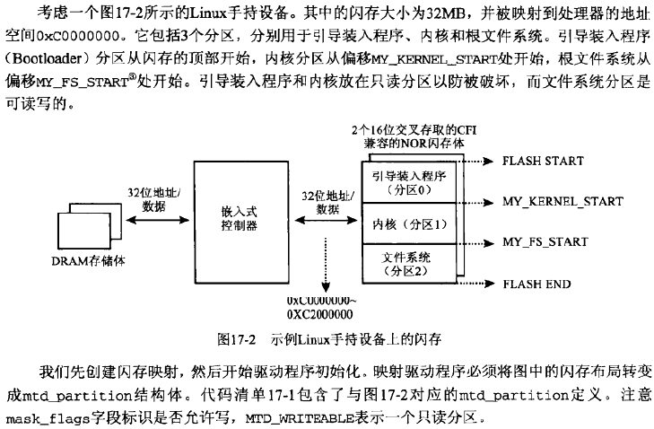

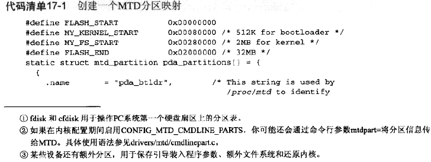

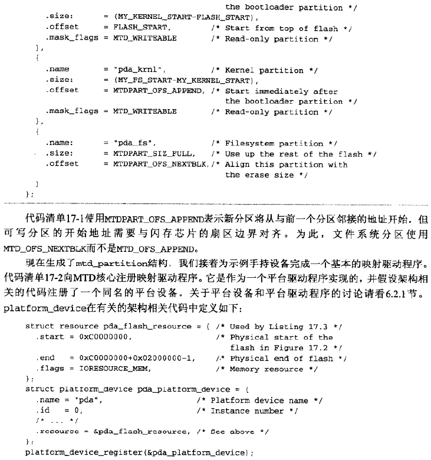

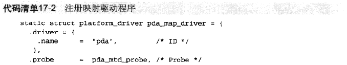

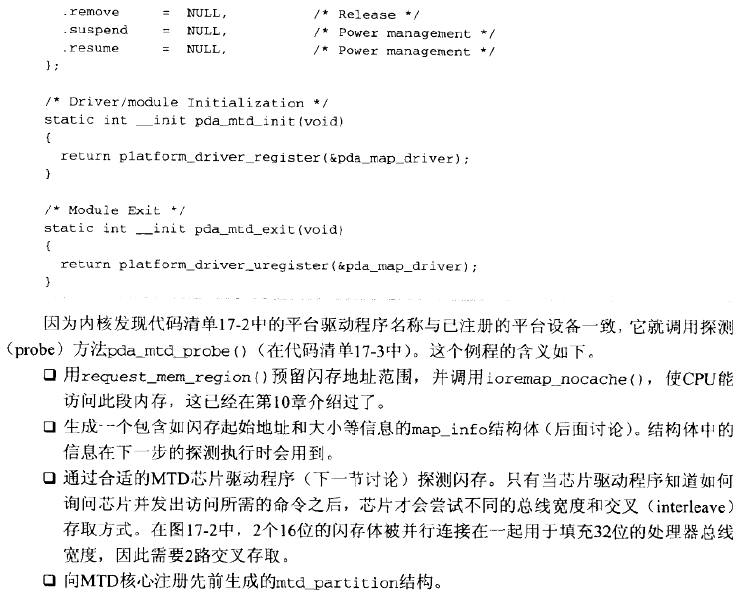

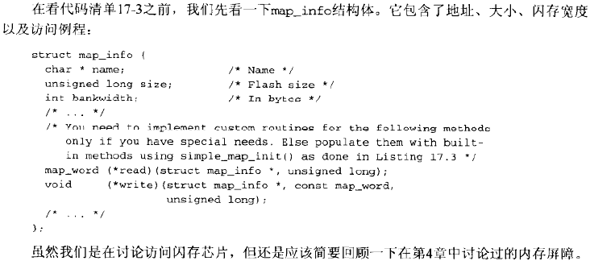

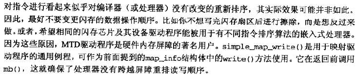

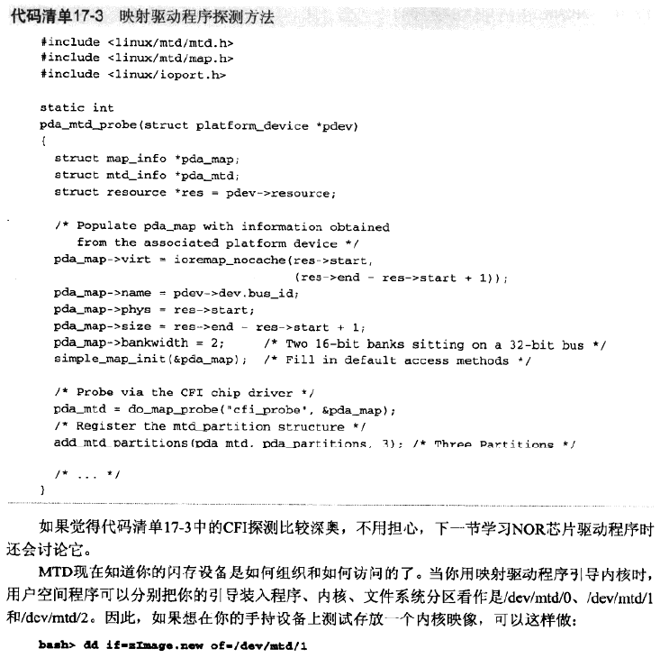

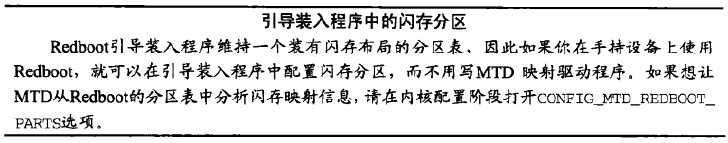

#### NOR芯片驱动程序

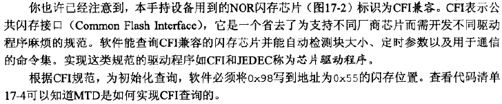

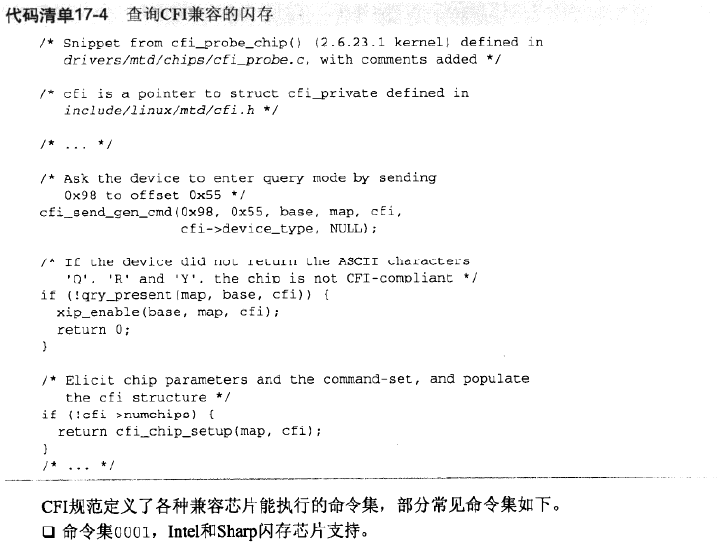

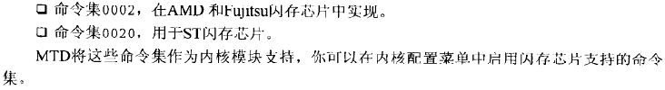

#### NAND芯片驱动程序

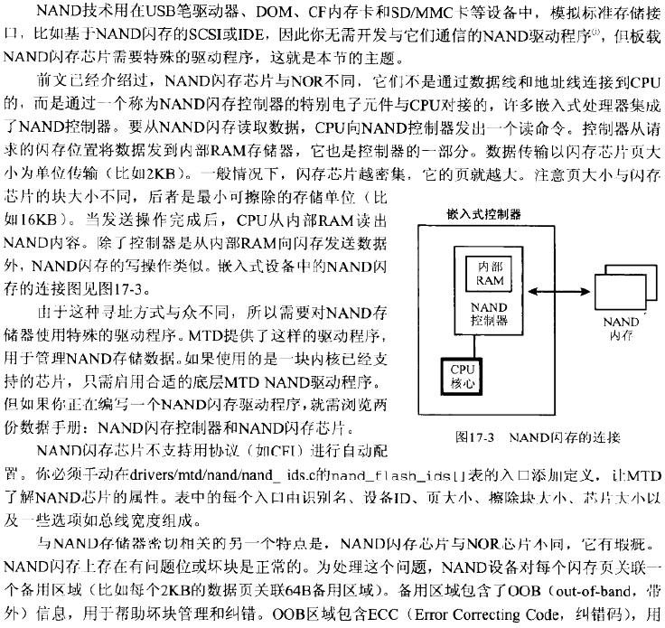

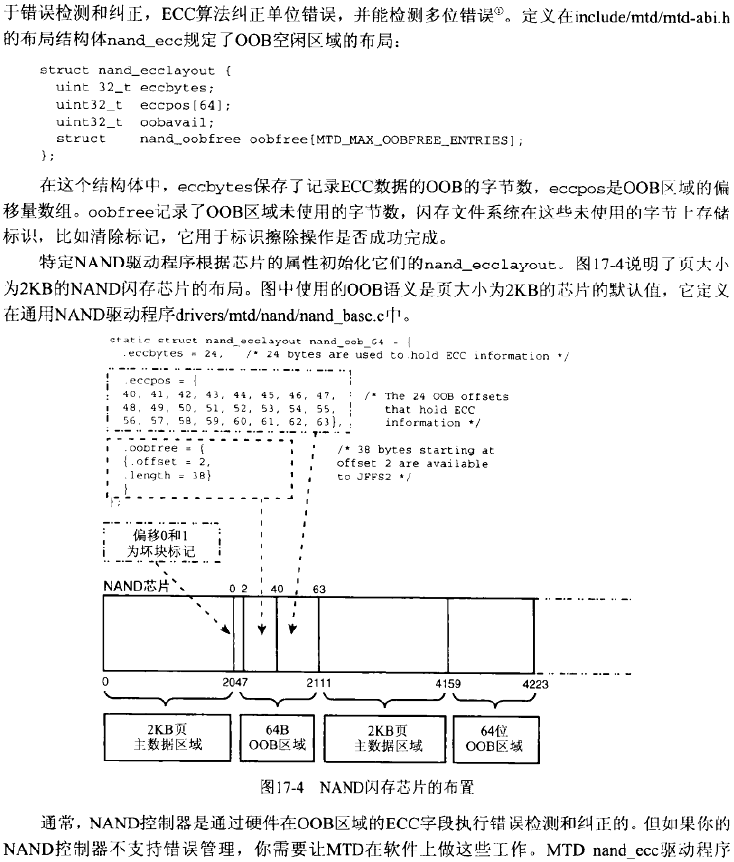

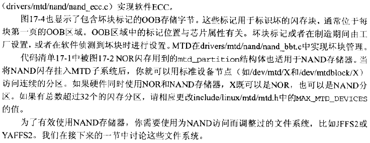

#### 用户模块

**块设备模拟**

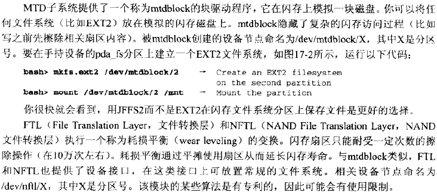

**字符设备模拟**

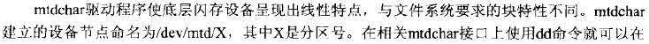

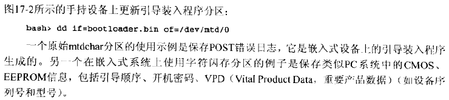

**JFFS2**

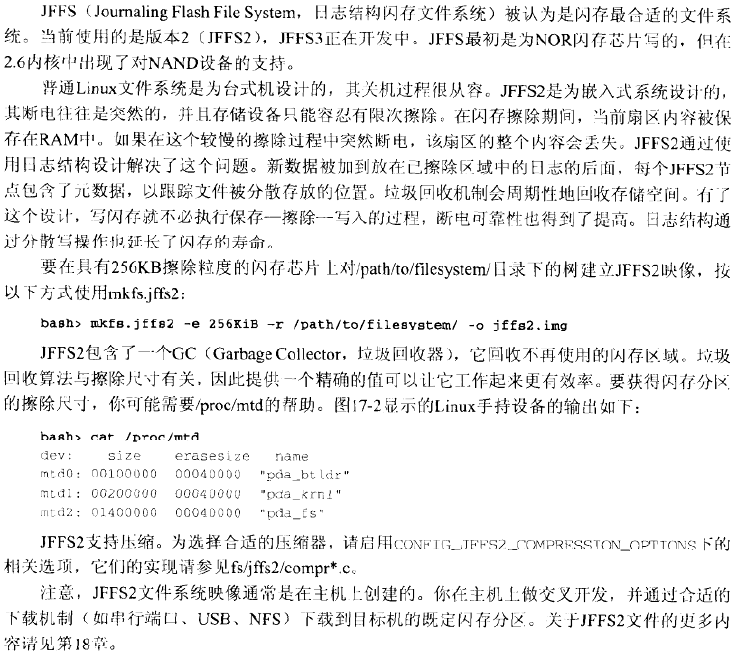

**YAFFS2**

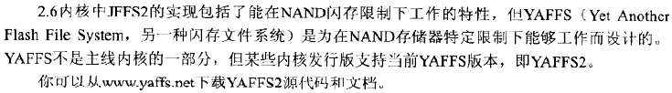

#### MTD-Utils

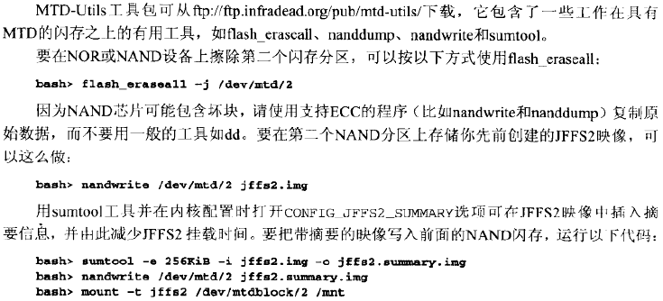

#### 配置MTD

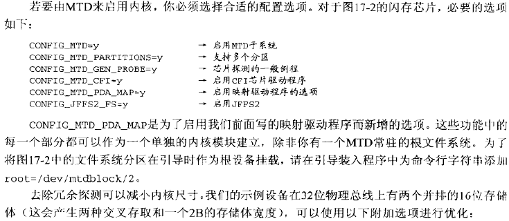

#### XIP

**FWH**

**调试**

**查看源代码**

