## 存储技术设备

#### 闪存

#### Linux-MTD子系统

#### 映射驱动程序

**手持设备**

#### NOR芯片驱动程序

#### NAND芯片驱动程序

#### 用户模块

**块设备模拟**

**字符设备模拟**

**JFFS2**

**YAFFS2**

#### MTD-Utils

#### 配置MTD

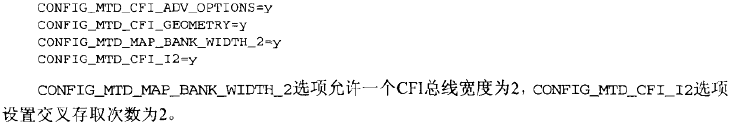

#### XIP

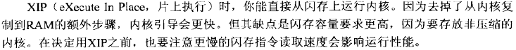

**FWH**

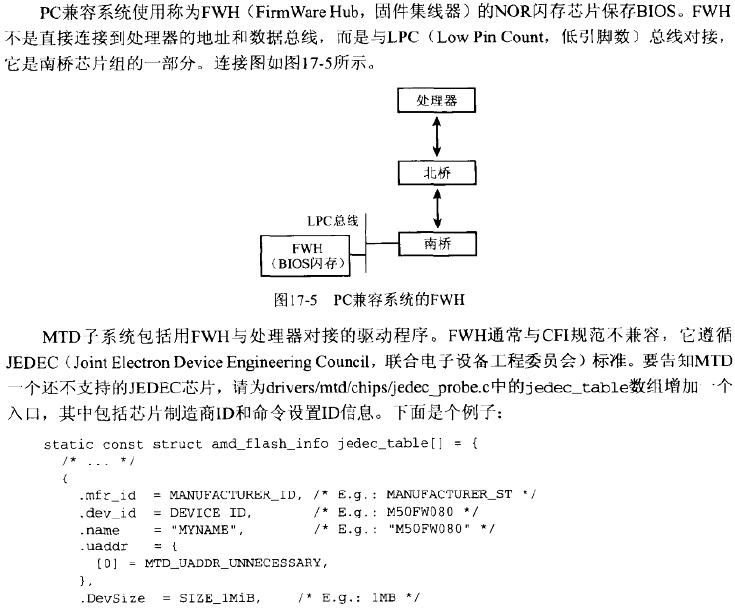

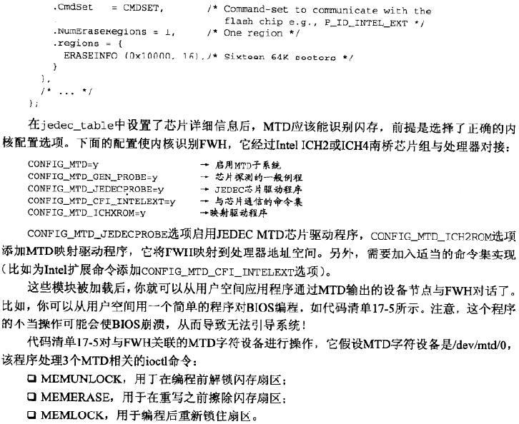

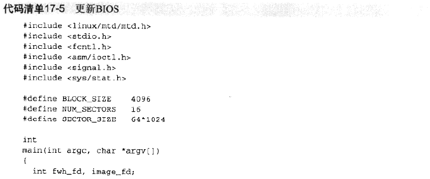

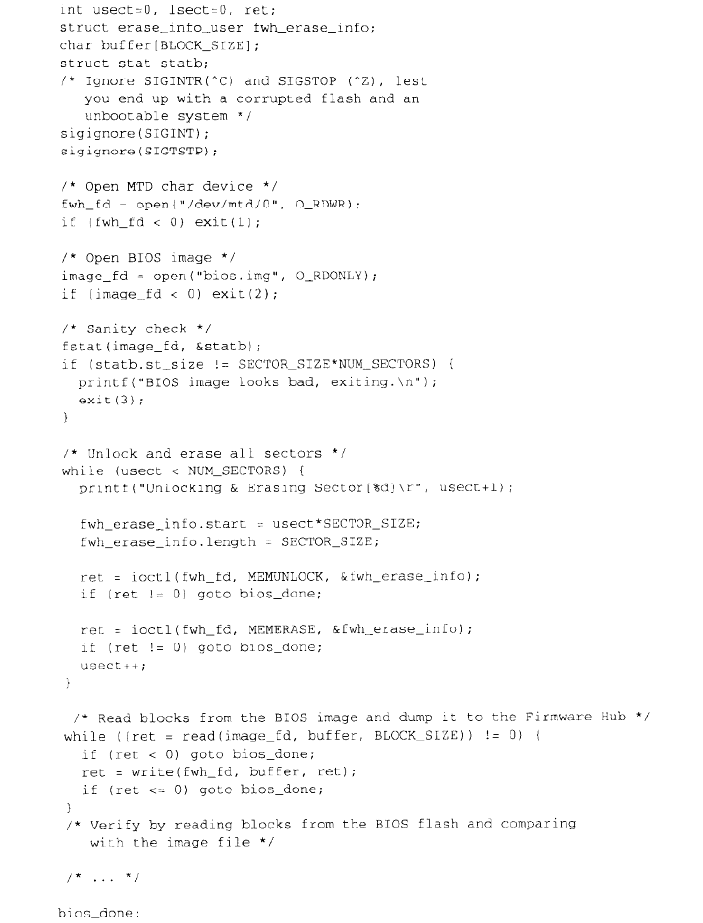

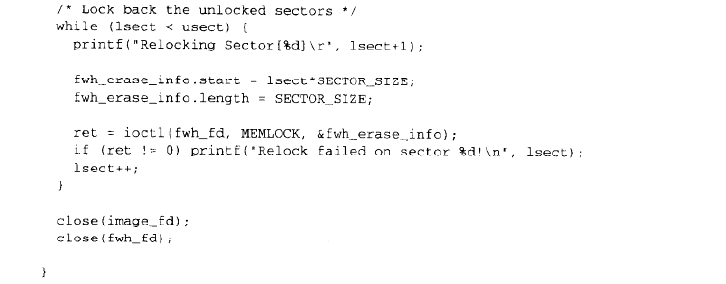

**调试**

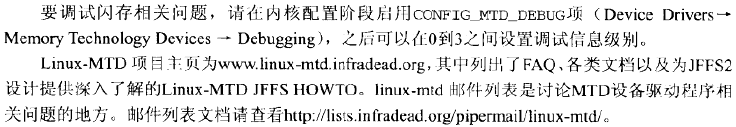

**查看源代码**

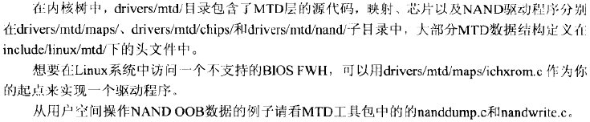

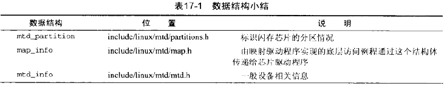

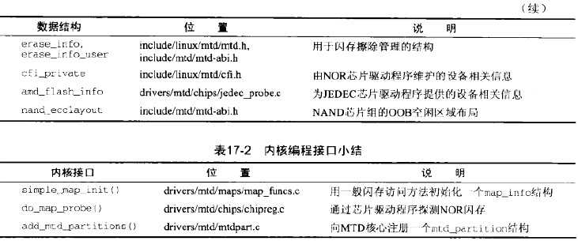