 * [块设备驱动程序](#块设备驱动程序)
 * [存储技术](#存储技术)
 * [Linux块I/O层](#linux块io层)
 * [I/O调度器](#io调度器)
 * [块驱动程序数据结构和方法](#块驱动程序数据结构和方法)
 * [简单存储控制器](#简单存储控制器)
    * [<strong>初始化</strong>](#初始化)
    * [<strong>块设备操作</strong>](#块设备操作)
    * [<strong>磁盘访问</strong>](#磁盘访问)
 * [高级主题](#高级主题)
 * [调试](#调试)
 * [查看源代码](#查看源代码)

#### 块设备驱动程序

#### 存储技术

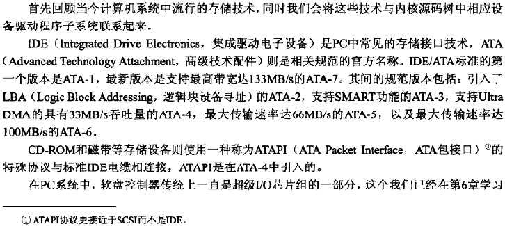

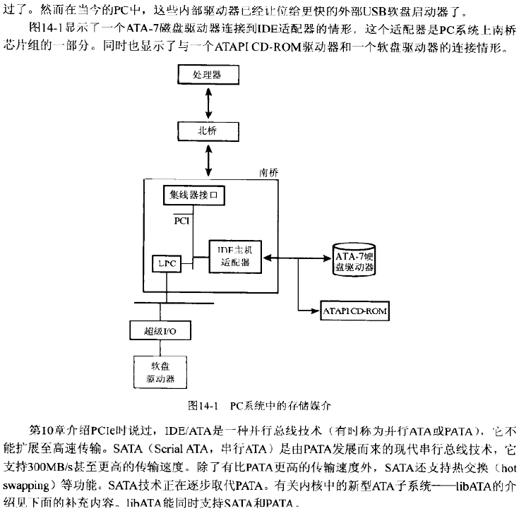

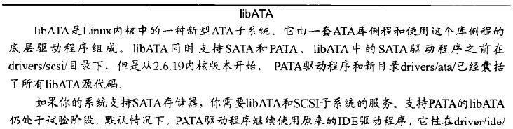

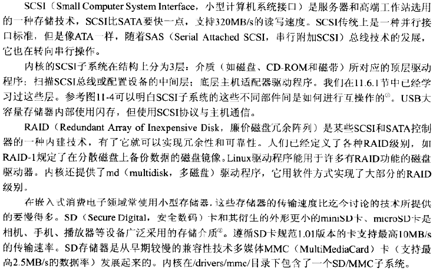

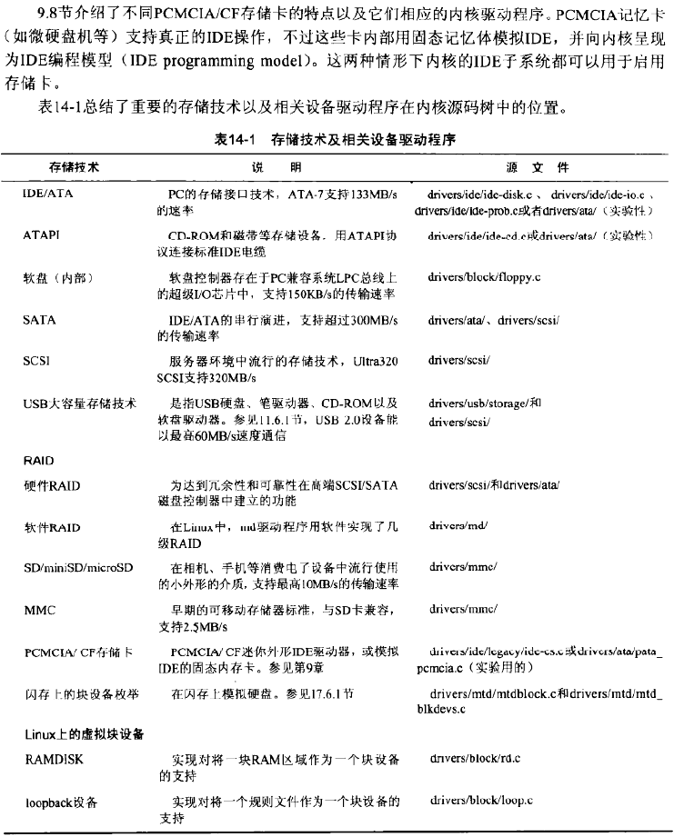

#### Linux块I/O层

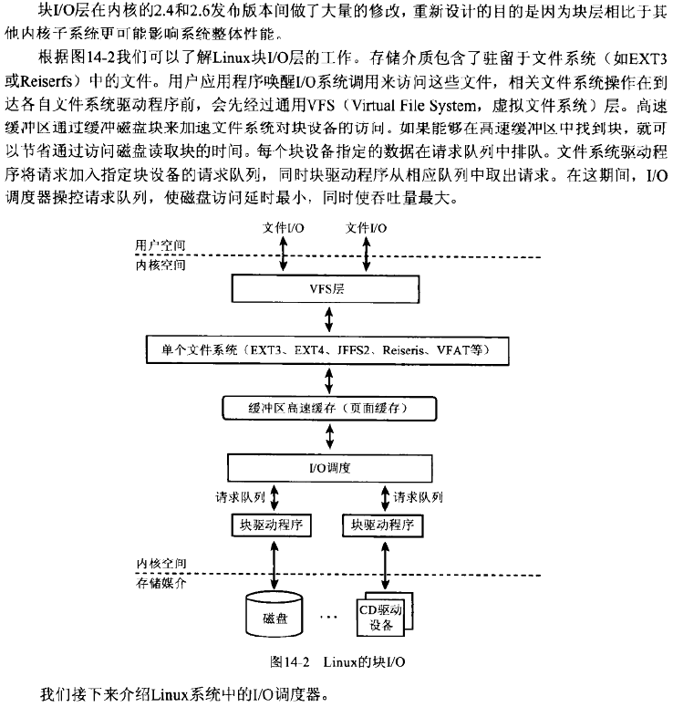

#### I/O调度器

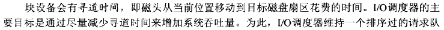

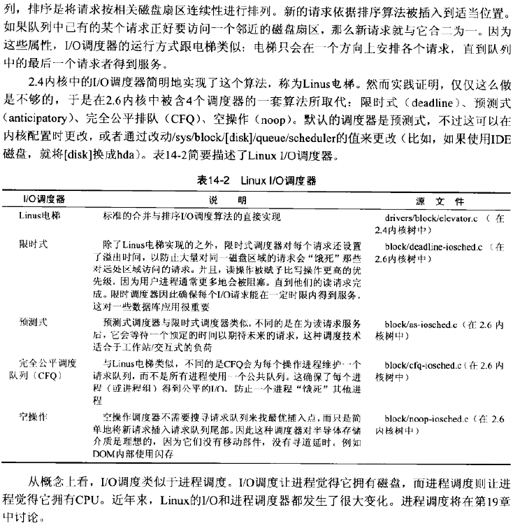

#### 块驱动程序数据结构和方法

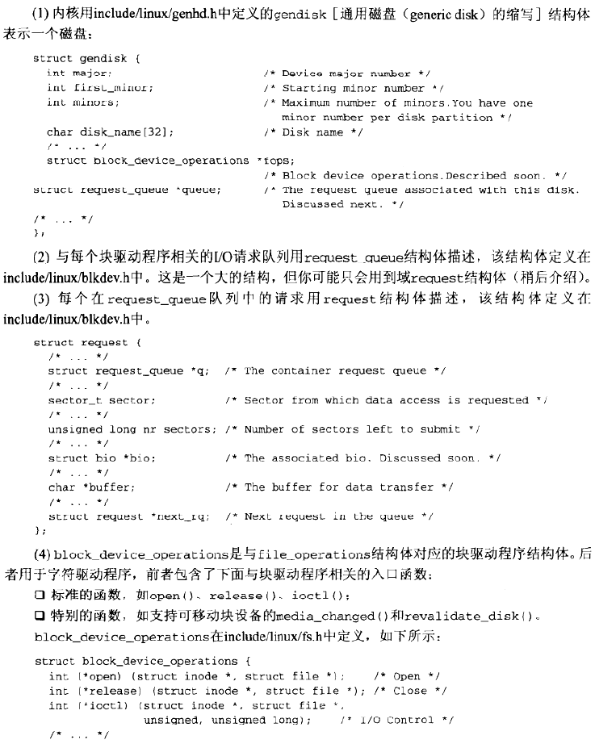

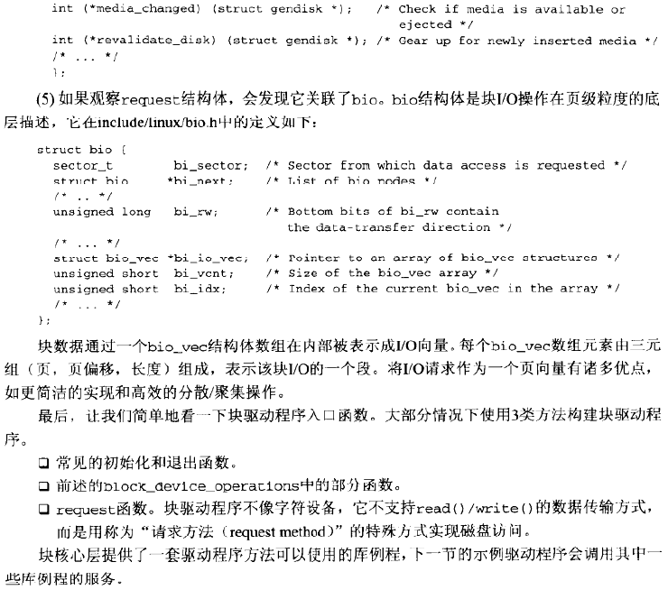

#### 简单存储控制器

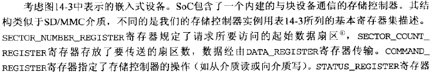

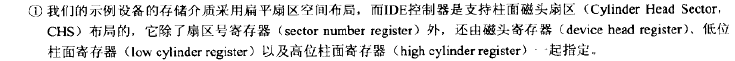

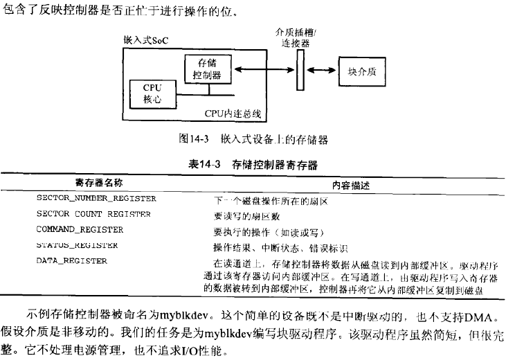

##### **初始化**

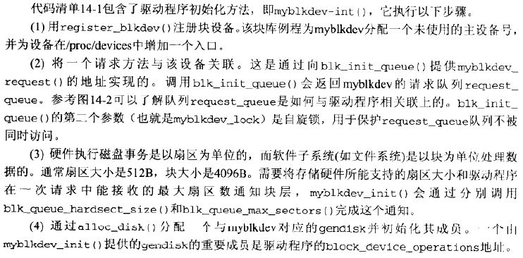

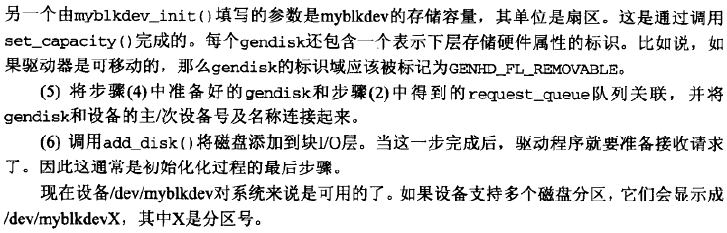

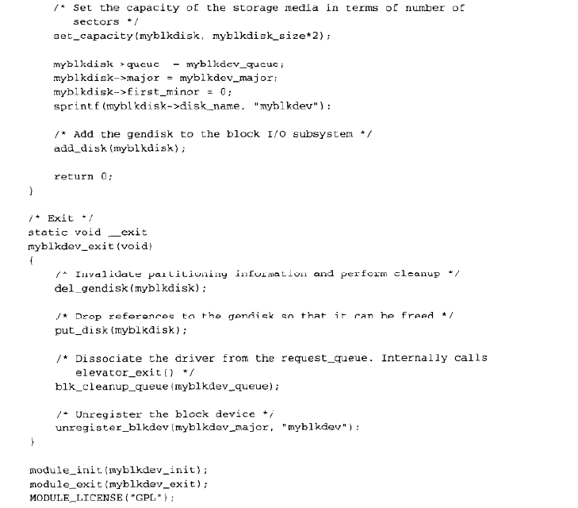

##### **块设备操作**

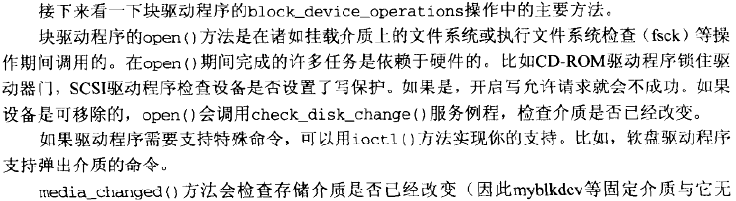

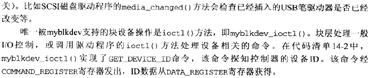

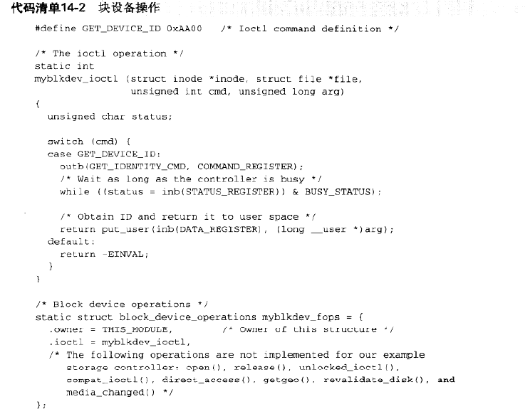

##### **磁盘访问**

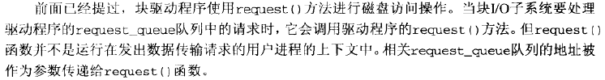

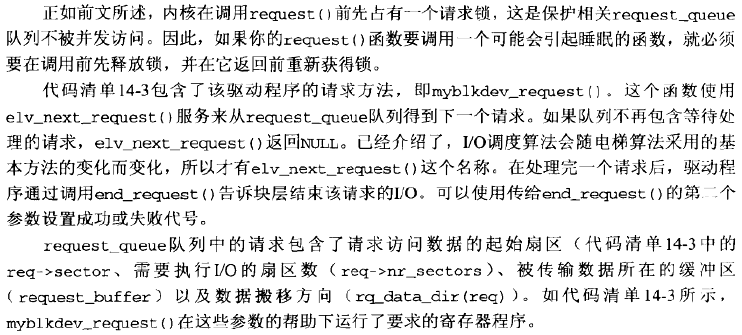

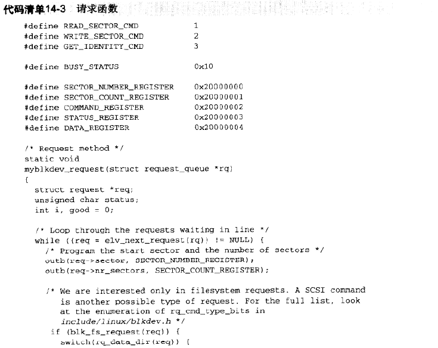

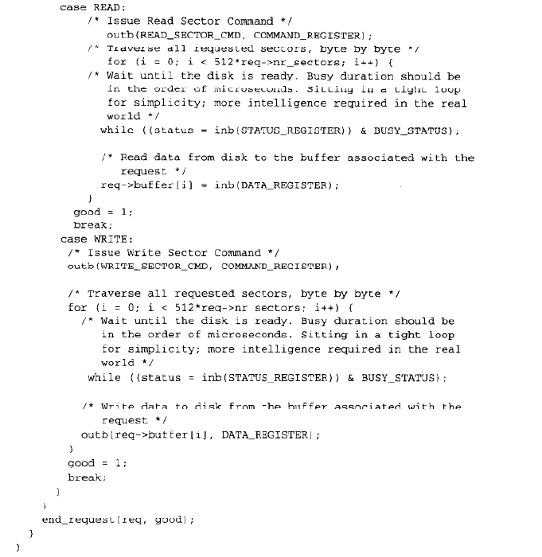

#### 高级主题

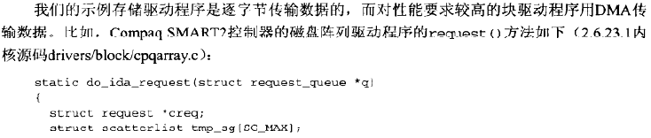

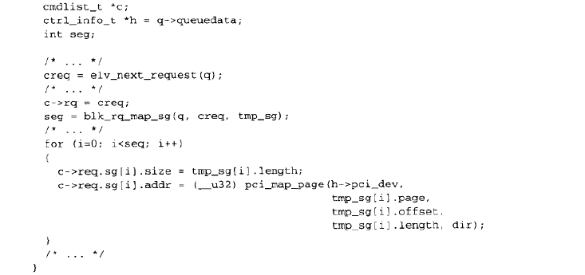

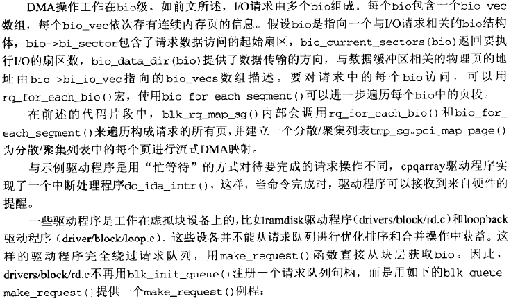

#### 调试

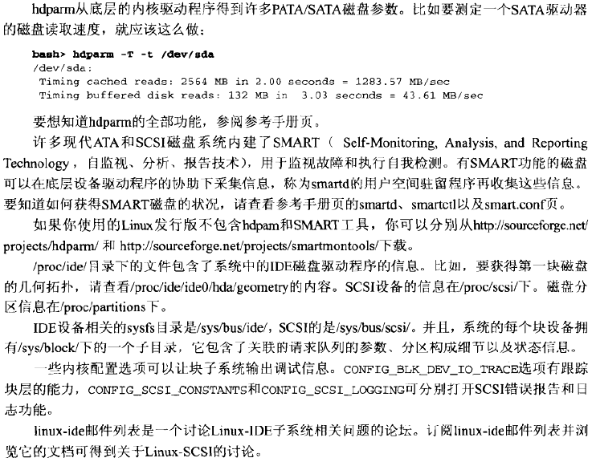

#### 查看源代码

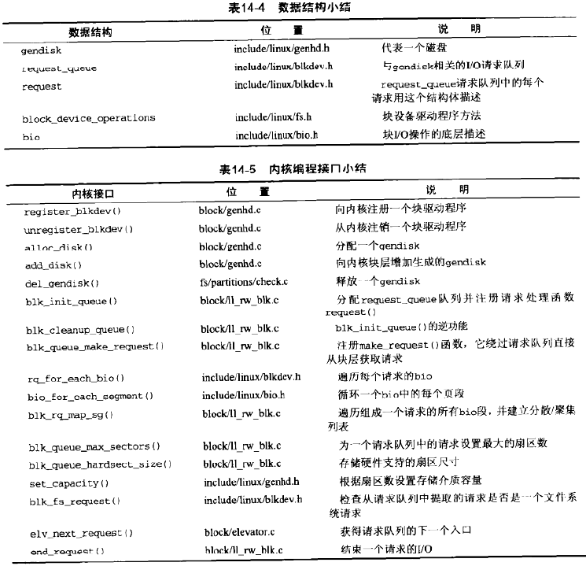