## 嵌入式Linux

#### 挑战

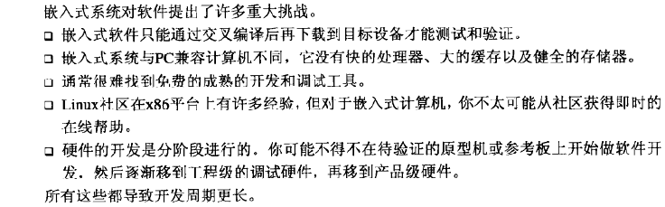

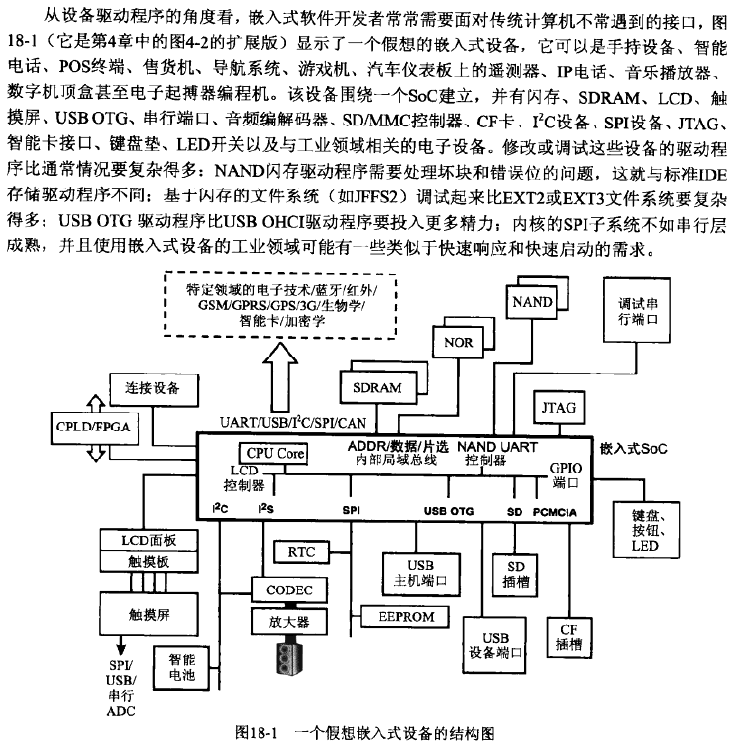

#### 元器件选择

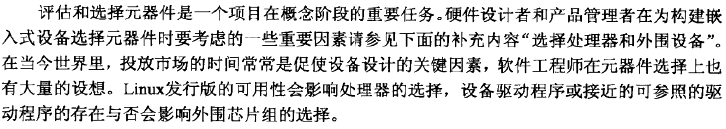

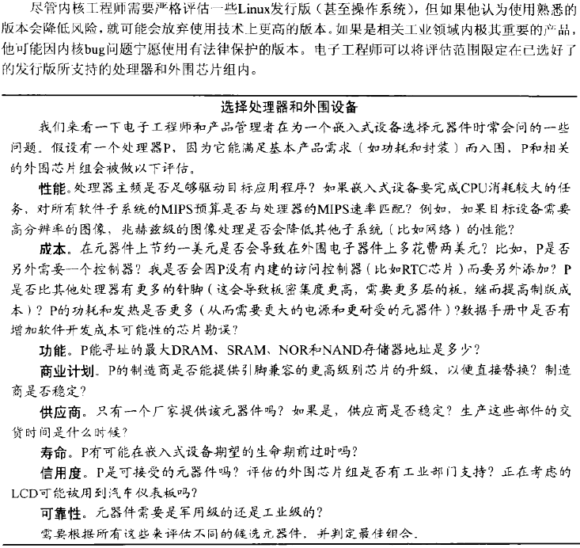

#### 工具链

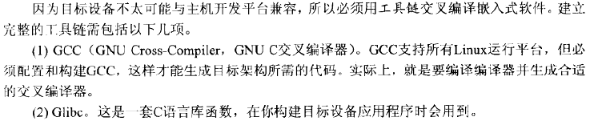

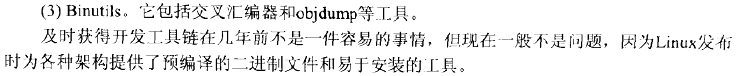

#### Bootloader

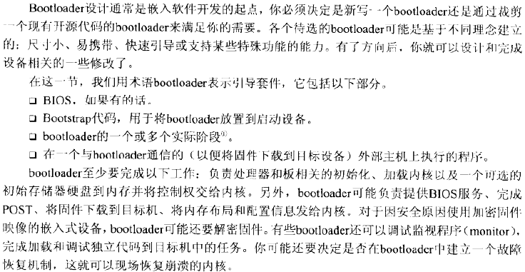

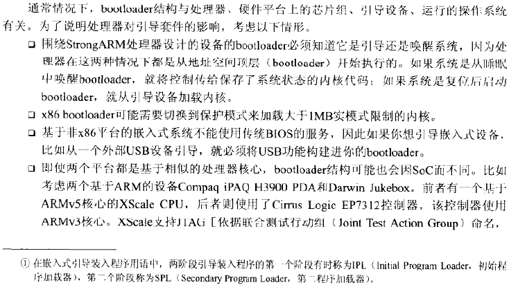

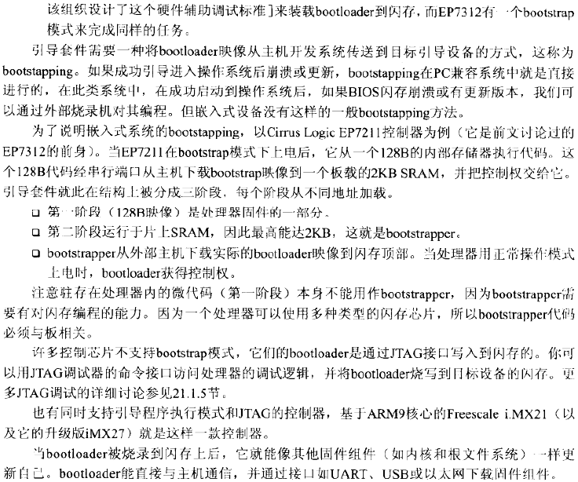

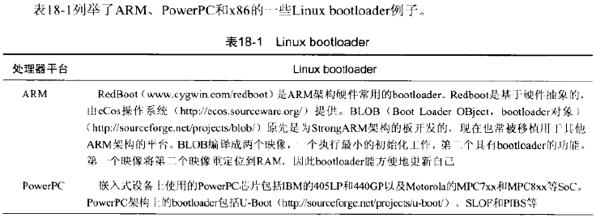

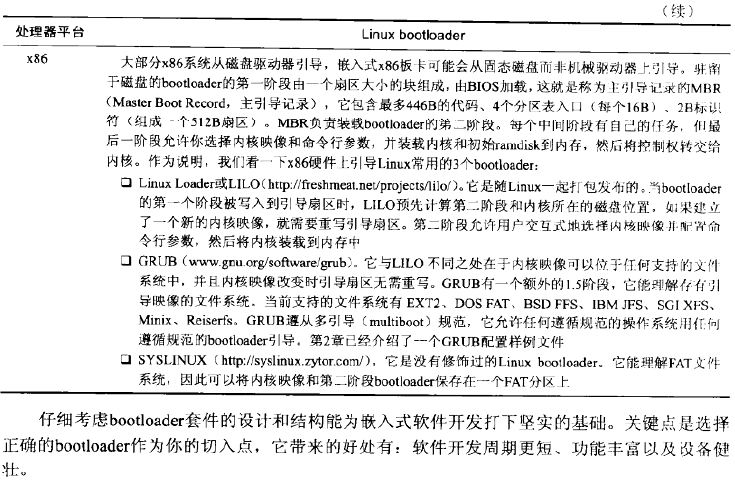

#### 内存布局

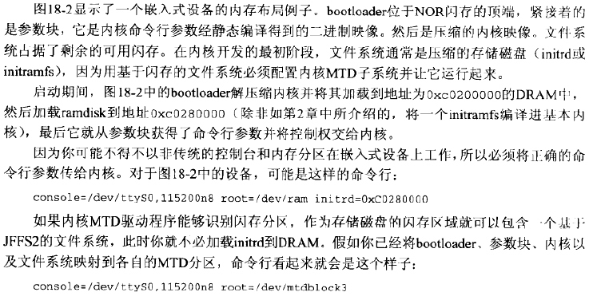

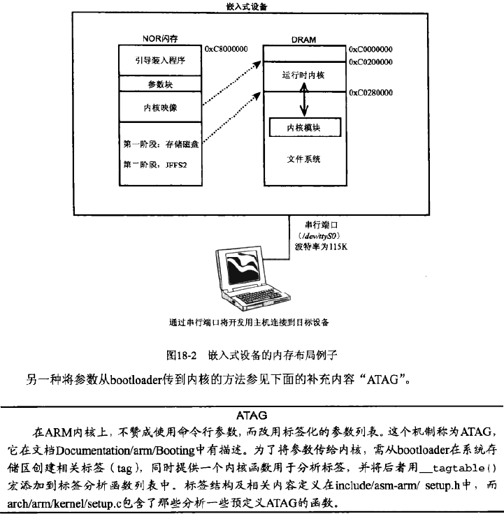

#### 内核移植

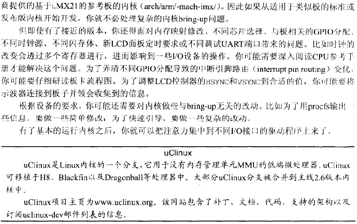

#### 嵌入式驱动程序

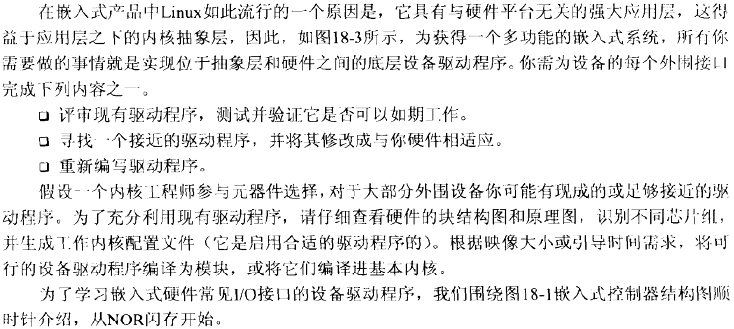

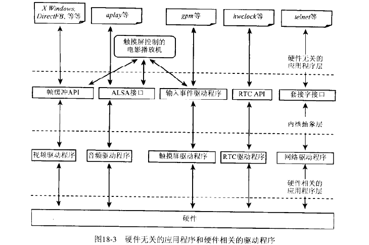

**闪存**

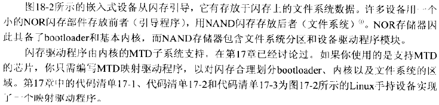

**UART**

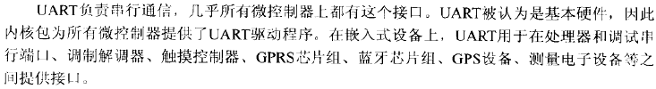

**按钮和滚轮**

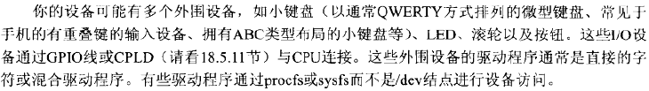

**PCMCIA/CF**

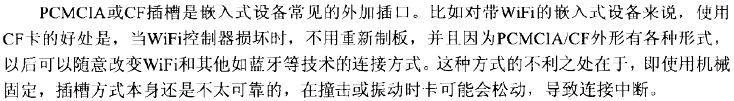

**SD/MMC**

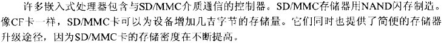

**USB**

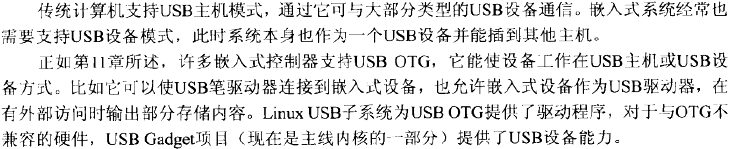

**RTC**

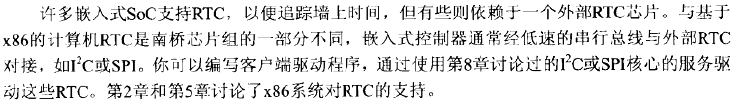

**音频**

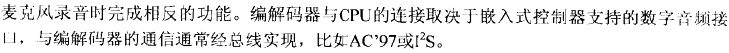

**触摸屏**

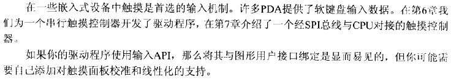

**视频**

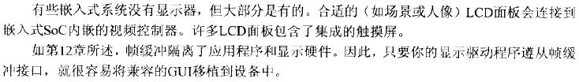

**CPLD/FPGA**

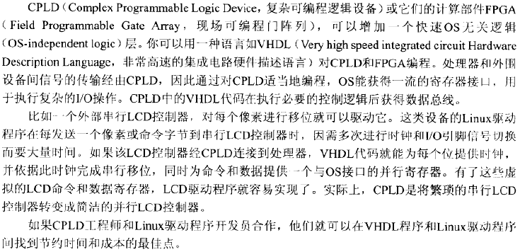

**连接性**

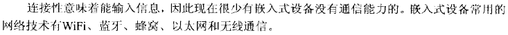

**专用领域电子器件**

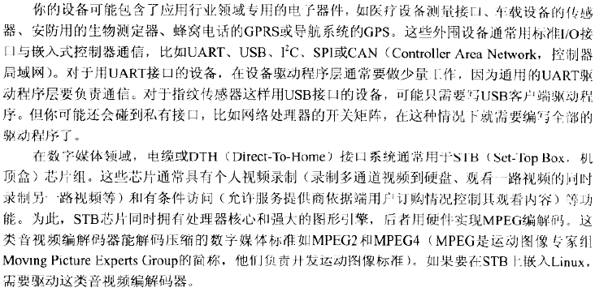

**更多驱动程序**

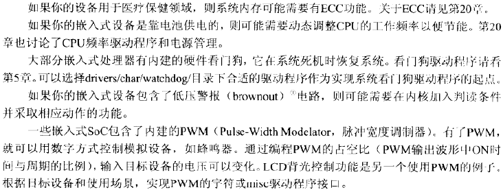

#### 根文件系统

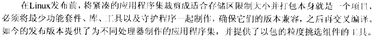

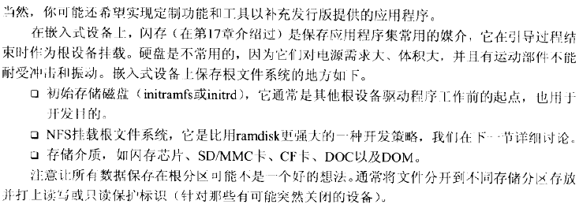

**NFS挂载的根文件系统**

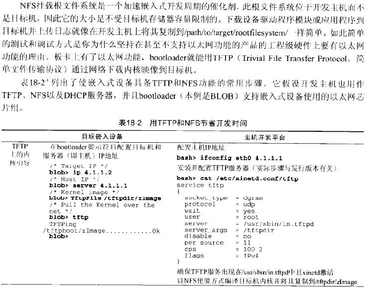

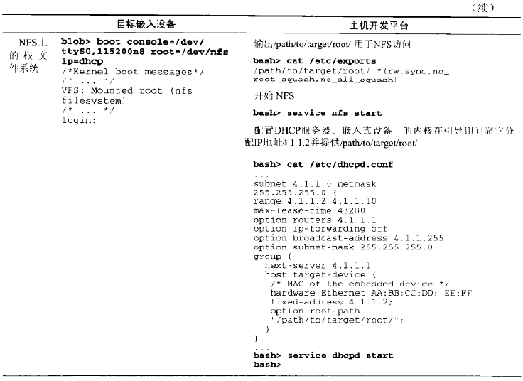

**紧凑型中间件**

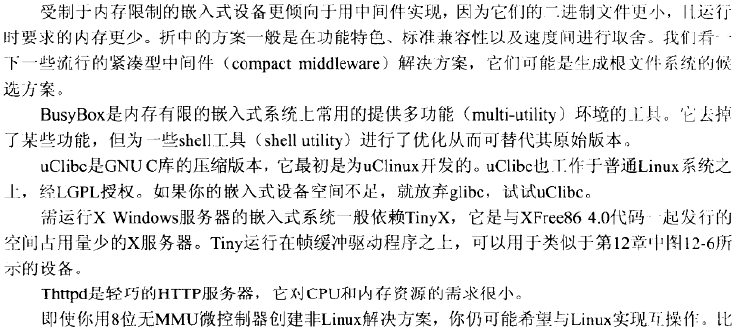

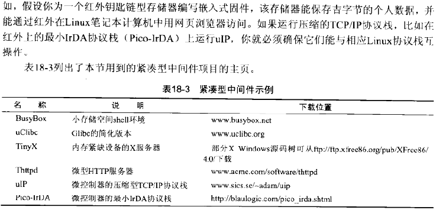

#### 测试基础设施

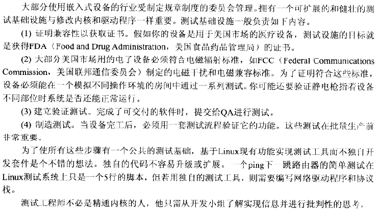

#### 调试

**电路板返工**

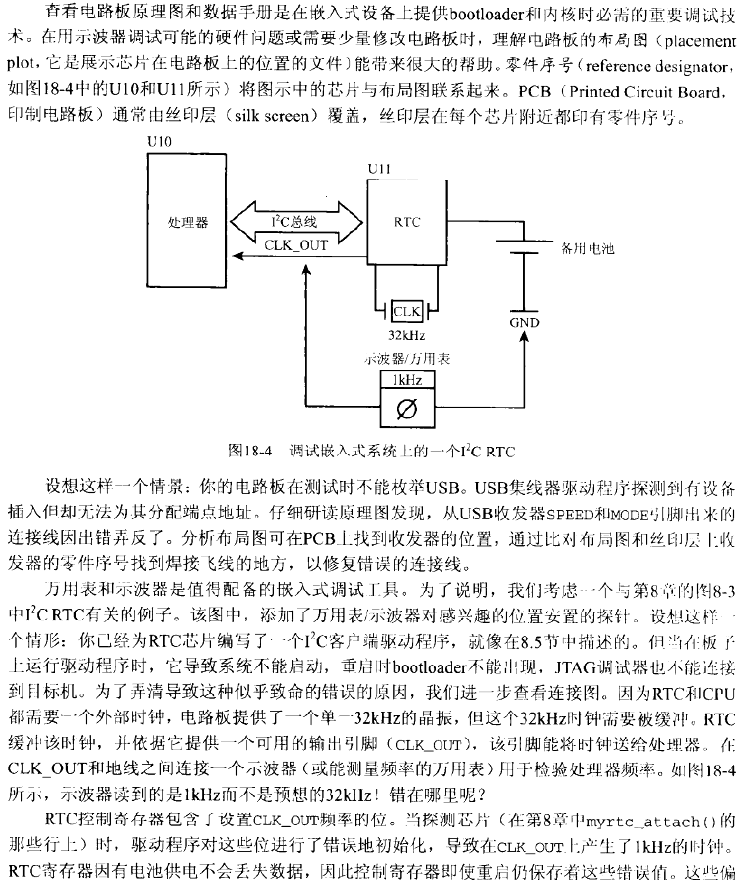

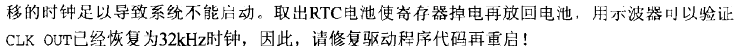

#### 调试器

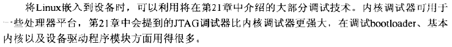