## 用户空间的驱动程序

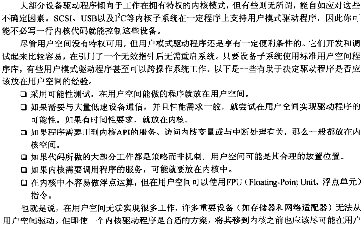

#### 进程调度和响应时间

**原先的调度器**

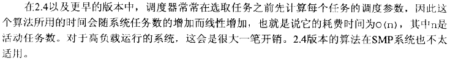

**O(1)调度器**

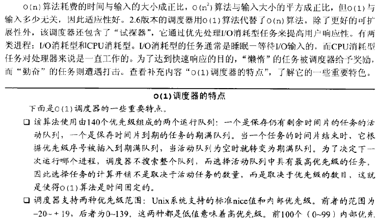

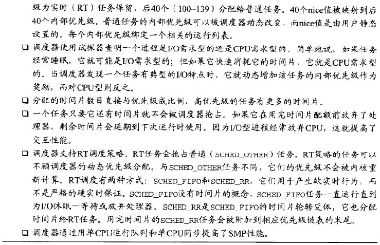

**CFS**

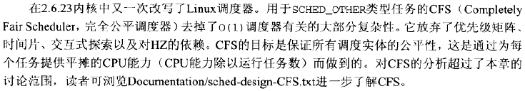

**响应时间**

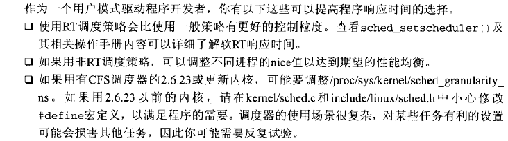

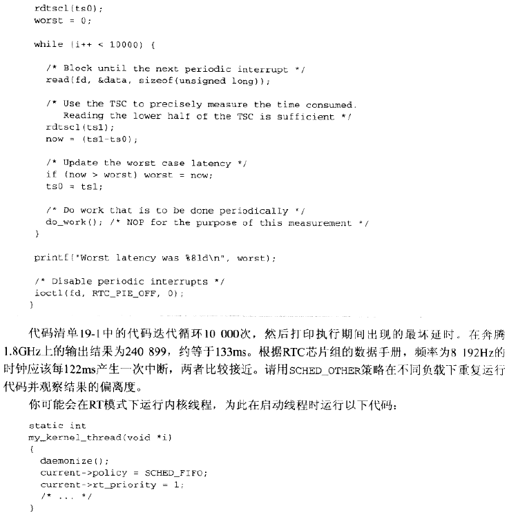

#### 访问I/O区域

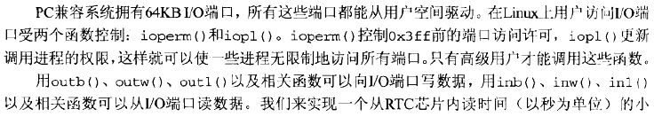

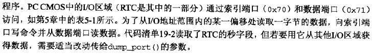

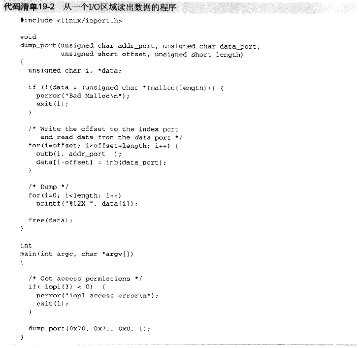

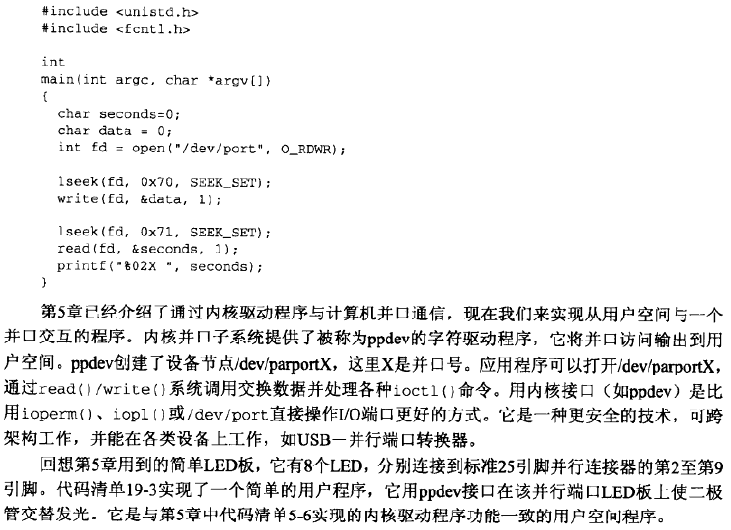

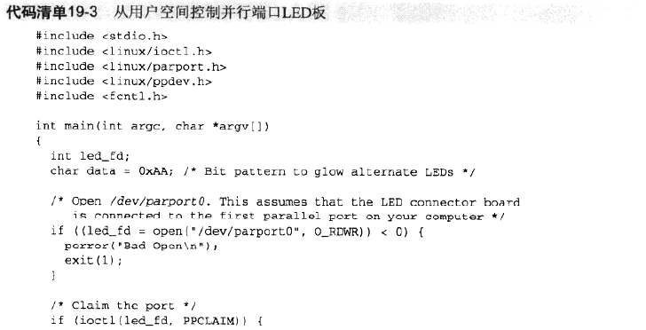

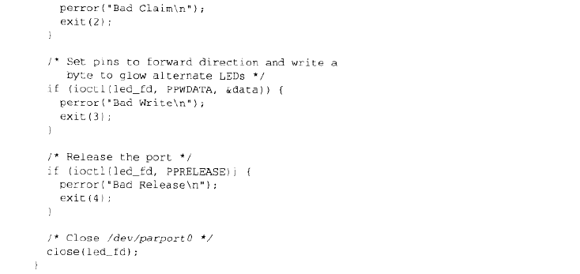

#### 访问内存区域

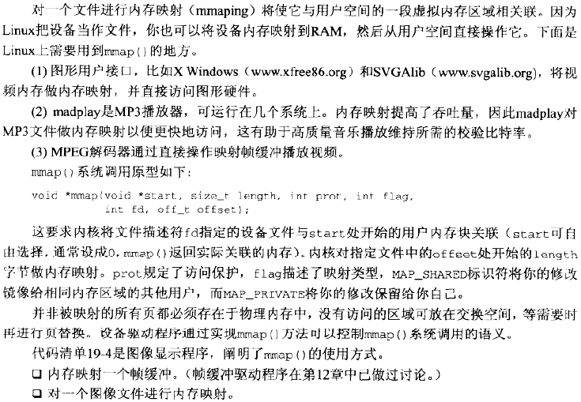

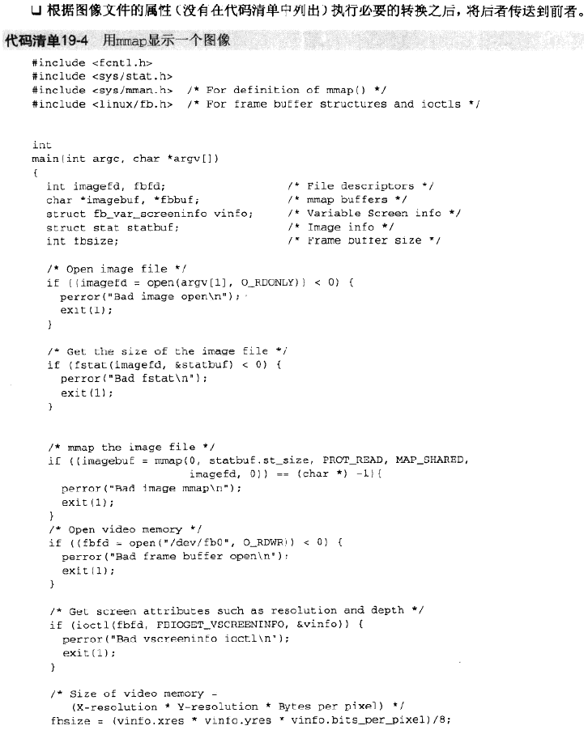

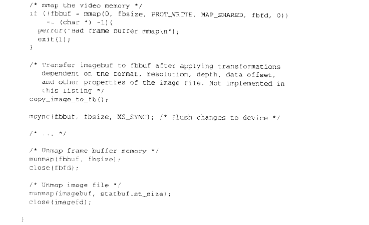

#### 用户模式SCSI

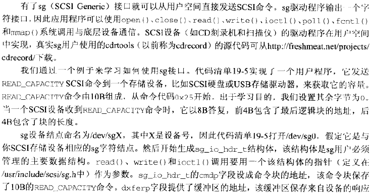

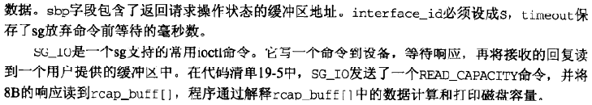

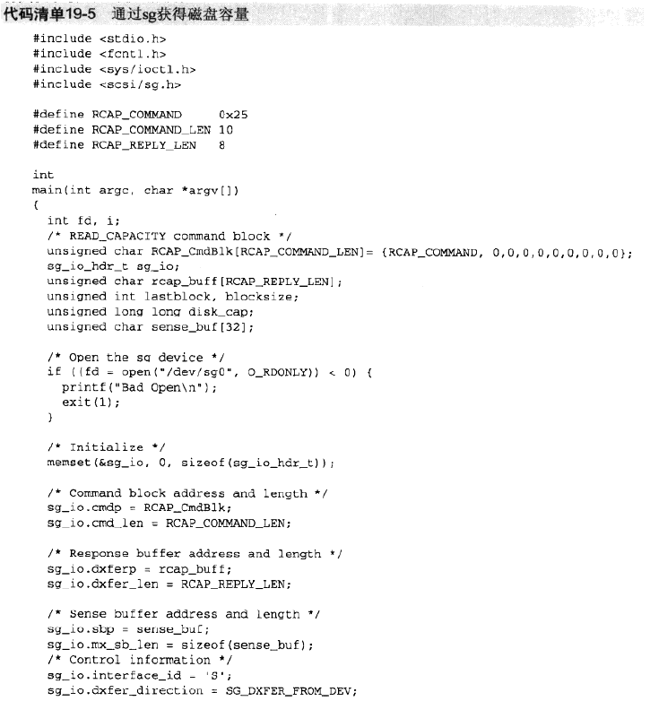

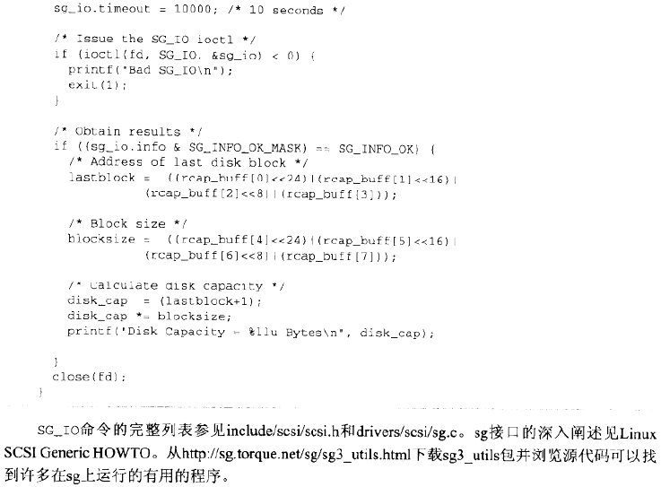

#### 用户模式USB

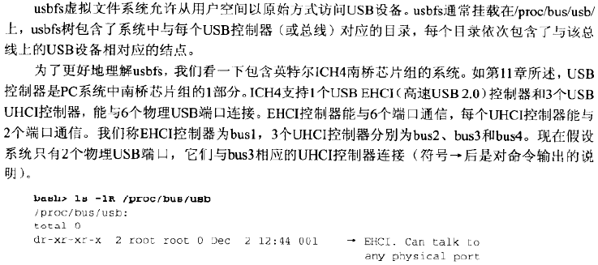

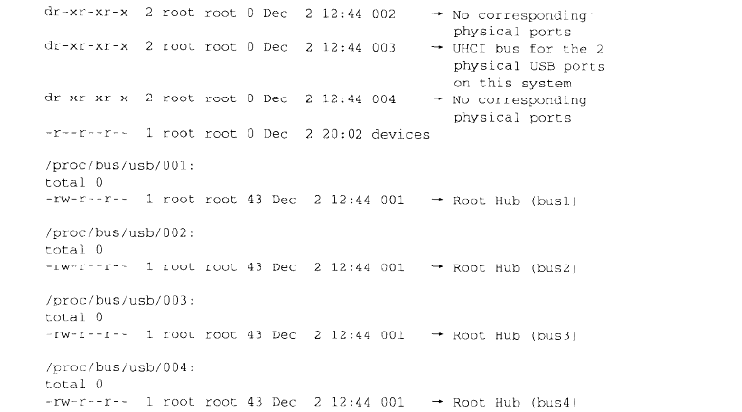

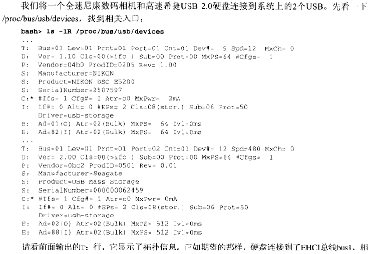

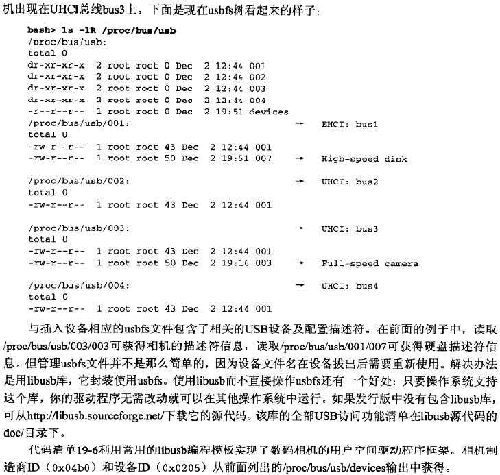

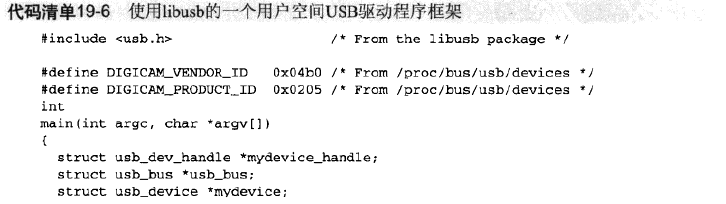

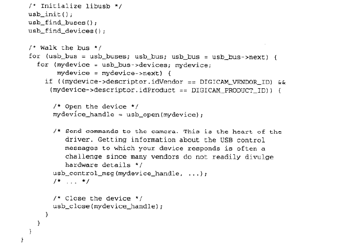

#### 用户模式I2C

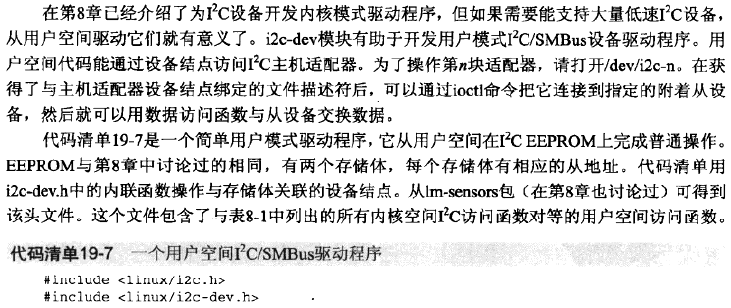

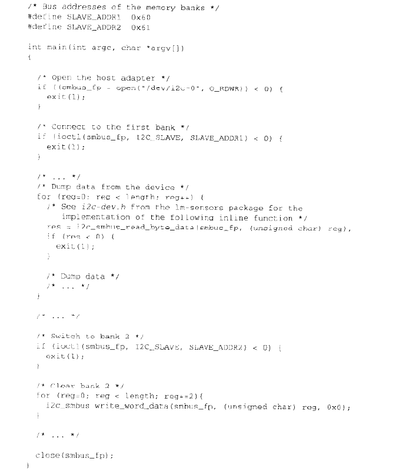

#### UIO

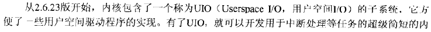

#### 查看源代码

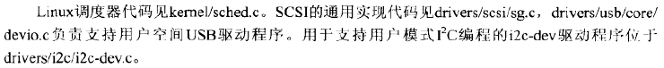

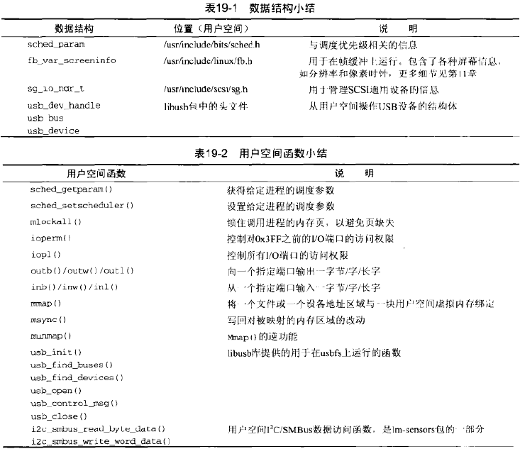

