## 网络接口卡

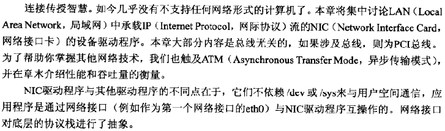

#### 驱动程序数据结构

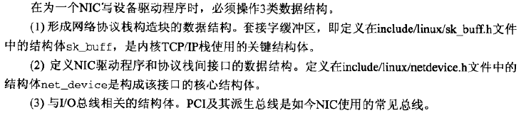

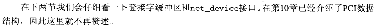

**套接字缓冲区**

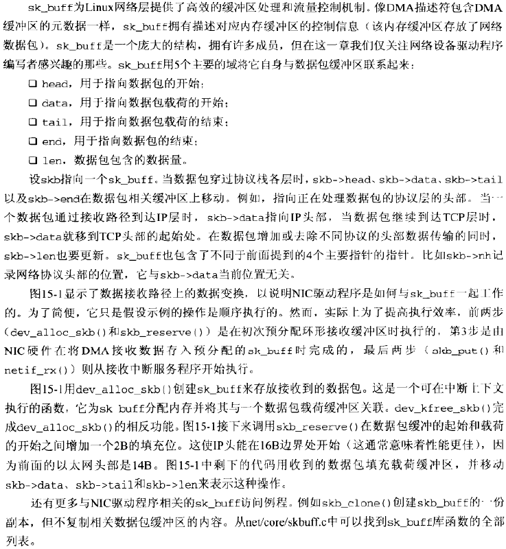

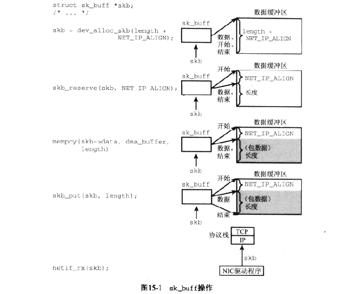

**网络设备接口**

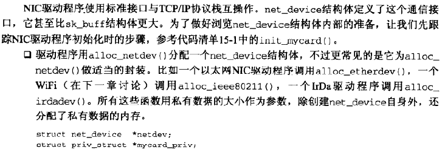

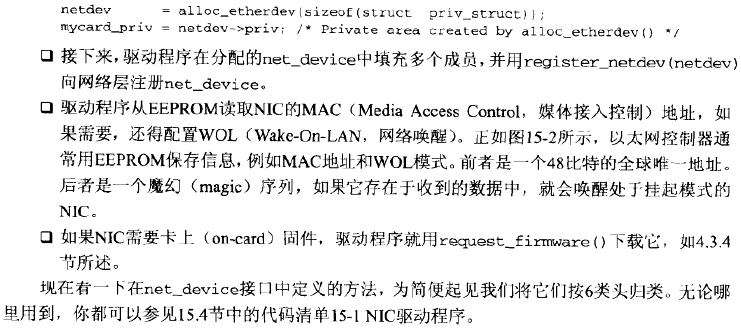

**激活**

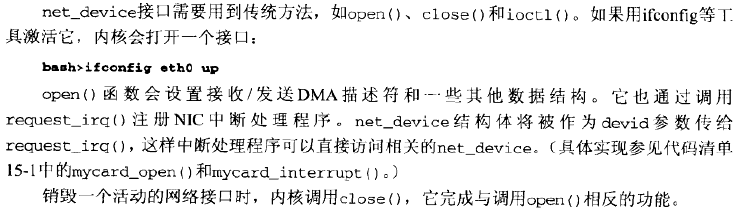

**数据传输**

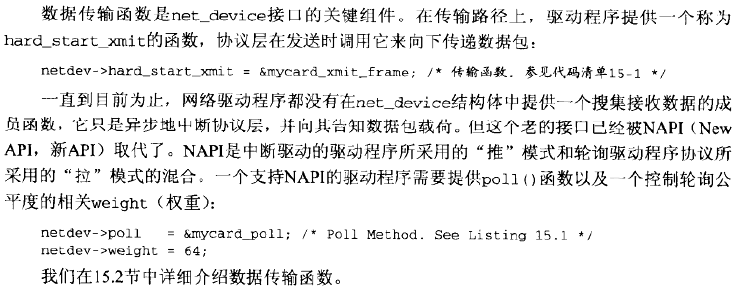

**看门狗**

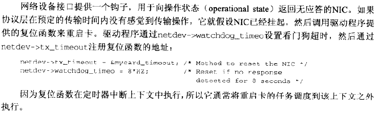

**统计**

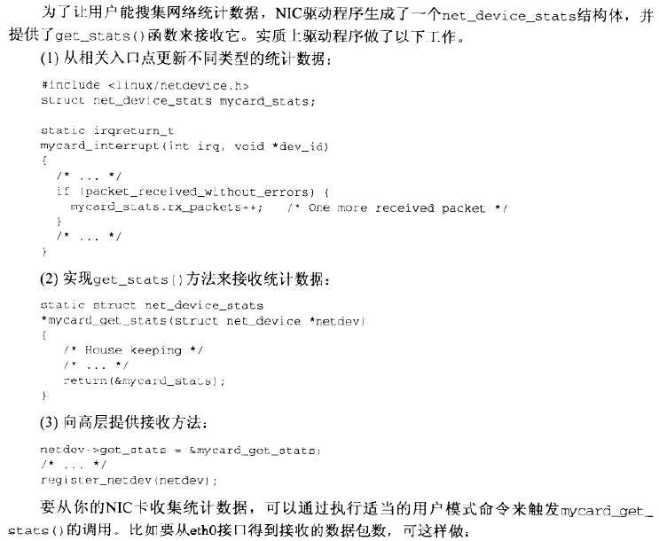

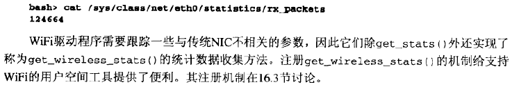

**配置**

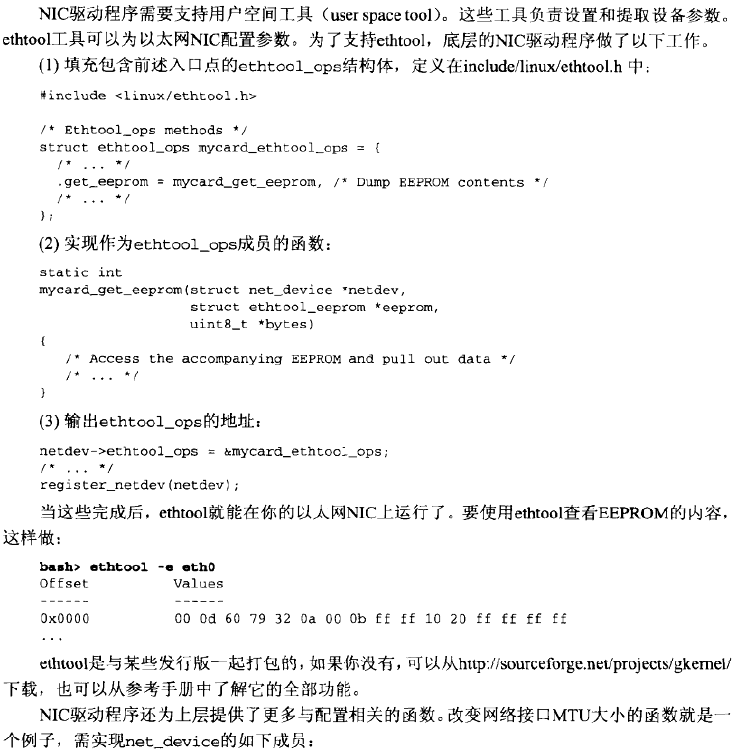

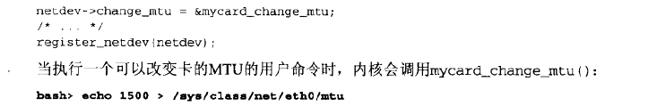

**总线相关内容**

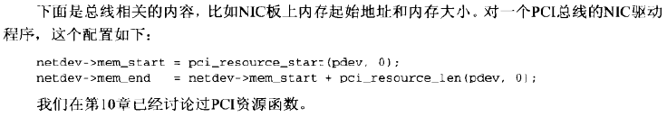

#### 与协议层会话

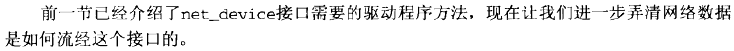

**接收路径**

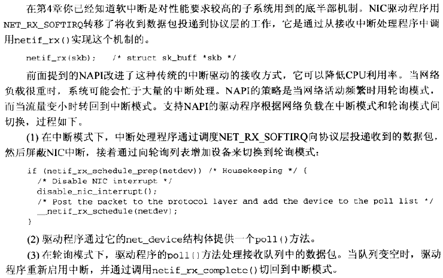

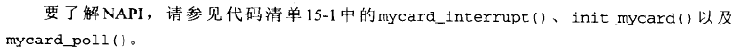

**发送路径**

**流量控制**

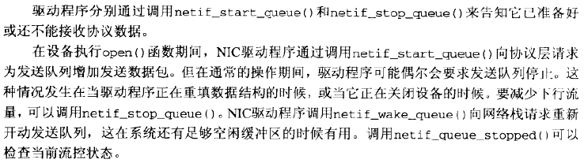

#### 缓冲区管理和并发控制

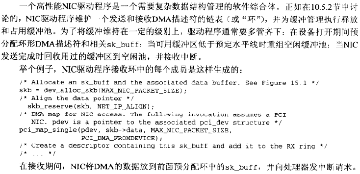

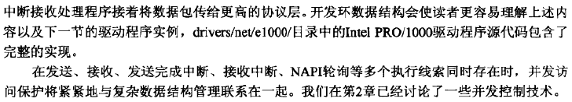

#### 以太网NIC

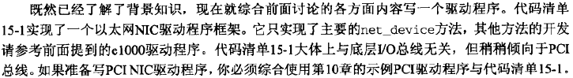

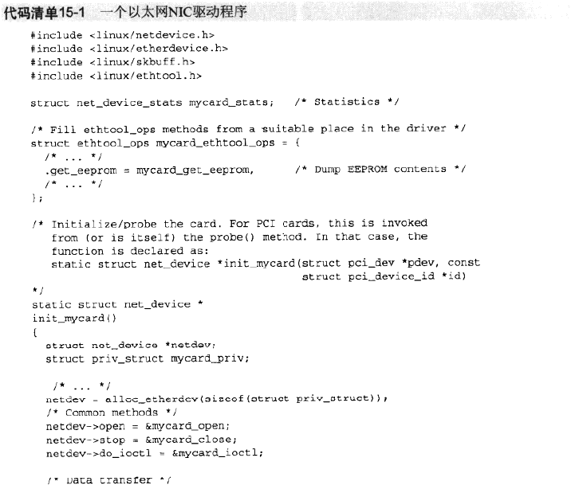

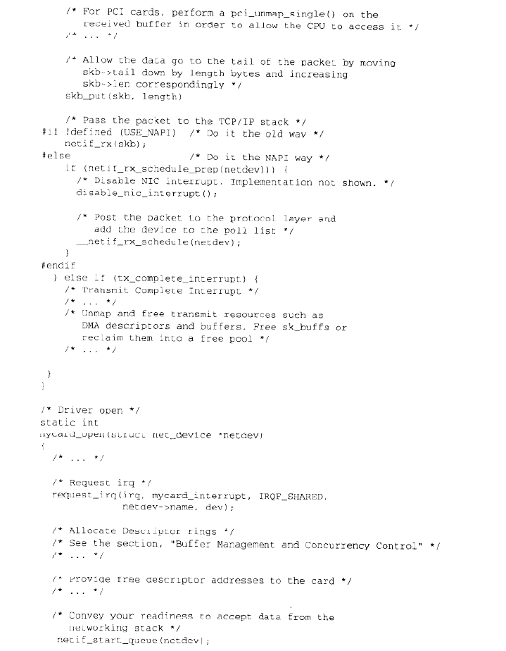

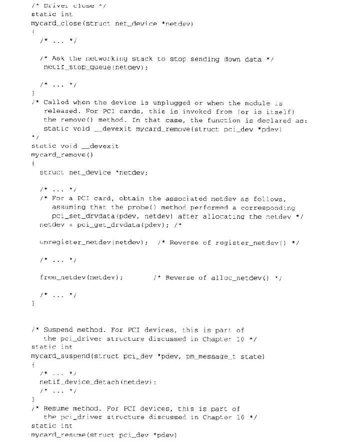

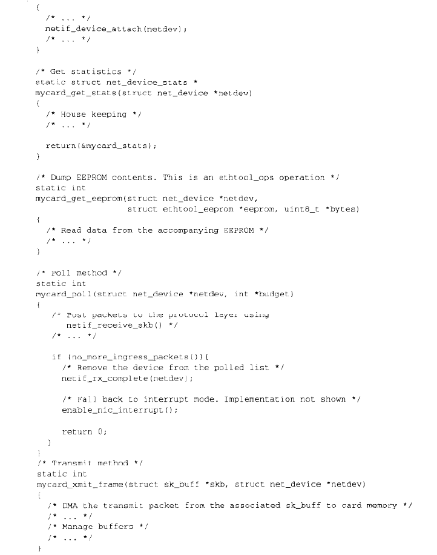

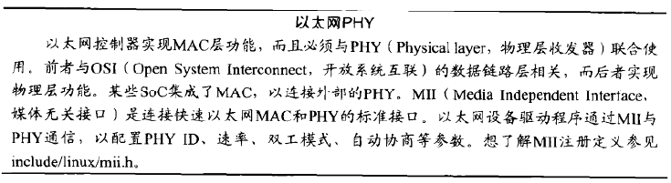

#### ISA网络驱动程序

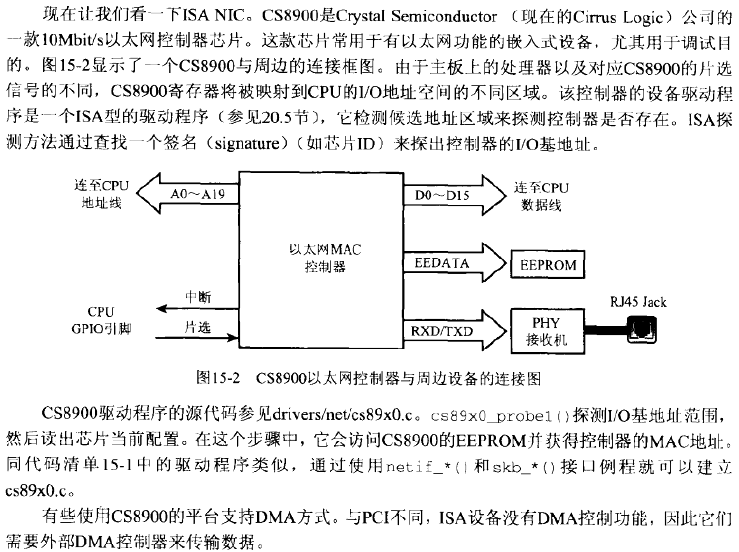

#### ATM

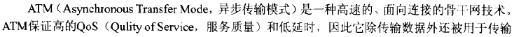

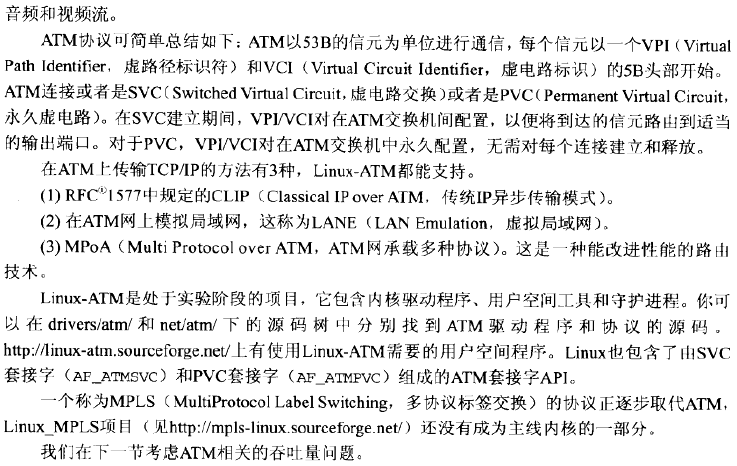

#### 网络吞吐量

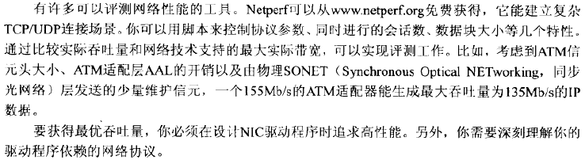

**驱动程序性能**

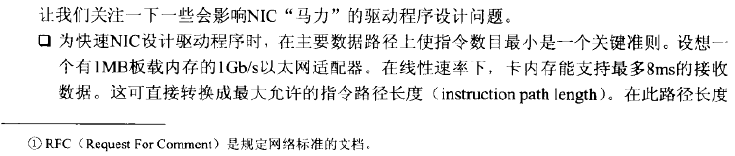

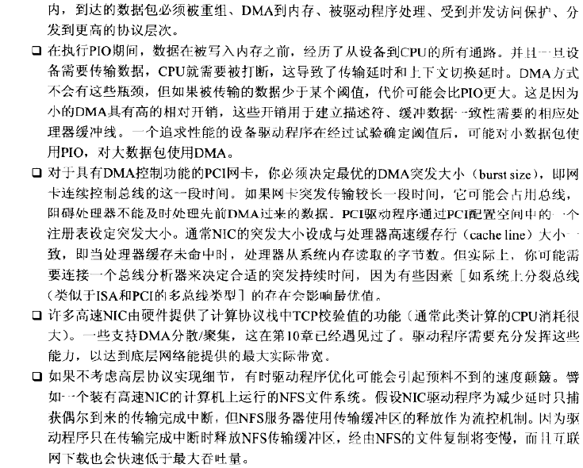

**协议性能**

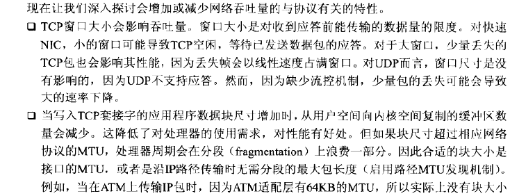

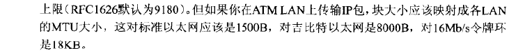

#### 查看源代码

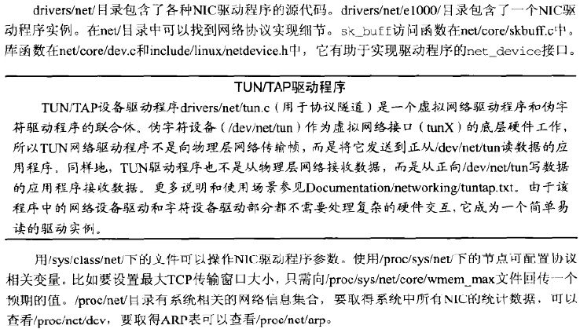

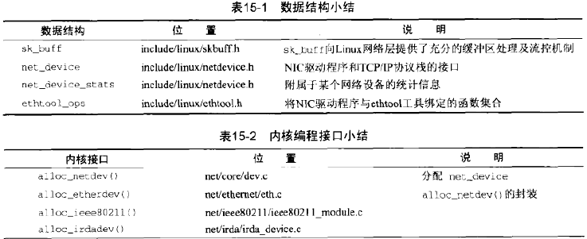

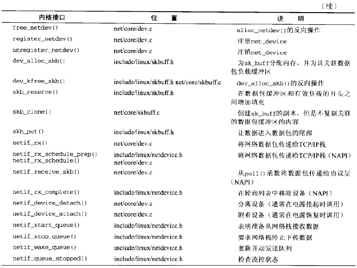

